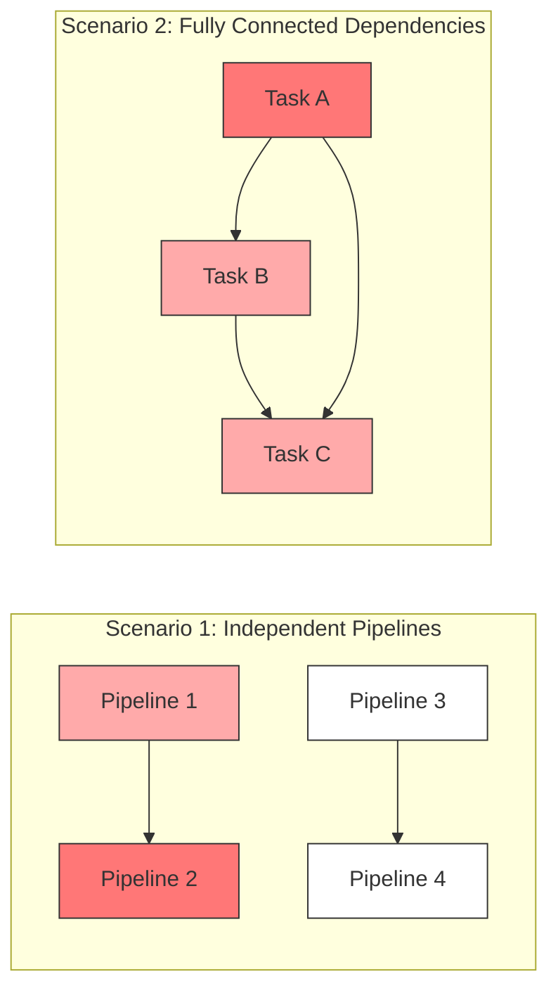

## Introduction

Have you ever been in a situation where you're in a meeting, everyone's deep in discussion, and suddenly someone drops off? The worst part is when the host says, "Alright, let's start over from the beginning!" Everyone's bewildered: why should everyone restart just because one person disconnected? Isn't that a waste of time?

In early versions of Flink, task failure handling worked exactly like this — when one task failed, all tasks had to restart. Today's FLIP-1 specifically addresses this "one fails, all suffer" problem. This improvement came in two phases: Flink 1.3 introduced the "partial recovery" mechanism, and Flink 1.9 upgraded the intermediate data handling.

## What Was Wrong with the Old Approach?

Imagine managing an order processing system for a large e-commerce platform. The system has 100 tasks working in parallel, each handling a portion of orders. Suddenly, one task encounters a problem. Under the old approach, all 100 tasks would have to stop and restart. This created three major problems:

### Problem 1: Resource Waste
Just like how absurd it is to restart an entire meeting when one person drops off, it's equally wasteful to restart all tasks when one fails. Especially during peak events like "Singles' Day," can you imagine the impact of a minor glitch causing the entire order system to restart?

### Problem 2: Slow Recovery
A complete restart means all tasks need to prepare again: reallocating machine resources, reloading previously saved states, re-establishing connections between tasks... It's like reorganizing a large conference where everyone has to find their seats again, reconnect to the network, and prepare their materials - very time-consuming.

### Problem 3: Network Congestion
When all tasks try to recover their states simultaneously, it's like everyone in an office trying to download the same file at once - the network inevitably slows down. This concentrated download can also affect other systems' normal operations.

This situation manifests differently in different types of tasks:

For stream processing tasks (tasks that need to process data continuously), if tasks are tightly coupled, like the "order-payment-shipping" sequence in an order system, then a problem in one step indeed affects the entire flow. However, if tasks are independent, like processing orders from different regions, there's no need for all to restart.

For batch processing tasks (tasks that process large amounts of data at once), it's even worse because they don't save intermediate states. Once an error occurs, all calculations must start from scratch - like when Excel crashes and you have to redo all your calculations.

## How Does FLIP-1 Solve This?

Let's first visually compare the traditional recovery mechanism with FLIP-1:

```mermaid
graph TD
    subgraph "Traditional Recovery Mechanism"
    A1[Task A1 Fails] --> B1[Restart Entire Job]
    B1 --> C1[All Tasks Recover State]
    C1 --> D1[Full Recomputation]
    end
    
    subgraph "FLIP-1 Fine-grained Recovery"
    A2[Task A1 Fails] --> B2[Identify Impact Scope]
    B2 --> C2[Restart Only Related Tasks]
    C2 --> D2[Utilize Intermediate Results]
    D2 --> E2[Quick Recovery]
    end

style A1 fill:#f77,stroke:#333
style A2 fill:#f77,stroke:#333
style B1 fill:#faa,stroke:#333
style C1 fill:#faa,stroke:#333
style D1 fill:#faa,stroke:#333
style B2 fill:#7f7,stroke:#333
style C2 fill:#7f7,stroke:#333
style D2 fill:#7f7,stroke:#333
style E2 fill:#7f7,stroke:#333
```

FLIP-1's approach is clever and comes in two steps:

### Step 1: Breaking Tasks Down Like Building Blocks

First, it divides tasks into "building blocks." Tasks within each block are related, while different blocks are relatively independent. When a task fails, only its block needs to restart while other blocks can continue working.

For example: Suppose you're processing order data from different cities. Beijing's order processing system (tasks A1 and A2) and Shanghai's order processing system (tasks B1 and B2) are independent. If Beijing's A1 task fails, only A1 and A2 need to restart while Shanghai's B1 and B2 can continue normal operation.

However, if tasks need to exchange data, things get more complicated. For instance, if A2 needs to send data to B1, when A1 fails, B1 might need to restart too. It's like dominos - you need to check their connections.

Let's look at two different scenarios:

### Step 2: Smart Intermediate Data Management

The second phase primarily addresses data transfer issues. The system designed three storage methods:

1. **Reliable Storage**: Like giving each task its own USB drive, able to save data anytime and recover conveniently when needed.

2. **Memory Buffer**: Like keeping a notepad in memory for temporary data. This method is fast but volatile, suitable for short-term records.

3. **Complete Batch**: Specifically designed for batch processing, like waiting for a full shipment before delivery. Although it requires longer waiting times, it ensures data completeness.

## How Is It Implemented?

The implementation focuses on two key points:

First, there's a "commander" (JobMaster) coordinating the entire recovery process. Like a project manager, it knows each task's status, allocates resources reasonably, and ensures correct data transmission. The system also includes a "heartbeat" mechanism, like regular check-ins asking "are you still there?", ensuring each task is alive.

Second, it provides three recovery strategies:
- Full restart (the safest method)
- Restart only failed tasks (the lightest method)
- Smart restart of related regions (the most balanced method)

## What Benefits Does It Bring?

These improvements bring tangible benefits to Flink:

First, it saves resources. Like a doctor treating patients, now we can just treat the sick person instead of having everyone undergo a medical examination.

Second, recovery is faster. Because it can precisely locate problems, it's like fixing a circuit - when you know where the short circuit is, you just fix that spot instead of replacing the entire circuit board.

## Practical Usage Tips

When using FLIP-1's new mechanism, here are some practical tips to help you make the most of this feature:

### 1. Choosing the Right Recovery Strategy

Like doctors prescribing the right medicine, different types of jobs need appropriate recovery strategies:
- If your tasks are independent (like processing orders from different cities), try using RestartPipelinedRegionStrategy
- If data consistency is crucial, use the safest RestartAllStrategy
- Note that some scenarios (like jobs with colocation constraints) aren't suitable for fine-grained recovery

### 2. Planning Checkpoints Wisely

Setting checkpoints should be like saving progress in a game:
- Moderate frequency: Too frequent affects performance, too infrequent risks larger losses after accidents
- Consider data volume: Large data volumes make checkpoints costly, need to balance well
- Monitor: If checkpoints keep failing, might need to investigate potential problems

### 3. Managing Intermediate Results

For data storage:
- Reserve enough disk space for TaskExecutor
- Set up cleanup policies to prevent data accumulation
- Consider adding heartbeat timeout buffer if disconnections are frequent

### 4. Monitoring Tips

Monitor like caring for a child:
- Watch failure rates: Frequent failures in a task likely indicate underlying issues
- Track recovery times: If getting slower, might need optimization
- Monitor resource usage: Especially disk space, don't let intermediate results fill up the hard drive

## Summary

Let's review the changes FLIP-1 has brought us.

Remember the meeting example from the beginning? Now, when someone drops off, we don't need everyone to restart the meeting - just the relevant few people need to realign. This is what FLIP-1 achieved - making Flink smarter in handling task failures.

Specifically, FLIP-1 brought three important improvements:

First is "Precise Recovery." Like modern firefighting, you don't flood an entire building when one room is on fire - you precisely locate and extinguish the fire source. FLIP-1 achieves this through identifying task dependencies for precise restarts.

Second is "Smart Storage." It designed three different data storage methods, like how we choose different storage methods in life: important files on USB drives, temporary notes on sticky notes, large items in warehouses. This design makes data storage and recovery more efficient.

Third is "Flexible Response." By providing different recovery strategies, users can choose based on their needs. Like medical treatment - sometimes you need a full checkup, sometimes just a prescription is enough.

These improvements not only make Flink more efficient in handling task failures but also lay the foundation for future development. While technology always advances, FLIP-1 has already brought us a more reliable and efficient Flink. As a teacher once said, "It's not about never making mistakes, but about knowing how to handle them gracefully." FLIP-1 makes Flink more graceful in handling errors.
