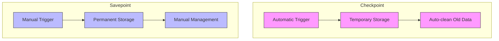
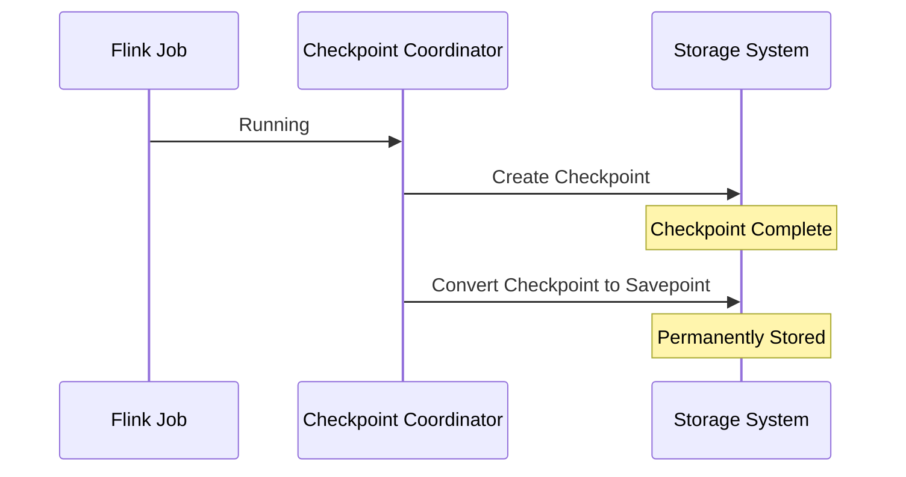
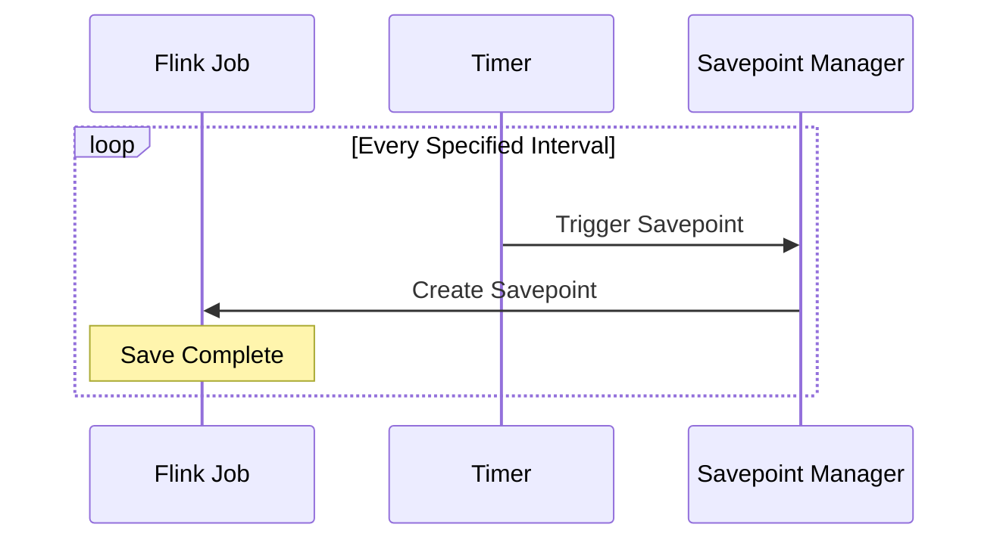
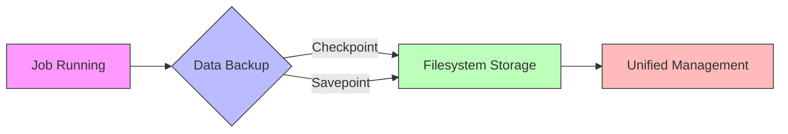

## Introduction

Backing up data is like taking photos of important files - sometimes you need automatic periodic snapshots (checkpoints), sometimes you need manual snapshots of important moments (savepoints). In early versions of Flink, these two "snapshot" methods operated independently, making them less convenient to use. FLIP-10 aims to unify these two methods, making data backup simpler and more flexible.

## What's the Difference Between Checkpoints and Savepoints?

Before understanding FLIP-10, let's look at the differences between these two "snapshot" methods:



Let's use room cleaning as an analogy:
- Checkpoints are like mom regularly tidying your room, throwing away excess items after cleaning
- Savepoints are like a major cleanup before moving, you decide when to do it, and everything is kept intact

The current design caused some inconveniences:
1. If a program needs to restart due to serious issues, the most recent checkpoint might have been automatically deleted
2. Creating periodic savepoints still requires manual operation or scripts
3. Programs without enabled checkpoints can't create savepoints at all

## What Changes Did FLIP-10 Bring?

FLIP-10's core is breaking down the barriers between checkpoints and savepoints, making them convertible. Specifically:

### 1. Persistent Checkpoints



This is like adding a new option to room cleaning: after tidying, you can choose to preserve important cleaning records, allowing you to return to this state anytime.

### 2. Periodic Savepoints



This is equivalent to adding a "timer reminder" feature to savepoints, eliminating the need to remember manual saves.

## How Is It Implemented?

FLIP-10 implemented these improvements through:

### 1. Configuration

Usage is simple, mainly through CheckpointConfig:

```java
// Enable persistent checkpoints
env.getCheckpointConfig()
   .enablePersistentCheckpoints("/path/to/save");

// Enable periodic savepoints
env.getCheckpointConfig()
   .enablePeriodicSavepoints(1, TimeUnit.HOURS, "/path/to/save");
```

### 2. Unified Storage Location

To simplify management, all savepoints are stored uniformly in the filesystem. It's like storing all photos in the same album for easy finding and management.



### 3. Backup Coordinator Improvements

The CheckpointCoordinator has become smarter:
- Always created, even without periodic checkpoints enabled
- Can handle persistent checkpoints
- Can automatically trigger savepoints
- Provides complete logging and REST API support

## What Benefits Does It Bring?

These improvements bring tangible conveniences to Flink users:

### 1. Better Fault Tolerance
If a program encounters unrecoverable errors, the most recent checkpoint is automatically saved, like adding an extra layer of protection for data.

### 2. Easier Operations
- No need for manual savepoint triggers
- Unified storage location simplifies management
- Easy viewing of all backup points through REST API

### 3. More Flexible Usage
Programs without enabled checkpoints can now create savepoints, giving users more choices.

## Practical Usage Tips

When using these new features, here are some recommendations:

1. Choose Storage Location Wisely:
- Ensure sufficient storage space
- Choose stable and reliable storage systems
- Consider filesystem performance

2. Set Save Frequency:
- Consider data importance
- Balance storage space usage
- Avoid too frequent saves affecting performance

3. Monitoring and Maintenance:
- Regularly check savepoint status
- Clean up unnecessary savepoints timely
- Monitor storage space usage

## Summary

FLIP-10 makes Flink's data backup system more unified and intelligent. It's like integrating two different photo album systems, maintaining their individual features while making usage more convenient. These improvements not only make data backup more reliable but also make operations work easier. This is the significance of technological progress - making complex things simple and tedious work efficient.
