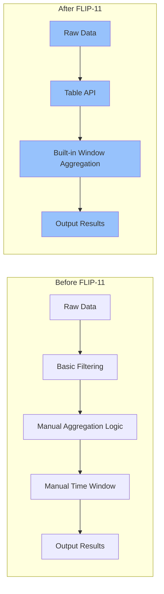
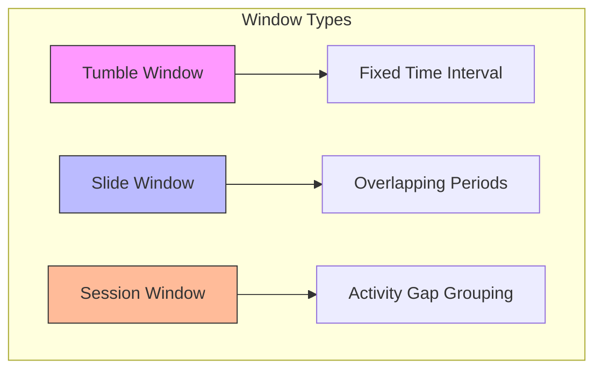
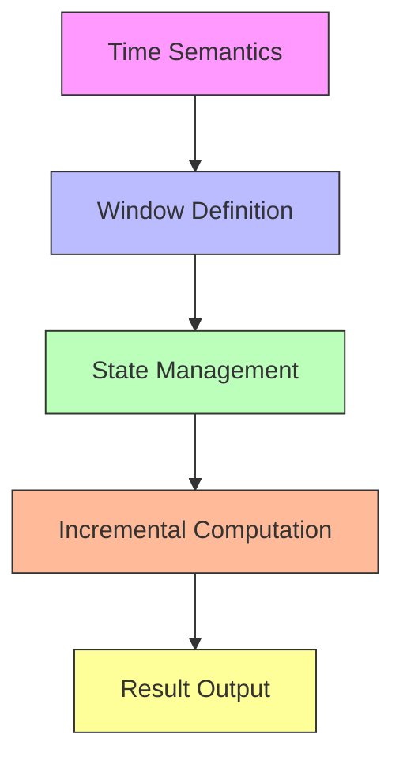

## Introduction

Table API, as Flink's declarative API, makes data processing more intuitive and simple. FLIP-11's goal is to enable Table API to handle stream aggregation operations elegantly.

## What Problem Does It Solve?

Imagine this scenario: an e-commerce platform needs to track sales statistics for each product in real-time. This requirement seems simple but involves several key challenges:

1. How to group unbounded data streams? We can't wait for all data to arrive before calculating
2. How to handle late-arriving data?
3. How to ensure calculation accuracy?

Before FLIP-11, Table API only supported basic operations like projection, selection, and union. To implement the above statistics functionality, developers often needed to write complex code directly using DataStream API.

Let's visually compare the differences before and after the improvement:



## Core Improvements

FLIP-11 introduced two main aggregation mechanisms:

### 1. Group-Window Aggregates

This mechanism is mainly used for scenarios requiring grouping by time or row count. For example, "calculate product sales every 5 minutes."

Supports three window types:



### 2. Row-Window Aggregates

This mechanism is better suited for scenarios like "calculate based on current row's surrounding range." For example, "calculate the difference between each order amount and the average of the previous 10 orders."

## How to Use It?

Let's look at some practical examples:

```scala
// Example 1: Calculate product sales every 10 minutes
val result = tableEnv.from("sales")
  .window(Tumble over 10.minutes on 'rowtime as 'w)
  .groupBy('productId, 'w)
  .select('productId, 'price.sum)

// Example 2: Calculate price difference between each order and previous 5 orders
val result = tableEnv.from("orders")
  .rowWindow(SlideRows preceding 5.rows following 0.rows as 'w)
  .select('orderId, 
          'price,
          'price.avg over 'w as 'avgPrice)
```

## Technical Implementation

Implementation involves several key points:



1. **Time Semantics**: Supports Event Time and Processing Time
2. **Window Definition**: Provides flexible window definition mechanism
3. **State Management**: Efficiently manages intermediate states during computation
4. **Incremental Computation**: Uses incremental computation for window aggregation to improve efficiency
5. **Result Output**: Supports multiple output methods and formats

## Usage Recommendations

1. Choose Appropriate Window Type:
   - Use Tumble windows for fixed statistical periods
   - Use Sliding windows when results need smoothing
   - Use Session windows for activity-based grouping

2. Time Window Considerations:
   - Set reasonable window size - too small increases computation pressure, too large affects real-time performance
   - Choose appropriate time semantics based on data characteristics
   - Handle late data carefully

3. State Cleanup:
   - Clean up expired states promptly
   - Set reasonable state Time-To-Live (TTL)

## Summary

FLIP-11's implementation makes Flink's Table API more powerful and user-friendly for handling stream aggregation. It not only provides rich aggregation functionality but also achieves a good balance between performance and usability.

This feature was released in Flink 1.4.0 and has been further optimized in subsequent versions. If your project involves stream data aggregation processing, Table API would be an excellent choice.
