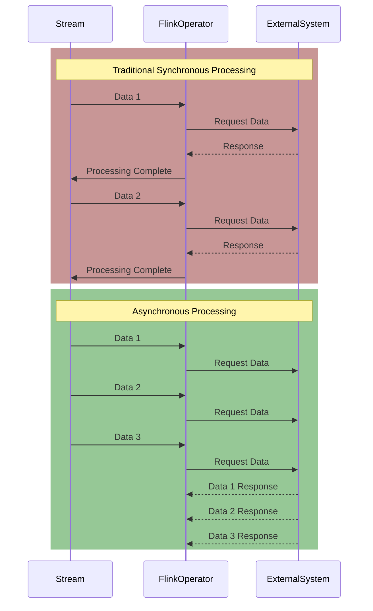
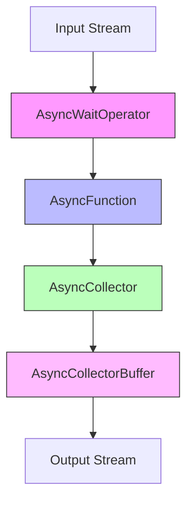

## Introduction

Imagine ordering at a restaurant. In a traditional approach, after taking your order, the waiter would stand at your table waiting for the kitchen to prepare the food before serving other customers. This is obviously inefficient, as the waiter could be serving other customers during the waiting time. This FLIP is like teaching Flink to work like a "multi-threaded waiter"!

## Why Do We Need Async I/O?

In stream processing, it's common to access external systems to enrich data streams. For example:
- Querying databases for user information
- Calling external APIs for product details
- Requesting third-party services for data validation

Traditional synchronous access creates a major problem: the entire processing slows down while waiting for external system responses. It's like a waiter having to wait for one dish to be prepared before serving other customers, which is very inefficient.



The above diagram shows the difference between synchronous and asynchronous processing: synchronous processing is like a "serial" process, while asynchronous processing allows multiple requests simultaneously, greatly improving efficiency.

## Core Design Solution

The async I/O design is like designing an efficient restaurant service system, including these key roles:



1. **Service Desk** (AsyncWaitOperator): Responsible for receiving customer orders
2. **Waiter** (AsyncFunction): Responsible for sending orders to kitchen, but doesn't wait
3. **Order Ticket** (AsyncCollector): Records status of each order
4. **Order Manager** (AsyncCollectorBuffer): Coordinates processing of all orders

## Two Service Modes

Like how restaurants can choose different serving methods, async I/O provides two modes:

| Mode | Characteristics | Suitable Scenarios |
|------|----------------|-------------------|
| Ordered | Strictly outputs in data arrival order | Scenarios requiring ordered data processing, like sequential event processing |
| Unordered | Outputs as soon as processing completes | Scenarios without strict order requirements, pursuing maximum throughput |

## Usage Examples

Suppose we need to query HBase database in a data stream. Here are two common usage patterns:

1. Using Callback:
```java
public class HBaseAsyncFunction implements AsyncFunction<String, String> {
    private transient Connection connection;
    
    @Override
    public void asyncInvoke(String key, AsyncCollector<String> collector) {
        Get get = new Get(Bytes.toBytes(key));
        Table table = connection.getTable(TableName.valueOf("test"));
        ((AsyncableHTableInterface) table).asyncGet(get, 
            new MyCallback(collector));
    }
}

// Create data stream
DataStream<String> stream = AsyncDataStream.unorderedWait(
    inputStream, 
    new HBaseAsyncFunction(), 
    100,    // Timeout (milliseconds)
    20      // Maximum concurrent requests
);
```

2. Using Future:
```java
public class HBaseAsyncFunction implements AsyncFunction<String, String> {
    private transient Connection connection;
    
    @Override
    public void asyncInvoke(String key, AsyncCollector<String> collector) {
        Get get = new Get(Bytes.toBytes(key));
        Table table = connection.getTable(TableName.valueOf("test"));
        
        ListenableFuture<Result> future = table.asyncGet(get);
        Futures.addCallback(future,
            new FutureCallback<Result>() {
                public void onSuccess(Result result) {
                    collector.collect(
                        Collections.singletonList(
                            Bytes.toString(result.getValue(
                                Bytes.toBytes("f"), 
                                Bytes.toBytes("c")
                            ))
                        )
                    );
                }
                
                public void onFailure(Throwable t) {
                    collector.collect(t);
                }
            }
        );
    }
}
```

## Important Considerations

1. **Resource Sharing**: If multiple tasks need to share connections (like database connections), use static modifier but be mindful of thread safety.

2. **State Management**: States of async I/O operations are automatically saved and can recover previous progress when jobs fail.

3. **Performance Tuning**:
   - Set reasonable concurrent request limits
   - Monitor timeout situations
   - Choose ordered or unordered mode based on actual needs

## Current Status

This FLIP was implemented in Flink 1.2. It significantly improved Flink's efficiency in processing external data, especially in scenarios requiring frequent access to external systems. The feature is now widely used in production environments for:
- Real-time data stream database correlation
- External service calls for real-time recommendations
- Cache system access for data enrichment

## Summary

FLIP-12 brought efficient async I/O processing capability to Flink, like introducing a professional order system to a restaurant, allowing each waiter to efficiently handle multiple orders. By transforming synchronous operations into asynchronous ones, it greatly improved processing efficiency while maintaining code simplicity and maintainability. This improvement makes Flink more capable in handling complex data streams, especially in scenarios requiring frequent interaction with external systems.
