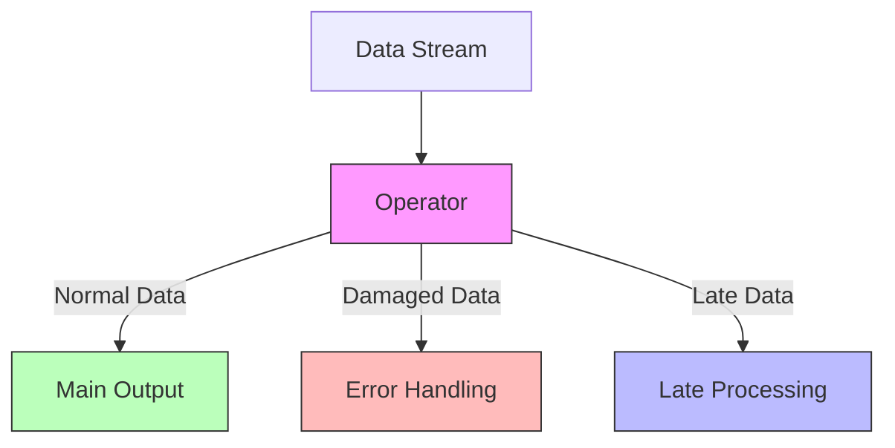
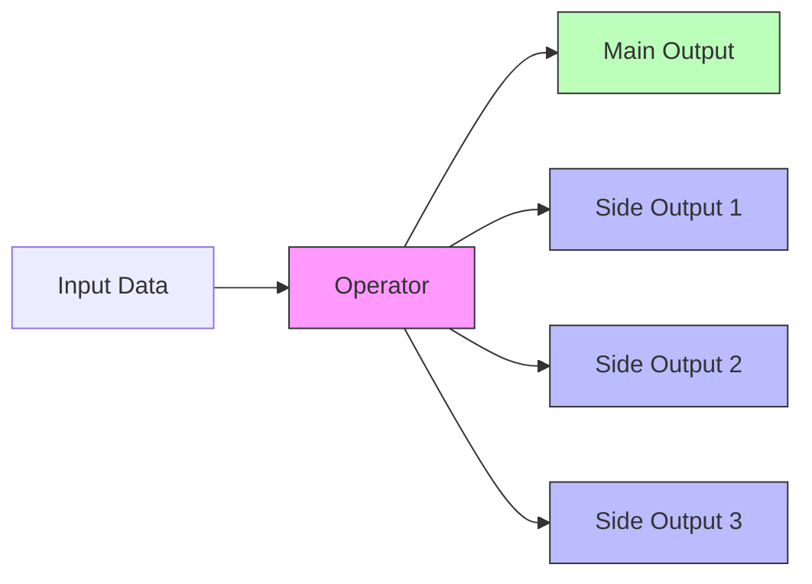
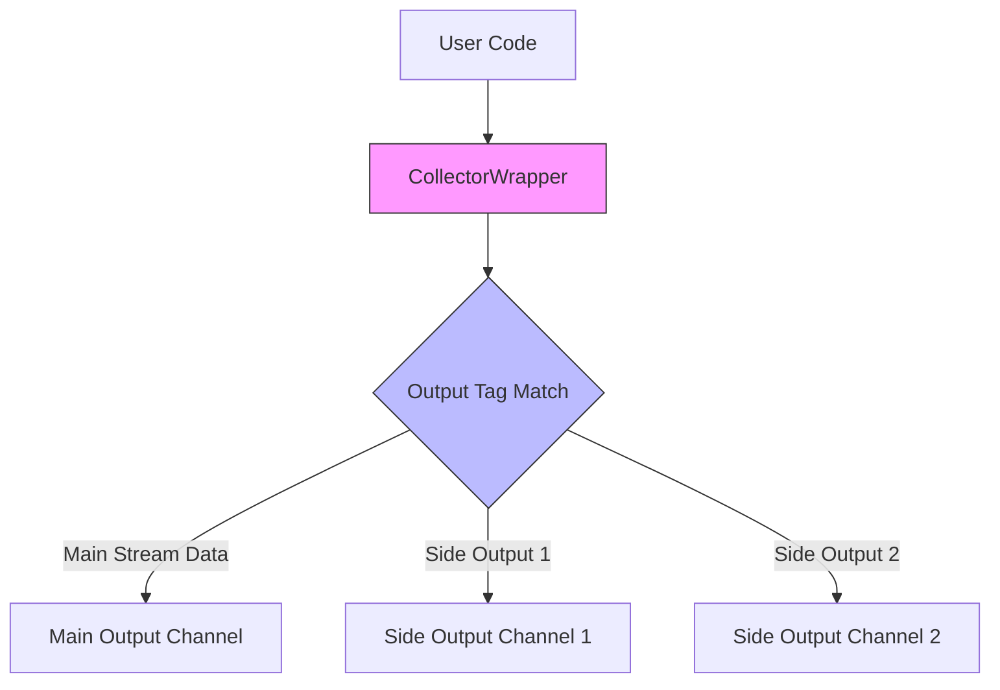

## Introduction

Imagine sorting packages on a conveyor belt. Traditionally, a worker can only put packages at one exit. If they encounter damaged packages, they either have to stop the entire conveyor belt to handle them or discard them outright. This approach clearly isn't flexible enough. Things would be much simpler if workers could put different types of packages at different exits. This is the problem Side Outputs aims to solve.

## Why Do We Need Side Outputs?

In real-world stream processing, we often encounter situations like this:



The above diagram shows a typical scenario: an operator needs to split data into multiple streams for different destinations. Before Side Outputs, handling such situations was problematic:
1. When data is corrupted, the entire task might get stuck in a "fail->restart->fail again" cycle
2. For window computations, late-arriving data could only be discarded

## Solution: Adding "Flow Splitters" to Operators

Side Outputs' design is like installing a "flow splitter" on each operator, allowing different types of data to be output to different streams based on needs. This design includes two core concepts:



1. **OutputTag**: Used to mark and distinguish different output streams
2. **CollectorWrapper**: Wraps the collector, capable of outputting data to different streams

## Scenario Comparison

| Scenario | Traditional Approach | Using Side Outputs |
|----------|-------------------|------------------|
| Handling Corrupted Data | Either stop task or discard | Output to dedicated error handling stream |
| Processing Late Data | Must discard | Can output to late processing stream |
| Data Classification | Requires multiple separate tasks | Complete streaming split in one task |
| Debug and Monitoring | Difficult to track specific data types | Can separately collect data of interest |

## Usage Example

Here's an example of processing order data, showing how to use Side Outputs to handle different situations:

```java
// Define output tags
final OutputTag<Order> invalidOrders = new OutputTag<Order>("invalid-orders") {};
final OutputTag<Order> lateOrders = new OutputTag<Order>("late-orders") {};

// Process order stream
SingleOutputStreamOperator<Order> mainStream = orderStream
    .process(new ProcessFunction<Order, Order>() {
        @Override
        public void processElement(Order order, Context ctx, Collector<Order> out) {
            // Check order validity
            if (!order.isValid()) {
                // Output invalid orders to side output
                ctx.output(invalidOrders, order);
                return;
            }
            
            // Check order time
            if (order.getTimestamp() < ctx.timerService().currentWatermark()) {
                // Output late orders to side output
                ctx.output(lateOrders, order);
                return;
            }
            
            // Output normal orders to main stream
            out.collect(order);
        }
    });

// Get and process invalid order stream
DataStream<Order> invalidOrderStream = mainStream.getSideOutput(invalidOrders);
invalidOrderStream.addSink(new InvalidOrderHandler());

// Get and process late order stream
DataStream<Order> lateOrderStream = mainStream.getSideOutput(lateOrders);
lateOrderStream.addSink(new LateOrderHandler());
```

## Internal Implementation

Side Outputs uses a clever design:



1. **Output Tags**: Each side output stream has a unique OutputTag
2. **Wrapped Collector**: Uses CollectorWrapper to wrap the original collector
3. **Type Safety**: OutputTag extends TypeHint, ensuring type safety
4. **Runtime Distinction**: Uses tags to distinguish different output streams and route to correct destinations

## Current Status

This FLIP has been implemented in Flink and is now a widely used feature. Its implementation was done in two phases:
1. First phase maintained backward compatibility, mainly adding the RichCollector interface
2. Second phase involved deeper framework restructuring to support more flexible multi-output scenarios

## Summary

Side Outputs adds more flexible data processing capability to Flink, like adding multiple exits to a conveyor belt. This improvement makes data processing more elegant: no need to worry about bad data causing entire task failures, and no need to abandon late-arriving data. Through a simple API design, users can easily implement complex data streaming logic, making the entire data processing flow clearer and more efficient.
