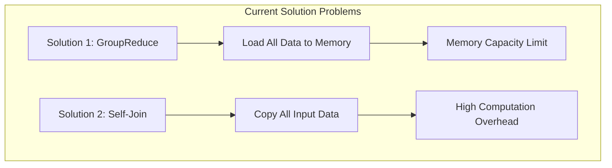
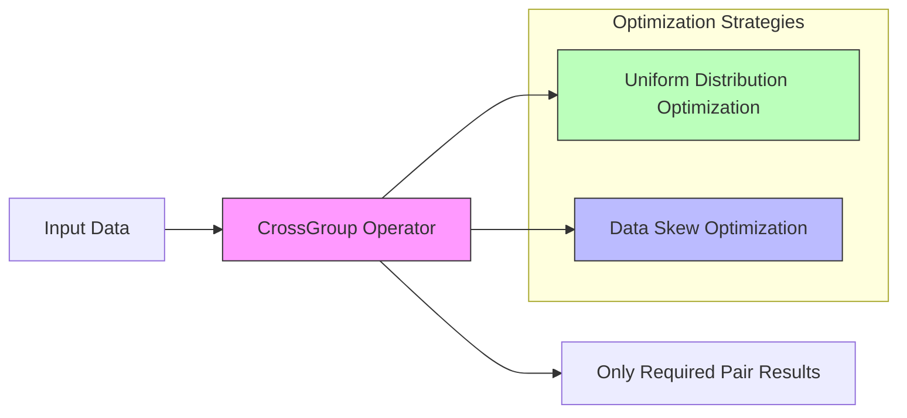
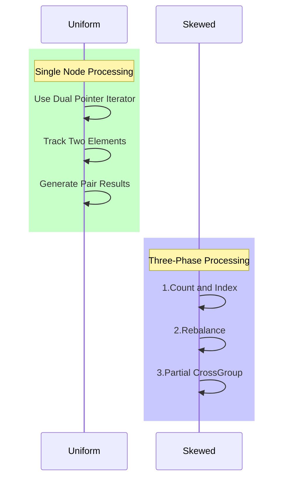

## Introduction

Imagine in an old library, you need to find each book's "good friends" (similar books). Traditional methods either require putting all books on a large table for comparison (memory-limited) or making copies of each book for comparison (data duplication). Neither approach is elegant. FLIP-14 aims to solve this problem by providing a smarter way to handle these "pairing" operations.

## Why Do We Need the CrossGroup Operator?

When processing graph data, we often need to pair-wise compare data within the same group. For example:
- Calculating friend recommendations in social networks
- Finding triangle relationships in networks
- Computing similarity between items

Currently, there are two solutions, but neither is perfect:

| Solution | Advantages | Disadvantages |
|----------|------------|---------------|
| GroupReduce | High flexibility, customizable pairing logic | Needs to fit entire group in memory, prone to memory overflow |
| Self-Join | Simple implementation, automatically handled by system | Requires data duplication, produces full Cartesian product, low efficiency |

## New Solution: CrossGroup Operator

The CrossGroup operator's design is like equipping the library with a smart librarian who knows how to efficiently match books without putting them all on the table.

### Core Design Features

1. **Smart Pairing**: No need to produce complete Cartesian product, only generates required pairs
2. **Memory-Friendly**: Uses iterator approach, doesn't need to load all data at once
3. **Distribution Optimization**: Provides different optimization strategies for different data distributions

### Processing Flow

CrossGroup provides two processing modes for different data distribution characteristics:

For uniformly distributed data, a simple iterator can process efficiently. For skewed data, a three-phase processing approach ensures load balancing.

## Use Cases

The CrossGroup operator is particularly suitable for:

| Scenario | Example | Advantage |
|----------|---------|-----------|
| Graph Analysis | Social Network Friend Recommendations | Efficient processing of node relationships |
| Similarity Calculation | Item Recommendation Systems | Avoids unnecessary pairing |
| Network Analysis | Triangle Relationship Detection | Better memory usage efficiency |
| Bipartite Graph Processing | User-Item Association Analysis | Optimized for data skew |

## Current Status

This FLIP is currently in a Reopened state. Although the feature was initially designed to optimize multiple scenarios in Flink's Gelly (graph computation) module, including:
- AdamicAdar similarity calculation
- Jaccard index computation
- Triangle relationship detection
- Bipartite graph projection methods

The improvement proposal is currently under re-evaluation, and new design and implementation solutions may emerge. Interested developers can follow the latest progress on JIRA.

## Summary

The CrossGroup operator brings a more elegant data pairing solution to Flink. It's like an experienced librarian who knows both how to efficiently match books and how to choose the most appropriate matching strategy for different situations. This improvement makes Flink more efficient in handling graph analysis, similarity computation, and other scenarios, while also providing users with a simpler programming model.
