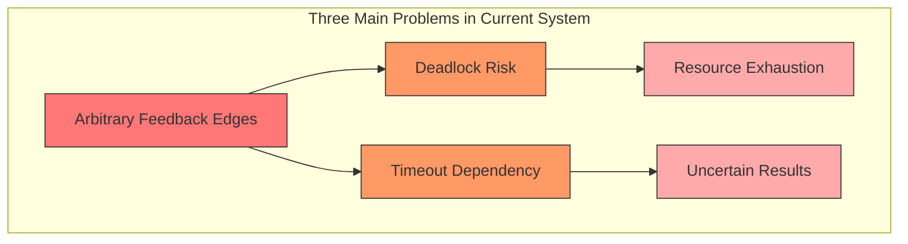
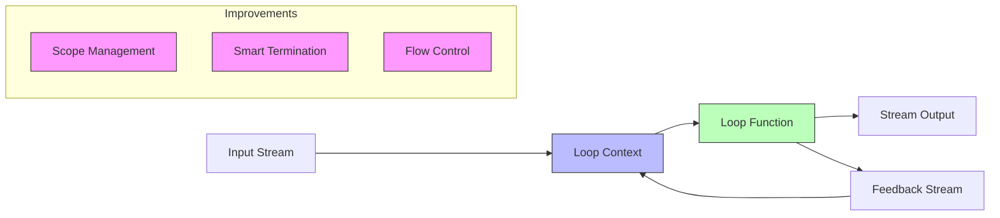
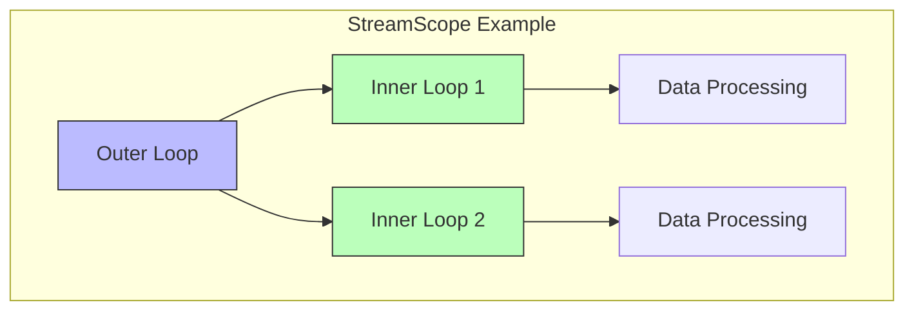
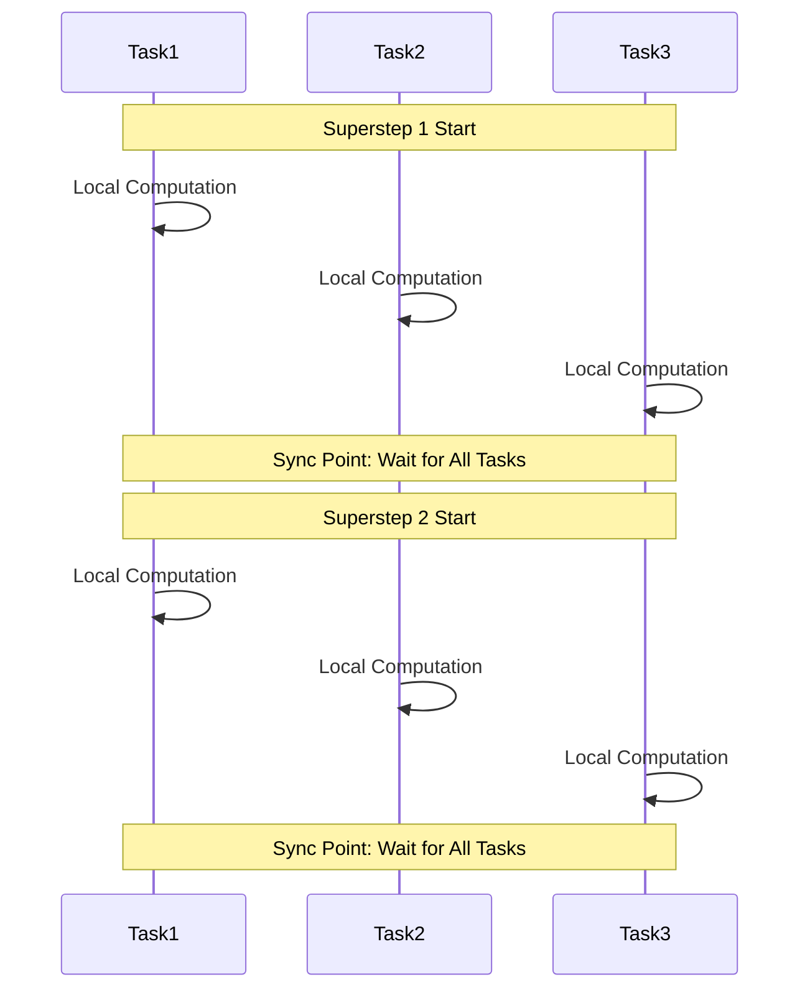

## Introduction

Imagine a crowd control system in a massive shopping mall. Sometimes, customers need to pass through the same area multiple times (like the food court), and different areas generate inter-area foot traffic. The current system has a problem: it either sets a fixed waiting time for each area or doesn't know when to close. This approach clearly isn't flexible enough. FLIP-15 aims to solve this problem by enabling the system to handle such circular flow scenarios more intelligently.

## Current Problems

The existing Flink stream processing iteration model has three main problems:



| Problem | Manifestation | Impact |
|---------|--------------|---------|
| Unstructured Loops | Can add feedback edges arbitrarily, no scope restrictions | Hard to ensure correctness, difficult maintenance |
| Unreliable Termination | Depends on fixed timeout | May end too early or wait too long |
| Poor Backpressure Handling | Circular data flows prone to deadlock | Affects system stability |

## New Solution: StreamScope and Smart Termination

The new solution is like designing an intelligent management system for the shopping mall, with three main improvements:



### 1. Introducing StreamScope

Each loop has its own "territory," like functional areas in a shopping mall:



### 2. New API Design

The new API is designed to be more intuitive and safe. Here's an example analyzing mall customer flow:

```java
// Define loop logic
DataStream<Customer> result = customerFlow.iterate(new LoopFunction<Customer, Customer>() {
    @Override
    public Tuple2<DataStream<Customer>, DataStream<Customer>> loop(DataStream<Customer> input) {
        // Analyze customer flow
        DataStream<Customer> analysis = input.map(new AnalyzeCustomerFlow());
        
        // Feed part of customer flow back to loop start
        DataStream<Customer> feedback = analysis
            .filter(new NeedsRecheck())
            .map(new PrepareForNextIteration());
            
        // Return streams for continued processing and final results
        return new Tuple2<>(feedback, analysis.filter(new IsComplete()));
    }
});
```

### 3. Smart Termination Mechanism

Instead of relying on fixed timeouts, it uses distributed coordination to determine when to end processing:

```mermaid
sequenceDiagram
    participant Source
    participant Loop
    participant Terminator
    
    Loop->>Loop: Process Data
    Source-->>Terminator: Stream End
    Terminator->>Loop: Initiate Termination
    Loop->>Terminator: Report Status
    Terminator->>Loop: Confirm Termination
    Loop->>Loop: Complete Cleanup
```

## Backpressure Handling Optimization

For loop scenarios, two strategies are provided for handling backpressure:

| Strategy | Advantages | Disadvantages | Suitable Scenarios |
|----------|------------|---------------|-------------------|
| Feedback Priority | Strong predictability, avoids disk writes | May reduce throughput | Low latency requirements |
| Dynamic Priority | High overall throughput | Single iteration latency may increase | High throughput requirements |

## Current Status and Evolution

This FLIP has an interesting development history. Initially aimed at solving iteration problems in the DataSet API, the entire iteration processing architecture has evolved with Flink:

1. **Early Stage**: The FLIP proposed two main prototype branches:
   - Loops + StreamScope API implementation
   - Job termination mechanism improvements

2. **Architecture Transition**: Since Flink 1.12, the DataSet API has been soft-deprecated, with official recommendations for:
   - Using Flink ML Iterations for machine learning iterations
   - Using Table API and SQL for batch processing
   - Using DataStream API's BATCH execution mode

3. **Current Recommendations**: For scenarios requiring iteration functionality:
   - New projects should use Flink ML Iterations or Table API directly
   - Existing projects using old iteration APIs should migrate following new best practices

## Parallel Processing of Iterations

In distributed environments, iteration computation introduces an important concept: Superstep Synchronization.



This synchronization mechanism ensures:
1. Each parallel task is on the same logical step
2. Termination conditions are evaluated after all tasks complete the current superstep
3. Data consistency is maintained

## Impact on Existing Programs

After implementing this improvement, note the following:

1. Need to remove iteration timeout settings from code
2. Loop logic needs to use new LoopFunction or CoLoopFunction approach
3. Binary operations (like union, connect) can only be used within the same loop context
4. Operators from different scopes cannot be chained

## Summary

FLIP-15 makes Flink more reliable and efficient in handling stream loops by introducing loop scopes and smart termination mechanisms. It's like upgrading a shopping mall's intelligent management system, accurately monitoring each area while flexibly controlling customer flow. This improvement eliminates fixed timeout limitations, provides a more elegant programming model, and resolves deadlock risks. Although still under development, it represents an important advancement in Flink's stream processing capabilities.
