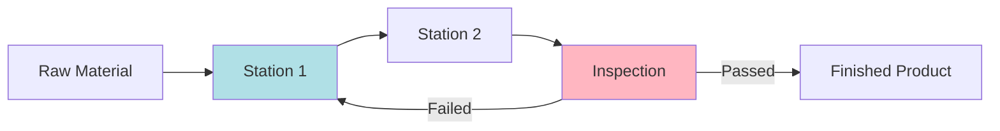
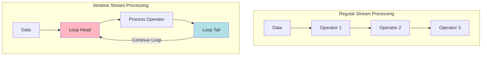
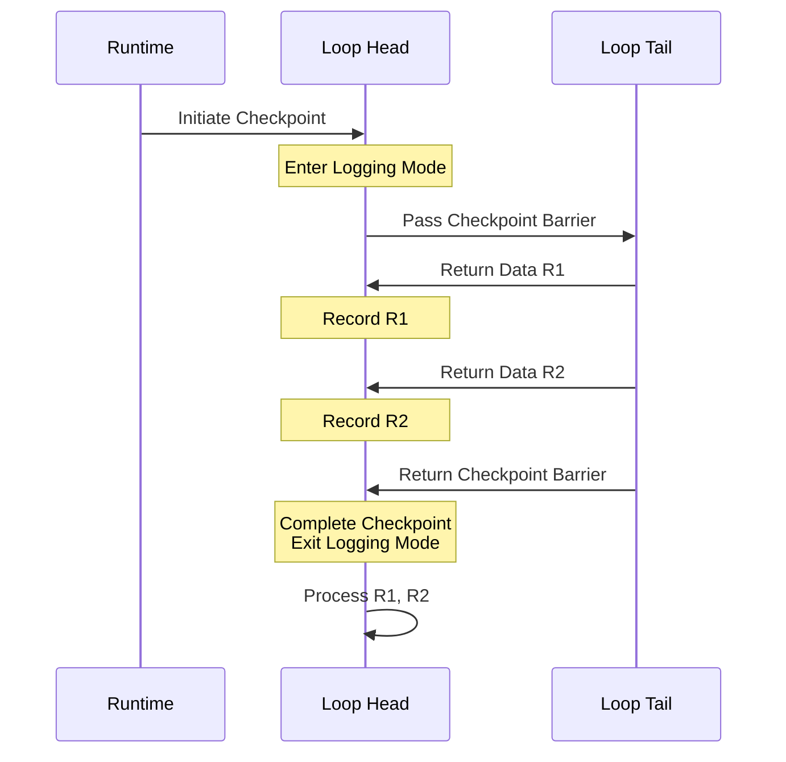

## Introduction

In some data processing scenarios, data needs to be processed multiple times to achieve the final result. For example, in machine learning training, the same batch of data needs repeated iterations to obtain the optimal model; in graph computation, multiple rounds of propagation are needed to get the final result. This cyclic processing pattern is also common in Flink's stream processing. However, if system failure occurs during iteration, how do we ensure data isn't lost or duplicated? This is the problem FLIP-16 attempts to solve.

## What's the Challenge?

### The Special Nature of Iterative Processing

Let's understand this problem with a simple analogy. Imagine a factory production line. Ordinary assembly lines are linear: raw materials enter from one end and emerge as finished products from the other end. But some special products might need repeated processing at certain stages, forming a circular production line.

In this circular production line, if the system needs to create a backup (called checkpoints in Flink), it faces a tricky problem: how to handle products currently in the loop?

### Limitations of Existing Solutions

In regular stream processing, Flink uses a method called "asynchronous barrier snapshots" to create checkpoints. It's like placing a marker on the assembly line and only backing up after all products before the marker are processed. But this method faces challenges in iterative processes:

Waiting for all data in the loop to finish processing before creating a checkpoint could take a very long time, possibly forever. It's like waiting for a never-ending game to finish.

## FLIP-16's Solution Approach

FLIP-16 proposed a clever solution. The core idea is: rather than waiting for all iterative data to complete processing, temporarily store it instead. Specifically:

1. When checkpoint begins, loop head enters "logging mode"
2. In logging mode, data returning from loop tail is recorded instead of being processed directly
3. After checkpoint completes, recorded data is reprocessed

This process can be shown in the following sequence diagram:

## Why Was This Proposal Abandoned?

Although this solution looked promising, it was ultimately abandoned for several reasons:

1. **Memory Consumption**: In logging mode, all returning loop data needs to be stored in memory. Large volumes of loop data could lead to memory exhaustion.

2. **Implementation Complexity**: Adding this special handling to the existing checkpoint mechanism would require modifying many core components, potentially affecting system stability.

3. **Runtime Overhead**: Frequent entering and exiting of logging mode, plus data recording and replay, would introduce significant performance overhead.

## Lessons from FLIP-16

Although this FLIP wasn't adopted, its exploration process provides valuable insights:

It highlights that data consistency in iterative stream processing remains a challenging technical problem.

The exploration process demonstrates the complexity of distributed system design - an apparently elegant solution may face unexpected challenges in practical application.

The case also shows that system design must consider not only functional correctness but also implementation feasibility and operational efficiency.

For scenarios requiring iterations in stream processing, current recommendations are:
- Try to convert iterative logic into batch-processable form
- Handle iteration interruption and recovery logic at the application level
- Or use other frameworks more suitable for iterative computation

## Summary

FLIP-16 attempted to solve a challenging problem in distributed stream processing: ensuring reliability in iterative data processing. Although its proposed solution was ultimately abandoned due to implementation difficulties and performance issues, the exploration process provided valuable reference for future research.
