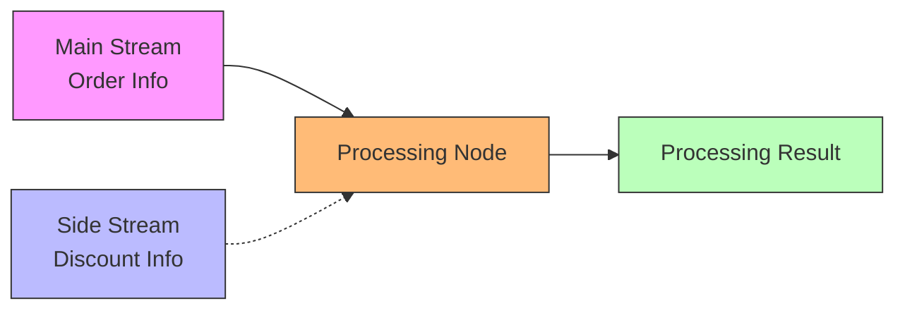
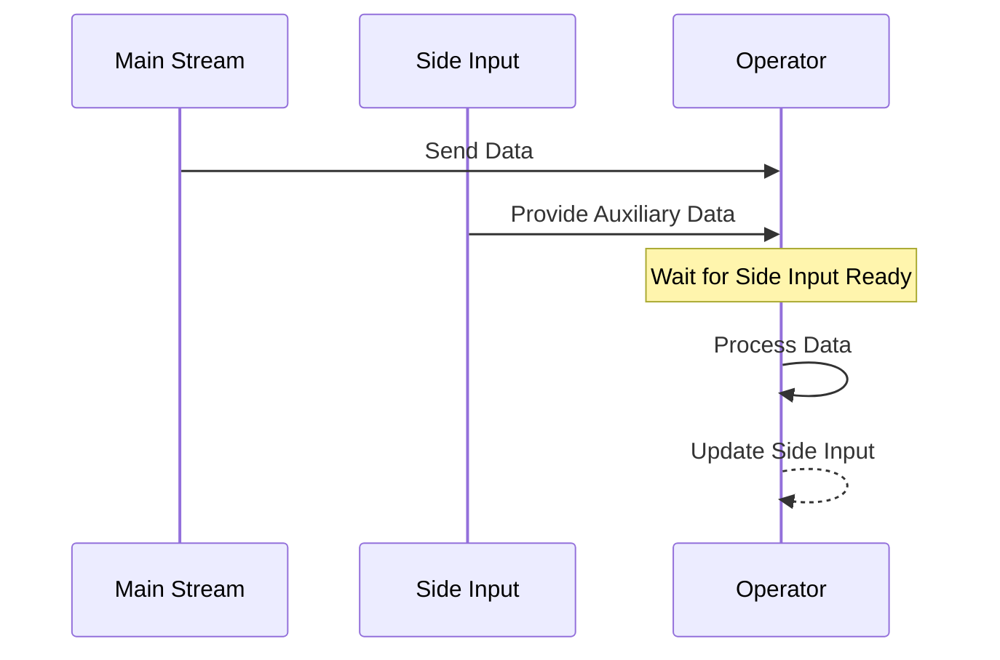

## Introduction

Imagine a factory assembly line: products rush by on the main line while reference materials like quality inspection manuals and parameter tables sit on nearby workbenches. Workers can consult these materials anytime while processing products. Similar scenarios exist in Flink's stream processing: when processing the main data stream, we often need to reference auxiliary data to guide the processing. This is the problem FLIP-17 aims to solve - adding side inputs functionality to the DataStream API.

## Why Do We Need Side Inputs?

Let's look at a concrete example: suppose we're processing an online store's order stream and need to calculate final prices based on different product discount information. The discount information is stored in another data stream and updates frequently. This requires the ability to access the latest discount information while processing orders.



This example demonstrates typical use cases for Side Inputs. It mainly solves four types of problems:

1. **Joining main stream with static data**
2. **Joining main stream with slowly changing data**
3. **Dynamic filtering and data enrichment**
4. **Window-based data joining**

## How Do Side Inputs Work?

Side Inputs work like reference material racks beside factory assembly lines, where workers can look up needed information at any time. The specific workflow is:



There are several key design aspects:

### 1. Data Waiting Mechanism

Like factory workers needing to wait for technical parameters and quality standards before starting processing, the system will:
- Buffer main stream elements
- Wait for Side Input data to be ready
- Then start processing

### 2. Storage Options

Three data storage methods are provided:
1. Reliable Storage - Like a factory's technical documentation library, with complete archived standards
2. Memory Cache - Like temporary parameter sheets at workstations, readily available but potentially losable
3. Complete Batch - Like waiting for a complete batch's quality inspection report, using data only when complete

## Usage Example

For instance, creating a real-time product recommendation system:

```java
// Main stream: user browsing records
DataStream<String> mainStream = ...
// Side Input: real-time product rating data
DataStream<String> sideStream = ...

// Create a Side Input wrapper
SingletonSideInput<String> productRatings = 
    new SingletonSideInput<>(sideStream);

// Use Side Input in main processing logic
mainStream
    .filter(new RichFilterFunction<>() {
        boolean filter(String product) {
            // Get real-time product rating
            String rating = getRuntimeContext()
                .getSideInput(productRatings);
            // Filter based on rating
            return shouldRecommend(product, rating);
        }
    }).withSideInput(productRatings);
```

## Current Status

This FLIP is still under discussion, facing two main technical challenges:

1. **Data Buffering Issue**:
Current design buffers main stream elements until Side Input is ready. This could cause excessive memory pressure.

2. **Network Stack Limitations**:
Another approach is blocking input until data is ready, but the existing network stack doesn't support "partial blocking" (blocking one input but not another).

Current development progress is shown in the following table:

| Phase | Status | Notes |
|-------|--------|-------|
| Design Discussion | In Progress | Discussing various implementation options |
| Basic Framework | Not Started | Waiting for design finalization |
| Core Features | Not Started | Planned two-phase implementation |
| Window Support | Not Started | Second phase feature |

## Design Trade-offs

There are three implementation options:

1. Reuse dual-input operator
2. Manage at StreamTask level
3. Support N-ary input

Each approach has its pros and cons:

| Approach | Advantages | Disadvantages |
|----------|------------|---------------|
| Reuse TwoInputStreamOperator | Simple implementation, easy to prototype | Limited extensibility |
| StreamTask Management | Clean interfaces | Increases system complexity |
| N-ary Input | High flexibility, good extensibility | Complex implementation |

## Summary

Side Inputs will bring more flexible data processing capabilities to Flink's stream processing. Like a factory assembly line equipped with not just the main production line but also various reference materials and auxiliary tools, making the entire production process more efficient and precise. Although this feature is still under development, it demonstrates Flink's continued efforts to enhance stream processing capabilities.
