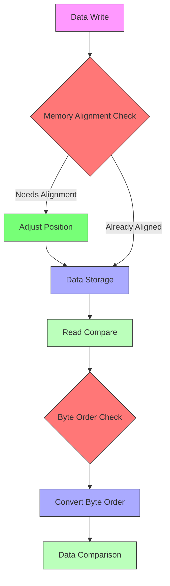
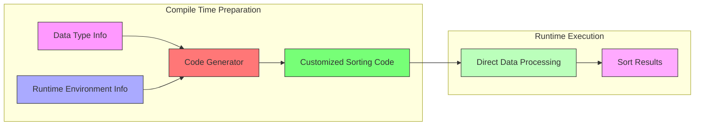

## Introduction

Imagine an industrial production line that needs to sort different types of products according to specific specifications. Using a single general-purpose sorting machine to handle all products, measuring dimensions and adjusting parameters each time, is clearly inefficient. A better approach would be to create specialized sorting equipment for each product type, with parameters pre-set and ready to work. Before Flink 1.2.0, all data sorting used the same generic sorter (NormalizedKeySorter), like that general-purpose sorting machine needing constant adjustments. FLIP-18's goal is to use code generation technology to "customize" specialized sorting code for different data types, making sorting more efficient.

## Limitations of Existing Sorting Solution

In Flink 1.2.0, all sorting operations used NormalizedKeySorter. This was like using a universal sorting tool, applying the same process whether sorting letters, packages, or files. Specifically, the original sorting process worked like this:

When data needed sorting, the system would first write it to memory segments (MemorySegment). To ensure correct data storage and comparison, a series of checks were needed for each write and read operation:



This design had several obvious limitations:

First, inefficient memory operations. Each data copy and swap operation required checking memory boundary alignment. It's like measuring door width every time you move furniture when these dimensions could be known in advance. Alignment checks for Unsafe.copyMemory consumed unnecessary CPU time.

Second, cumbersome byte order handling. Flink stored data in big-endian format, but most modern computers use little-endian. This required frequent byte order conversions during data comparison. Given quicksort's comparison count, data might need O(log n) conversions, wasting resources.

Third, limitations of generic code. To handle various data types, the code included many conditional checks and generic processing logic. Like using a Swiss Army knife for all tasks - flexible but inefficient. For example, loops for fixed-length data could be unrolled, but generic code couldn't achieve this.

## Solution

FLIP-18 proposed a brilliant idea: instead of using generic code, "tailor" code according to actual situations. It's like preparing specialized tools for each task rather than using a generic toolbox.



Several clever optimizations were implemented. First, customized data copy operations were created, generating fixed-length copy code based on data size instead of using a generic copy method, eliminating memory alignment checks and greatly improving data swap efficiency.

Second, byte order handling was optimized. Instead of frequent byte order conversions during data comparison, conversions now happen during data serialization. This simple change reduced conversion operations from O(n log n) to O(n), significantly reducing sorting overhead.

Third, many unnecessary calculations were eliminated. For example, division and modulo operations were replaced with more efficient bit operations, and some loops were unrolled to reduce branch predictions. These detailed optimizations combined made the entire computation process more efficient.

## Results

Test data showed impressive results:

| Optimization | 10,000 Records | 100,000 Records | 1,000,000 Records |
|-------------|---------------|-----------------|------------------|
| Original | 4.70 ms | 61.53 ms | 609.00 ms |
| Optimized Swap | 3.34 ms | 49.88 ms | 471.30 ms |
| Little Endian | 4.20 ms | 56.15 ms | 578.14 ms |
| Loop Unrolling | 4.29 ms | 53.59 ms | 605.32 ms |

The data shows that swap operation optimization had the most significant effect, improving performance by about 20-25%. Byte order optimization brought 5-10% improvement. Loop unrolling showed some effect but not as pronounced as the first two.

Additionally, division operation optimization showed these comparative results:

| Optimization | 10,000 Records | 100,000 Records | 1,000,000 Records |
|-------------|---------------|-----------------|------------------|
| Original | 4.34 ms | 61.79 ms | 582.88 ms |
| Optimized | 3.00 ms | 35.90 ms | 386.95 ms |

This optimization showed even more significant results, improving performance by about 30-40%.

## Technical Implementation Details

Code generation optimization involved improvements across multiple technical layers, mainly including:

### 1. Code Generation Framework Design

Using ASM (Java bytecode manipulation framework) to dynamically generate classes, primarily generating three component types:
```java
// 1. Specialized comparators
public class GeneratedComparator {
    // Optimized comparison logic for specific types
    public int compare(Object o1, Object o2) {
        // Direct field access
        // Avoid reflection overhead
    }
}

// 2. Optimized serializers
public class GeneratedSerializer {
    // Type-specific serialization logic
    public void serialize(Object obj, DataOutput out) {
        // Write with predefined byte order
        // Avoid runtime byte order conversion
    }
}

// 3. Customized sorters
public class GeneratedSorter {
    // Combine optimized comparison and serialization logic
    // Implement efficient sorting algorithm
}
```

### 2. Memory Access Optimization

Generated optimized code for memory segment operations:

```java
// Before optimization: generic access
public long getValue(MemorySegment segment, int position) {
    // Check alignment every time
    checkAlignment(position);
    // Possible byte order conversion
    return Long.reverseBytes(segment.getLong(position));
}

// Generated optimized code
public long getValueOptimized(MemorySegment segment, int position) {
    // Alignment ensured at compile time
    // Direct memory access, avoid overhead
    return UNSAFE.getLong(segment.getBaseObject(),
                         segment.getBaseOffset() + position);
}
```

### 3. Loop Optimization

Generate unrolled loop code for known-length data processing:

```java
// Before: generic loop
for (int i = 0; i < length; i++) {
    result += data[i];
}

// After: unrolled loop
// Assuming length is multiple of 8
result += data[0];
result += data[1];
result += data[2];
result += data[3];
result += data[4];
result += data[5];
result += data[6];
result += data[7];
```

## Current Status

This improvement has been implemented and merged into the Flink codebase. By establishing a code generation framework, it can now automatically select the most appropriate optimization strategy for different scenarios. Performance monitoring mechanisms have also been added, making the sorting process not only faster but also easier to tune.

## Summary

FLIP-18 achieved significant sorting performance improvements in Flink through clever use of code generation. It's like replacing generic tools with specialized ones, each crafted for specific tasks. Although implementation was complex, the performance improvements justified the effort. This improvement also provided valuable experience for applying code generation techniques in other areas of Flink.
