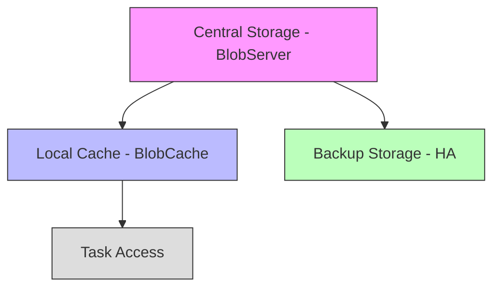
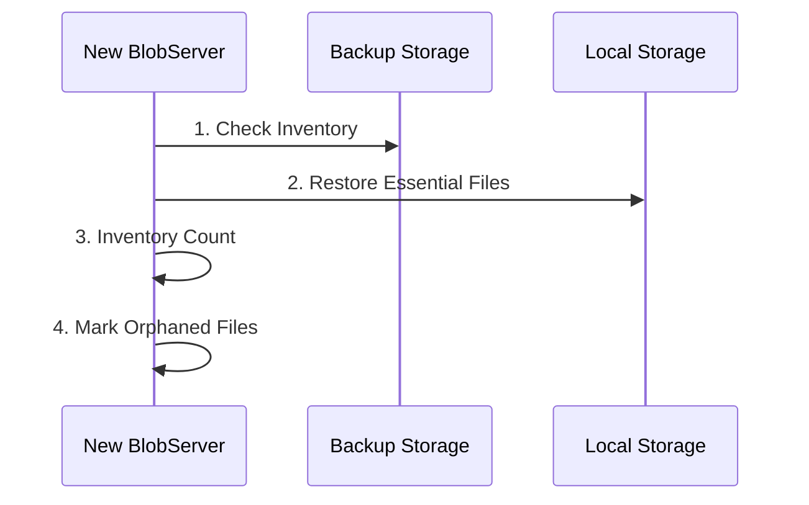
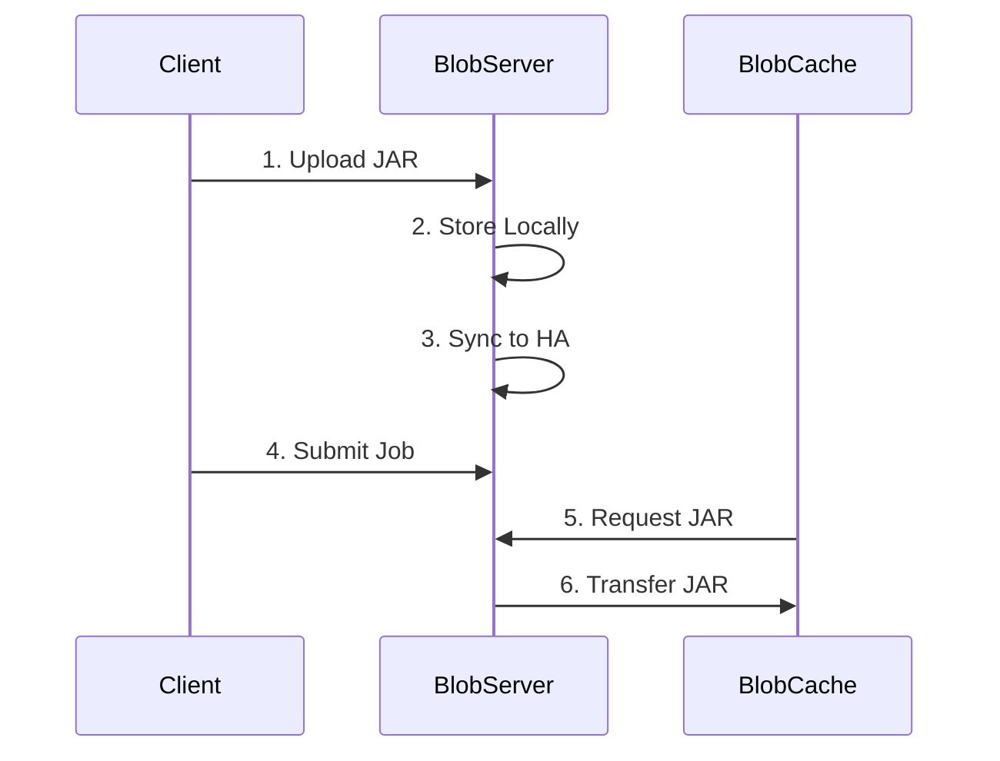

## Introduction

Imagine managing a warehouse for a large shopping mall. This warehouse stores various items - from product manuals to delivery slips, from product images to transaction records. Over time, several issues emerge: sometimes the same file is stored multiple times; sometimes files that are no longer needed continue occupying space; worse yet, sometimes file contents are accidentally modified without anyone noticing. These issues make warehouse management chaotic and inefficient.

In Apache Flink, the BLOB (Binary Large Object) storage system is like such a warehouse, responsible for managing various binary files. These files might be user-uploaded JAR files, large messages passed between tasks, or TaskManager log files. Before Flink 1.4, this "warehouse" faced similar issues.

## Major Improvements

Let's understand the new BLOB storage architecture through diagrams:

### 1. File Verification Upgrade

Like anti-counterfeit tags in stores, the new system performs checksum verification when reading or copying files. This ensures file contents haven't been accidentally modified, improving system reliability.

### 2. Reference Counting and Smart Cleanup

Imagine a store's inventory management system where product usage status needs real-time tracking and updating. The new BLOB storage system employs smart reference counting to accurately track each file's current usage. When the system detects a file is no longer used by any task, instead of immediate deletion, it waits for a period. During this time, if new tasks need the file, it's retained. It's like a store's "near-expiry products section" where products aren't discarded immediately upon expiration but observed for a while in a special area.

### 3. Layered Storage Design

The new BLOB storage system adopts a layered storage system similar to large chain stores. It includes three core components:
- Central warehouse (BlobServer) for unified management and backup
- Branch warehouses (BlobCache) for local quick access
- Logistics team (BlobClient) for coordinating between warehouses

### 4. High Availability Recovery Mechanism

When a new BlobServer takes over, it follows four steps:
1. Examines backup storage inventory
2. Restores essential files to local storage
3. Performs comprehensive file inventory
4. Marks "orphaned" files for later cleanup

### 5. File Classification and Lifecycle

Different file types have different lifecycle management approaches:

| File Type | Usage | Lifecycle Management |
|-----------|-------|---------------------|
| JAR Files | Program Code | Aligned with job lifecycle |
| RPC Messages | Task Communication | Short-term, delete after use |
| Log Files | System Monitoring | On-demand storage, timely cleanup |

## Real-World Scenarios

### Scenario 1: Submitting New Jobs

### Scenario 2: Large RPC Message Transfer

When TaskManagers need to exchange large messages:
1. Sender stores message content in BlobServer
2. Receiver downloads content from BlobServer
3. Reference count decreases after processing
4. Messages enter cleanup queue when all receivers confirm completion

### Scenario 3: Log Viewing

Web UI log viewing process:
1. Web UI initiates log view request
2. TaskManager uploads logs to BlobServer
3. Web UI downloads and displays logs
4. Temporary files cleaned up after viewing

## Technical Tips

For Flink 1.4 and later versions, these improvements are enabled by default. Important considerations:

- `blob.retention.interval` parameter defaults to 30 minutes (reduced from 1 hour)
- Reserve at least double the expected BLOB total size for TaskManager storage
- Ensure sufficient HA storage space for high availability mode

## Summary

FLIP-19 completely overhauled Flink's BLOB storage system, introducing file verification, smart reference counting, and layered storage design. Like a modern intelligent warehouse, it ensures both file safety and efficient space management. The improvement resolves concurrency and cleanup issues in the original architecture while laying groundwork for future extensions (like large RPC message handling). Now a standard feature in Flink 1.4 and later versions, it provides robust support for Flink's stable operation.
