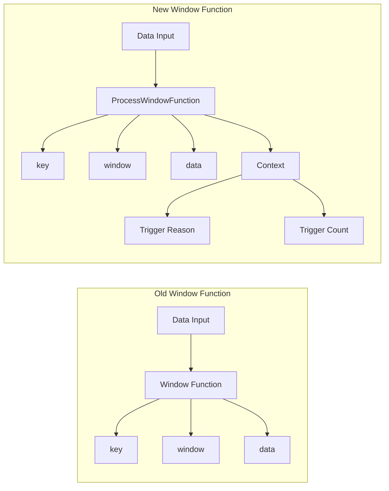
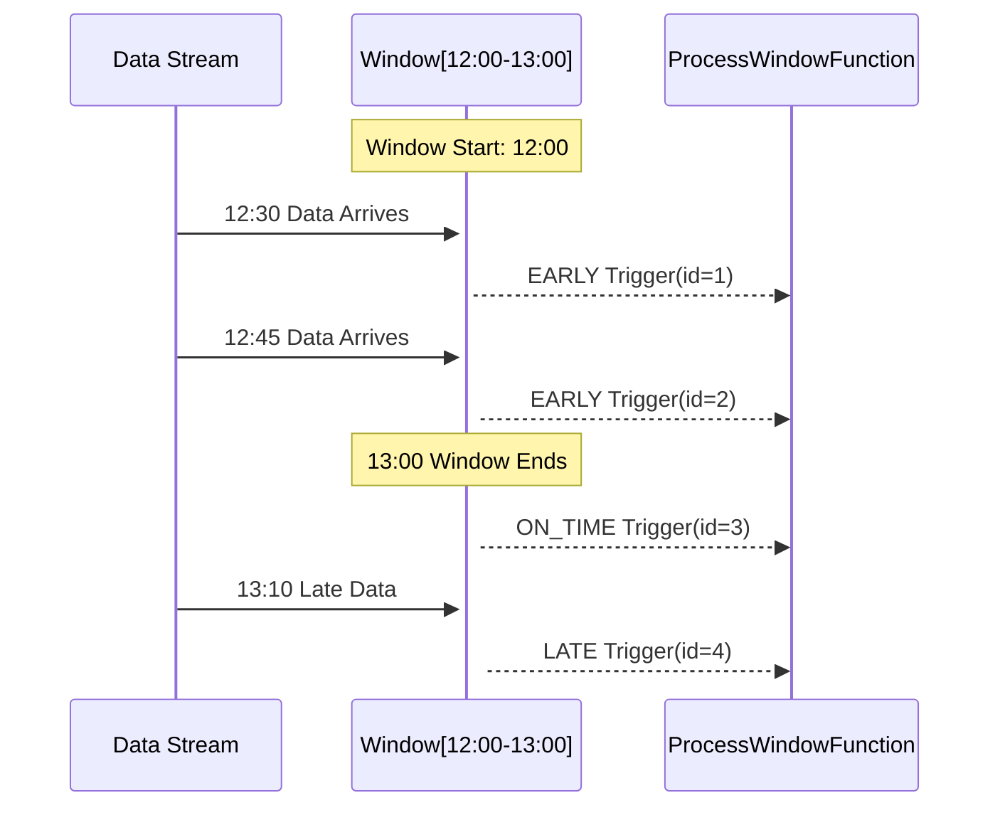

## Introduction

Have you ever been in this situation: As a class teacher, you need to track student attendance every hour. The current system only tells you "how many students are present this hour," but you might also want to know: "Did any students arrive late?" "How many times have we counted attendance for this hour?"

A similar situation exists in Flink's window processing. Current window functions only know "what data is in the window" but don't know "whether this data arrived on time or late" or "how many times this window has been processed." FLIP-2 aims to solve this "can't see the forest for the trees" problem by giving window functions access to more contextual information.

## What Was Wrong with the Old Approach?

The current window function (WindowFunction) has very limited access to information, like an incomplete report:

### Problem 1: Limited Information
Currently, window functions only know three things:
1. Which window triggered (like "the period from 1 PM to 2 PM")
2. What's the key for this window (like "Math class")
3. What data is in the window (like "list of present students")

### Problem 2: Lack of Context
Just as teachers want to know not just "who's here" but also "who's late," we need more information during window processing. We want to know if the data arrived on time or late, whether the computation was triggered naturally by time or prematurely for other reasons. We also want to know how many times this window has been processed before.

This information is crucial in real-world applications. For example, in e-commerce systems, we need to distinguish between normal orders and delayed orders; in monitoring systems, we need to know how many times an alarm has been triggered; in data analysis, we need to clearly mark which data is historical backfill. All these scenarios require window functions to provide more contextual information.

## How Does FLIP-2 Solve This?

Let's first look at a comparison between the old and new approaches:



FLIP-2's solution is clever and includes two innovations:

### Step 1: Design a New Window Processing Interface

First, FLIP-2 designed a new interface called ProcessWindowFunction, with its main feature being the introduction of a "context" object. It's like giving each class teacher a smart assistant who not only knows "who's here" but can tell you much more information.

This new interface is very flexible and can add new functionality at any time, just like how a smart assistant can be upgraded to provide more information.

### Step 2: Add More Contextual Information

FLIP-2 plans to add two important types of information in this new interface:

1. **Window Trigger Reasons**
   - ON_TIME: Data arrived and processed on time
   - EARLY: Results needed earlier for some reason
   - LATE: Processing late-arriving data

2. **Window Trigger Count**
   - Each trigger is given a sequence number
   - Helps track how many times a window has triggered
   - Useful for distinguishing different processing batches

Let's understand different window trigger scenarios through a sequence diagram:



Let's explain this sequence diagram in detail:

1. First, a time window is created starting at 12:00, responsible for processing data between 12:00 and 13:00.

2. At 12:30, the first batch of data arrives. Sometimes we can't wait until the window ends to see results, like in real-time monitoring systems where we want to detect anomalies early, or in real-time dashboards where we need to show current statistics quickly. So the system supports early computation triggers (EARLY trigger), marking this trigger with id=1. This is like a teacher taking attendance mid-class to quickly identify if attendance is too low.

3. At 12:45, new data arrives. The system triggers another early computation (EARLY trigger), this time with id=2. This is like the teacher taking attendance again.

4. When the time reaches 13:00, the window officially ends. The system performs a normal trigger (ON_TIME trigger) with id=3. This is equivalent to the teacher taking final attendance at the end of class.

5. Interestingly, at 13:10, some more data arrives. Although the window has ended, the system still processes this late data (LATE trigger) with id=4. This is like recording students who arrived late.

Through this example, we can see the power of the new window function: it not only knows the data content but can also distinguish when data arrived (on time or late) and record processing counts, making data processing more flexible and intelligent.

## How Is It Implemented?

The implementation mainly consists of two parts:

1. **New Interface Design**:
   ```java
   public abstract class ProcessWindowFunction<IN, OUT, KEY, W extends Window> {
       public abstract void process(KEY key, Context ctx, Iterable<IN> elements, 
           Collector<OUT> out);
       
       public abstract class Context {
           public abstract W window();    // Window info
           public abstract int id();      // Trigger count
           public abstract FiringInfo firingInfo();  // Trigger reason
       }
   }
   ```

2. **Internal Implementation Changes**:

While maintaining compatibility with old interfaces, we added counters to track trigger counts and used watermark checking to determine data arrival status. This design ensures backward compatibility while providing new functionality.

## What Benefits Does It Bring?

These improvements bring tangible benefits to Flink. First, data processing becomes more fine-grained - we can now treat data differently based on arrival time: special handling for late data, distinguishing between normal and supplementary data, supporting more complex business scenarios.

Second, monitoring and debugging become more convenient. Through the new information, we can clearly know how many times each window has triggered and when data arrived. This information makes problem investigation easier, like having a detailed operation log.

Finally, system extensibility is improved. The new interface design is very flexible - future functionality can be added directly to the context without affecting existing code. This smooth upgrade capability makes system maintenance easier.

## Practical Usage Tips

Here are some practical suggestions for using FLIP-2's new features.

### 1. Choose Interfaces Wisely

Like prescribing medicine, you need the right treatment. If your business logic is simple and only needs basic window calculation functionality, continue using the original WindowFunction. But if you need more contextual information, like distinguishing late data, you should choose the new ProcessWindowFunction. Also, consider future requirements when choosing - if you might need more functionality later, it's recommended to use the new interface directly.

### 2. Make Good Use of Trigger Information

These new trigger details are like data "ID cards," telling us the story behind each piece of data. We can use trigger reasons to distinguish different data situations and trigger counts for version management. For late data, design processing strategies in advance - whether to discard or handle specially should be based on business requirements.

### 3. Balance Performance Overhead

Like upgrading to a higher-spec phone, new features inevitably bring some additional overhead. This contextual information will use some storage space, so balance information completeness with system performance. It's recommended to set reasonable cleanup policies and periodically clear unnecessary state data to prevent state accumulation.

## Summary

FLIP-2 is like installing a "holographic projector" on window functions, allowing them to see more complete information. Not just "what happened," but also "why it happened" and "how many times it happened."

Such improvements are crucial for building more intelligent data processing systems. Just as a good teacher needs to know not only if students are present but also understand their attendance patterns and learning performance, a good window processing system needs to grasp more comprehensive information.

Although these improvements might seem small, they open a new door for Flink's real-time processing capabilities. As the saying goes, "Details determine success or failure," FLIP-2 makes Flink's window processing more powerful and intelligent through these detailed improvements.
