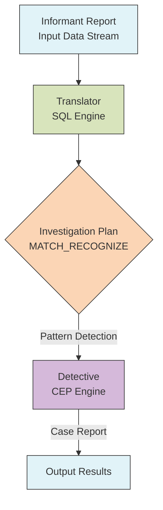
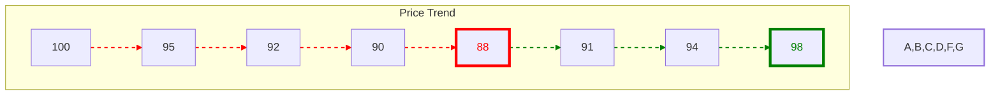

## What is CEP?

CEP (Complex Event Processing) is like a magnifying glass in the data world, capable of discovering specific event sequences in continuous data streams. For example: a mall wants to identify customers with "three consecutive failed purchases" to provide timely assistance, banks need to detect "multiple small withdrawals in a short time" as suspicious behavior, and e-commerce platforms need to find products with "sudden significant price fluctuations". All these require CEP. It's not about finding single events, but sequences of events matching specific patterns.

## Introduction

Imagine data as crowds flowing through a bustling city. In this data city, there's an experienced detective called CEP (Complex Event Processing). This detective excels at finding specific behavior patterns in the crowd - like discovering suspicious activity patterns. But there's a problem: to engage this detective's services, you need to write a lot of complex instructions (Java code).

Now enters a talented translator called SQL. With this translator, you just need to describe the pattern you're looking for in simple language, and the detective immediately understands and starts the investigation. This is what FLIP-20 aims to achieve: letting SQL and CEP team up to solve cases, making data queries both simple and powerful.

## Why Need This Collaboration?

Just like solving cases requires collaboration, data analysis needs different technologies working together. Detective CEP excels at finding complex behavior patterns, while translator SQL is good at expressing requirements in simple language. Together, they make data investigation work twice as effective.



Looking at this diagram is like seeing a complete investigation process: informants (data sources) provide intelligence, the translator (SQL) organizes it into an investigation plan, hands it to the detective (CEP) for analysis, and finally produces a case report. This is a perfect example of SQL and CEP collaboration.

## Investigation in Action: How Does It Work?

Let's look at a specific case: suppose you're a financial detective looking for "V-shaped" suspicious trading patterns in the stock market - where prices continuously fall then rise. This pattern might indicate market manipulation. Previously requiring manual monitoring, now with the SQL-CEP partnership, you just need to write an investigation plan like this:

```sql
SELECT *
FROM Ticker MATCH_RECOGNIZE (
     PARTITION BY symbol
     ORDER BY tstamp
     MEASURES  STRT.tstamp AS start_tstamp,
               LAST(DOWN.tstamp) AS bottom_tstamp,
               LAST(UP.tstamp) AS end_tstamp
     ONE ROW PER MATCH
     AFTER MATCH SKIP TO LAST UP
     PATTERN (STRT DOWN+ UP+)
     DEFINE
        DOWN AS DOWN.price < PREV(DOWN.price),
        UP AS UP.price > PREV(UP.price)
     ) MR
ORDER BY MR.symbol, MR.start_tstamp;
```

Sample input data (stock prices at different times):
```
symbol    tstamp         price
APPLE     09:00:00      100
APPLE     09:01:00      95
APPLE     09:02:00      92
APPLE     09:03:00      90
APPLE     09:04:00      88
APPLE     09:05:00      91
APPLE     09:06:00      94
APPLE     09:07:00      98
APPLE     09:08:00      96
```

SQL execution output:
```
symbol  start_tstamp  bottom_tstamp  end_tstamp
APPLE   09:00:00     09:04:00       09:07:00
```

This result tells us:
- Pattern starts at 09:00:00 (price 100)
- Price continues falling until bottom at 09:04:00 (price 88)
- Then rises until 09:07:00 reaching period high (price 98)
- Forming a complete V-pattern

Price change visualization:


Red lines indicate downward trend, green lines indicate upward trend. Red number is lowest point, green number is highest point.

Let's decode this investigation plan step by step:

1. `PARTITION BY symbol`: Group by stock code, investigate each stock separately
2. `ORDER BY tstamp`: Sort by timestamp, ensure events are analyzed in chronological order
3. `MEASURES` clause defines data to extract from matches:
   - `STRT.tstamp AS start_tstamp`: Timestamp of first matching event
   - `LAST(DOWN.tstamp) AS bottom_tstamp`: Timestamp of last DOWN pattern, the V-pattern's bottom
   - `LAST(UP.tstamp) AS end_tstamp`: Timestamp of last UP pattern, end of entire V-pattern
4. `ONE ROW PER MATCH`: Output one row for each match found
5. `AFTER MATCH SKIP TO LAST UP`: After finding a V-pattern, continue searching from last rise
6. `PATTERN (STRT DOWN+ UP+)`: Defines complete V-pattern:
   - `STRT`: Starting point
   - `DOWN+`: One or more consecutive drops
   - `UP+`: One or more consecutive rises
7. `DEFINE` section specifies exact conditions:
   - `DOWN AS DOWN.price < PREV(DOWN.price)`: Current price lower than previous is a drop
   - `UP AS UP.price > PREV(UP.price)`: Current price higher than previous is a rise

## Behind the Scenes: Implementation Details

Like a police system needs various departments, this feature's implementation requires several key modules:

| Module | Responsibility | Implementation Status |
|--------|---------------|---------------------|
| SQL Parser | Parse MATCH_RECOGNIZE syntax | Completed |
| Pattern Compiler | Convert SQL patterns to CEP patterns | Completed |
| Runtime Matcher | Execute actual pattern matching | Completed |
| Result Generator | Generate matching results | Completed |

## Usage Recommendations

When designing patterns, always follow the principle of simplicity. Complex pattern definitions not only increase system computational overhead but can also make maintenance difficult. For complex business requirements, it's better to break them down into multiple simple patterns, process them separately, then combine results. This improves system performance and makes code easier to understand and maintain.

Partition strategy choice significantly impacts performance. When choosing partition keys, consider business characteristics and data distribution. Good partitioning can fully utilize system parallel processing capabilities, while improper partitioning may cause data skew and affect performance.

Time window configuration needs to balance data completeness and system resource consumption. Too small windows might miss patterns, while too large windows consume excessive resources. Set appropriate time ranges based on specific business scenarios and configure reasonable state cleanup mechanisms.

## Summary

With this "detective duo" combination, complex data analysis that previously required extensive coding can now be done with a simple SQL query. Like Holmes having Dr. Watson, making investigation work both professional and understandable.

This feature has been production-ready since Flink 1.7. As technology continues to evolve, more powerful features will likely be added. Whether for financial analysis, risk control, or business monitoring, SQL-turned-detective can help you find important clues hidden in data streams.
