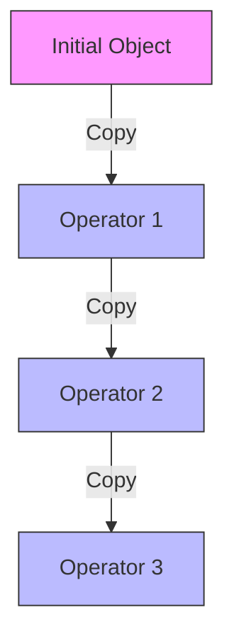
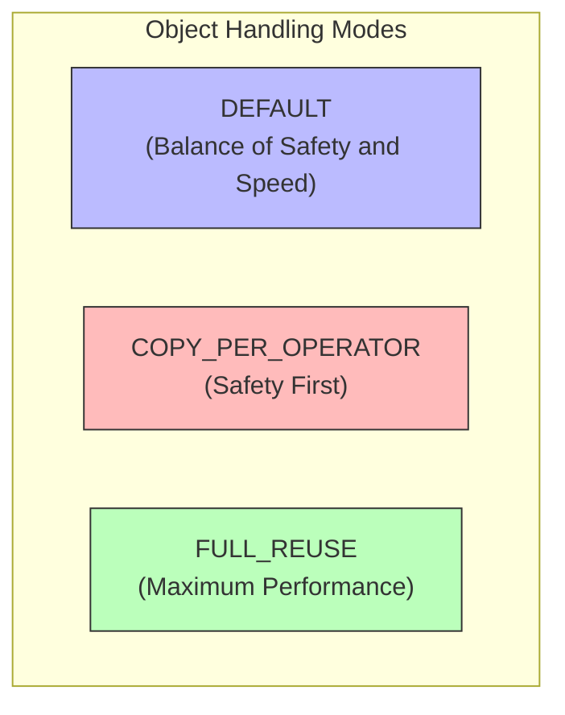

## Introduction

Imagine a delivery service where couriers repackage every parcel at each transfer station. Sure, it's safe - you know the package is well-protected - but isn't it inefficient? This is exactly what's happening in Flink's streaming runtime: data gets copied every time it moves between chained operators. FLIP-21 aims to fix this inefficiency while maintaining data integrity.

## What's Wrong with the Current Design?



Looking at this diagram, you can see how data is copied between each operator. This design was originally implemented for safety reasons, particularly to prevent issues with mutable objects when state backends store objects on the heap. It's like that overly cautious courier who insists on repackaging at every station just to be absolutely sure nothing gets damaged.

The current approach has several issues:

| Issue | Impact |
|-------|---------|
| Performance Hit | Copying objects is expensive, especially for complex types like Avro, Thrift, and JSON |
| Unnecessary Work | Keyed operations after shuffles don't need copies since they're first in the chain |
| API Inconsistency | DataSet API doesn't copy at each step, creating confusion |
| Misleading Config | The `enableObjectReuse()` option name is confusing as it doesn't actually reuse objects |

## The Proposed Solution

To address these issues, FLIP-21 introduces three different modes for handling objects:




Let's break down these three modes:

The DEFAULT mode creates new objects only during deserialization, then passes them along without copying. Think of it as using better packaging from the start so you don't need to repackage at every stop. This will become the new standard for both DataStream and DataSet APIs.


The COPY_PER_OPERATOR mode is like our current overly cautious courier - copying data between each operator. It's very safe but slower.


The FULL_REUSE mode is the speed champion - reusing objects whenever possible. It's like having a single container that gets refilled with new content at each stop. Fast, but you need to be careful about how you handle the contents.


## Current Status and Migration Plans

This FLIP is currently under discussion, with two main aspects being considered:

First, there's the migration strategy question. Two approaches are on the table:
- Switch directly to DEFAULT mode and document the change
- Use COPY_PER_OPERATOR for jobs upgraded from pre-1.4 versions

The community seems to favor the first approach. While it's a bigger change upfront, it's cleaner in the long run.

Second, there's the question of handling existing applications that might rely on the current copying behavior. However, since these cases are rare and can still use the old mode through configuration, this isn't seen as a major hurdle.

## Current Version Configuration related Options

One key configuration option related to object handling is `pipeline.object-reuse`. Think of it as a switch that controls whether Flink reuses the delivery containers (objects) for deserialization and passing data to user functions. By default, this switch is turned off (`false`) for safety.

```yaml
pipeline.object-reuse: false  # Default setting
```

When you flip this switch on (`true`), Flink will reuse objects internally for better performance - like reusing delivery containers instead of getting new ones each time. However, just like how reusing containers requires careful handling to avoid mixing up contents, this setting requires careful consideration:

| Consideration | Description |
|--------------|-------------|
| Performance Gains | Reduces object creation and garbage collection overhead |
| User Code Impact | Functions must handle object reuse properly |
| Reference Validity | Object references aren't guaranteed valid beyond function calls |
| Testing Required | Thorough testing needed before enabling in production |

Think of it as upgrading from single-use packaging to reusable containers - it's more efficient but requires proper handling protocols to be in place.

## Summary

This optimization is like upgrading a delivery system: instead of repackaging at every station, we use better packaging from the source. By introducing three object handling modes (DEFAULT, COPY_PER_OPERATOR, and FULL_REUSE), users can choose the right balance between performance and safety for their needs.

Currently, this improvement is still under discussion, but the community response has been positive. It's like giving Flink a pair of lightweight running shoes - making data transfer between operators more nimble and efficient, while still maintaining the option to use safety gear when needed.
