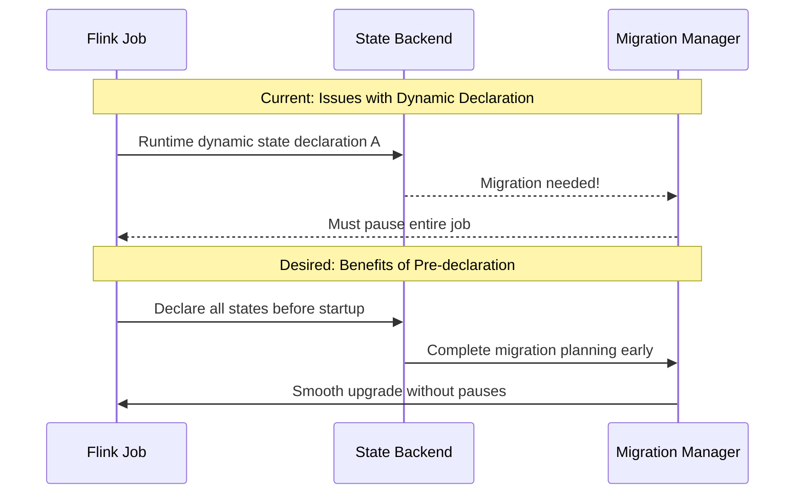
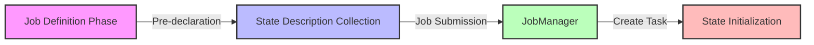

## Introduction

In programming, there's a fundamental principle: declare what you need before using it. However, in Flink's early state management, you could "use as you go" - meaning states could be dynamically declared and used at any time. While this flexibility was convenient, it brought several challenges. FLIP-22 addresses these issues by proposing a more structured state declaration approach.

## What Problems Exist Now?

The current state declaration method is like "building a house as you walk." Programs can declare and use states anytime during runtime through `getRuntimeContext().getState(descriptor)`. While this approach seems flexible, it introduces three major problems:

### Problem 1: Difficult State Migration and Version Upgrades
Imagine trying to upgrade a system without knowing the layout of all rooms - it would be a nightmare. Similarly, Flink only knows whether state migration or version upgrades are needed when states are declared. If states are declared dynamically, the entire process needs to pause for migration, which is far from elegant.



### Problem 2: Limited State Query Functionality
In the current design, a state can only be queried after it's registered in the keyed state registry. This means states restored from checkpoints cannot be queried until they are redeclared. It's like having a file but being unable to locate it until it's re-registered.

### Problem 3: Incomplete JobManager Information
JobManager currently can't access complete state information, such as serialization methods or operator state distribution schemes. It's like headquarters being unclear about how branch offices operate, making it difficult to plan effectively.

## How Does FLIP-22 Solve These Problems?

FLIP-22 proposes a new state declaration approach with three main components:

### 1. Pre-declaration Mechanism

This new approach requires declaring all states before job submission. Here's how it works:



This mechanism is implemented through:
- Adding new state registration methods in StreamOperator and RichFunction interfaces
- Requiring state descriptors to be registered before job submission
- Restricting runtime access to only registered states

### 2. Annotation-based Syntax Sugar

To make code more concise and readable, FLIP-22 introduces annotations for state declaration:

```java
// Keyed state declaration example
@KeyedState(
    stateId = "myPojoListStateId",
    queryableStateName = "myPojoListStateQueryHandle",
    typeSerializerFactory = MyPojoSerializerFactory.class
)
private ListState<MyPojo> pojoListState;

// Operator state declaration example
@OperatorState(
    stateId = "myPojoListStateId",
    redistributeMode = OperatorStateHandle.Mode.BROADCAST
)
private ListState<MyPojo> pojoOperatorState;
```

This approach not only makes the code clearer but also automates state initialization.

### 3. Legacy Interface Handling

To ensure a smooth transition, existing dynamic declaration interfaces will be marked as deprecated but not immediately removed. It's like finding a better solution but providing a transition period rather than immediately demolishing the old structure.

## What Benefits Does This Bring?

The pre-declaration mechanism brings clear benefits, illustrated in this comparison:

| Feature | Old Approach | New Approach |
|---------|-------------|--------------|
| State Migration | Requires job pause | Early planning, smooth execution |
| State Queries | Await redeclaration | Immediately available |
| State Management | Incomplete JobManager info | Global view, easier management |
| Code Organization | Scattered | Centralized, clear |
| Operations Efficiency | Reactive | Proactive |

## Current Progress

This FLIP is still under community discussion. From the mailing list discussions, several concerns have emerged:

1. Completely prohibiting dynamic declaration might be too strict. Some scenarios genuinely need to create states dynamically based on runtime conditions, such as using different aggregation functions for different key types.

2. Special cases like WindowOperator need further consideration. These scenarios require more flexible state management mechanisms.

3. The annotation approach has limitations when handling states with function parameters, as Java annotations only support constant parameters.

## Summary

FLIP-22's state pre-declaration proposal is like drawing up blueprints before building a house. While it might seem less flexible than building at will, it makes the entire system more robust and maintainable.

Although the proposal is still under discussion and faces some technical challenges, its core principles - early planning and centralized management - are commendable. This improvement will enable new possibilities in Flink's state management, such as more powerful migration capabilities and enhanced query functionality.

Like all significant technical improvements, implementing this change requires finding the right balance between flexibility and maintainability. The ongoing discussions show that the community is carefully considering how to maintain Flink's powerful features while making the system more robust.
