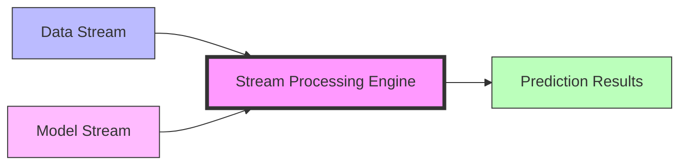
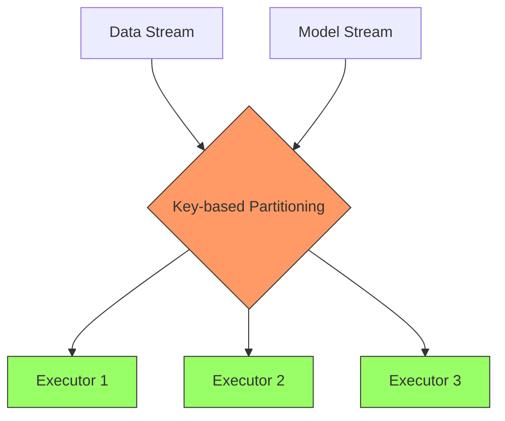
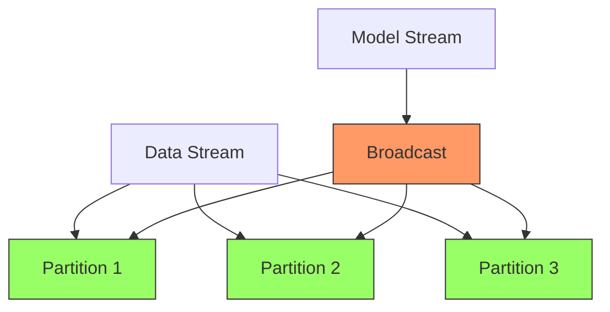
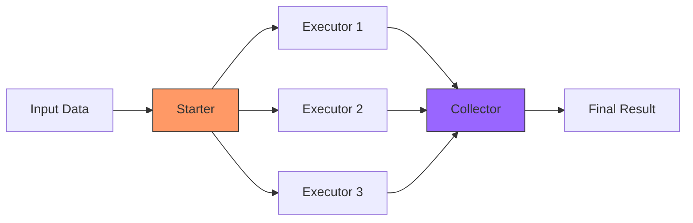

## Introduction

Imagine you're a restaurant owner with multiple master chefs in your kitchen, each with their unique cooking techniques and secret recipes (much like data scientists using different tools to train models). The challenge is: how do you standardize these unique dishes so that any waiter can accurately serve them to customers? More importantly, how do you ensure the restaurant service continues uninterrupted when chefs are improving their recipes?

This is a typical challenge in the machine learning field: data scientists (like chefs) use different tools to train models (create dishes), while engineers (like waiters) need to find a unified way to serve these models. FLIP-23 was an attempt to address this challenge by providing a unified "serving platform" within Flink.

## What Problems Was This Proposal Trying to Solve?

Modern machine learning applications face several interconnected challenges that make model deployment and management increasingly complex. The first major challenge comes from tool diversity. Data scientists today use a wide range of tools like TensorFlow, PyTorch, and scikit-learn to train their models. Each of these tools comes with its own deployment requirements, much like different brands of kitchen equipment requiring different operating procedures. This diversity forces engineers to learn and maintain multiple deployment systems, significantly increasing both maintenance costs and the risk of errors.

The second challenge revolves around model updates. In the fast-paced world of machine learning, models need frequent updates to adapt to new data patterns and changing business requirements. These updates must happen seamlessly, without interrupting the service - just like a restaurant can't close while changing its menu. When problems arise with new models, the system needs the ability to quickly roll back to previous versions to maintain service quality.

Scale brings another level of complexity to model deployment. In IoT scenarios, each device might need its own unique model, while in the telecom industry, different regions and user groups often require different models. This means the system needs to manage and serve thousands of models simultaneously, each with its own storage and loading requirements. The challenge isn't just about handling volume - it's about doing so efficiently and reliably.

Finally, there's the complex task of monitoring and management. A robust system needs to track each model's performance and health in real-time, quickly detect any anomalies, and collect comprehensive usage statistics. It also needs to support A/B testing to compare different models effectively, ensuring that model improvements actually benefit the end users.

## Core Design Concepts

Let's look at how this proposal addresses these challenges with its core design:

The design cleverly tackles each challenge through a comprehensive approach. At its heart is the dual stream design, which provides a unified interface for model publishing and deployment. This elegant solution allows models trained with different tools to be converted into a unified format, effectively solving the tool diversity problem. The system can perform hot updates through the model stream without service interruption, making model updates seamless and reliable.

The in-memory model design focuses on performance and availability. By keeping models in memory, the system achieves quick response times by avoiding loading overhead. When new models arrive, the system prepares them in memory and performs seamless transitions, ensuring continuous service. This approach is particularly efficient for large-scale deployments, as it only keeps active models in memory.

To handle different deployment scenarios, the system offers two complementary implementation approaches. The key-based join approach excels at managing many different model types efficiently, perfect for scale deployment scenarios. Meanwhile, the partition-based join approach optimizes for high-throughput scenarios through parallel processing, ensuring optimal performance under heavy loads.

The design also incorporates a comprehensive monitoring system that integrates seamlessly with Flink's existing capabilities. This system provides real-time visibility into model performance, supports detailed status queries, and facilitates easy A/B testing for model comparison, addressing the critical need for robust monitoring and management.

## Technical Implementation Details

The proposal designed two implementation approaches:

### Key-based Join

In this approach, data is routed to specific executors based on key values. Each executor handles a specific set of models, making it suitable for processing multiple types of data and models.

### Partition-based Join

In this approach, models are broadcast to all executors, with each executor processing a partition of the data stream. This method is suitable for high-throughput scenarios with a single model.

## Speculative Execution and Model Serving

In computer science, speculative execution is an optimization technique. Like a skilled chess player who thinks ahead about possible opponent moves and prepares for each scenario, computer systems with speculative execution prepare for potential tasks in advance - if the task is needed, the result is immediately available; if not, the result is discarded.

This technique is widely used in processor design and memory prefetching. For example, modern CPUs predict and execute likely next instructions to save time, and browsers pre-download links that might be clicked for instant page loading. In the big data processing field, Apache Spark applies this concept to address the "stragglers" (abnormally slow tasks) problem: when it detects that a task's execution speed significantly lags behind other tasks in the same stage, Spark launches a copy of that task and runs both instances in parallel, using the result from whichever finishes first. This fault-tolerance mechanism effectively reduces the impact of individual slow tasks on overall job completion time.

Based on this concept, the proposal introduced an interesting design - the speculative model serving mechanism. This mechanism adopts a multi-model parallel processing architecture:

In this architecture:
1. **Starter**: Receives input data and distributes it to multiple executors based on configuration.

2. **Executors**: Each executor can run different versions or types of models:
   - Different versions of the same model for A/B testing
   - Models of varying complexity for speed-accuracy balance
   - Different framework implementations for performance comparison

3. **Collector**: This key component:
   - Collects results from all executors
   - Selects final result based on predefined strategies
   - Records model performance data

This mechanism supports several advanced features:

1. **Intelligent Result Selection**:
   - Selects results with highest confidence
   - Supports majority voting mechanism
   - Dynamically adjusts weights based on historical performance

2. **Service Quality Assurance**:
   - Sets maximum wait time for timely responses
   - Falls back to simpler models if complex ones don't respond in time
   - Supports priority-based request handling

3. **Flexible Deployment Strategy**:
   - Supports canary releases with gradual rollout
   - Progressive updates based on performance
   - Quick rollback capability

4. **Performance Optimization**:
   - Hardware-specific model optimization
   - Result caching and reuse
   - Load balancing and resource optimization

## Why Was It Abandoned?

The FLIP was ultimately abandoned for several reasons:

1. **Framework Scope**: Model serving is a substantial topic that might be better suited as an independent project.

2. **Technical Disputes**: Disagreements over technical details like data serialization (ProtoBuf) and monitoring implementation.

3. **Maintenance Burden**: Supporting multiple ML frameworks and model formats would create significant maintenance overhead.

4. **Ecosystem Evolution**: The emergence of specialized systems like KServe and TensorFlow Serving made standalone model serving solutions more appropriate.

## Summary

Although FLIP-23 was abandoned, its concepts and solutions offer valuable insights:

1. The dual-stream architecture effectively solved the model hot-update challenge.
2. The speculative serving mechanism provided new ideas for high-reliability model serving.
3. The key-based and partition-based join implementations suited different application scenarios.

This FLIP's journey shows that sometimes good ideas may not be implementable due to practical constraints, but the thinking and design process can still provide valuable references. In the current machine learning ecosystem, using specialized model serving systems integrated with Flink might be a more practical approach.
