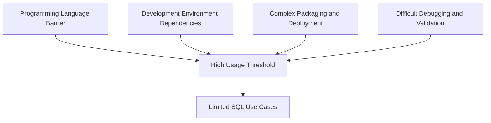
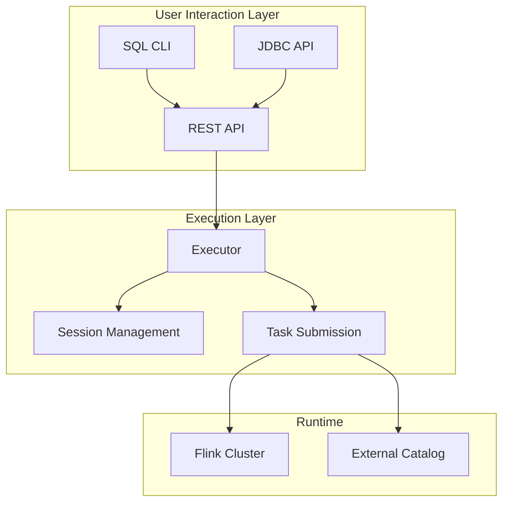

## Introduction

Imagine this scenario: A data analyst wants to analyze real-time data but doesn't know Java or Scala programming. Previously, they would need to find a developer to write code, package, and deploy it - a process that could take days. Now with SQL Client, they can simply open a command line, enter SQL statements, and get results in minutes. This is the transformation that FLIP-24 brings.

## Why Do We Need SQL Client?

Before SQL Client, using Flink's SQL functionality required:

1. Writing Java or Scala code
2. Embedding SQL statements in the code
3. Packaging the project with Maven
4. Submitting to the cluster for execution

This process had several obvious issues:



SQL should be a simple and user-friendly tool for data querying and analysis, but these limitations made it less accessible. Especially for non-programmers like data analysts and data scientists, these barriers significantly reduced their enthusiasm for using Flink.

## How Does SQL Client Solve These Problems?

SQL Client adopts two modes to meet different scenario requirements:

1. Embedded Mode focuses on simplicity and speed. It integrates the SQL CLI with the executor in the same process, allowing users to start quickly without launching additional components. This mode is particularly suitable for development and testing phases.

2. Gateway Mode targets production environment needs. It provides services through an independent SQL gateway process, supporting REST and JDBC interfaces, allowing multiple applications to connect simultaneously. This mode offers better scalability and manageability for enterprise applications.

Let's look at its overall architecture:



## What Features Are Implemented?

SQL Client's feature design thoroughly considers practical usage requirements:

### 1. Configuration Management System
The configuration management adopts a layered design, supporting the combined use of global and session configurations. Runtime parameters can be flexibly adjusted, and commonly used table sources and custom functions can be pre-registered, greatly improving usage efficiency.

### 2. Query Execution Mechanism
Query execution supports multiple modes, allowing both SELECT queries for real-time results and INSERT statements for writing data to external systems. The system can handle both batch and stream processing tasks, meeting different scenario requirements.

### 3. Result Processing
SQL Client not only provides multiple result processing modes but also implements intelligent result maintenance mechanisms.

First, there are three basic result processing modes:

| Mode | Use Case | Characteristics |
|------|----------|----------------|
| Internal Mode | Small Result Sets | Processed directly in memory |
| External Mode | Large Result Sets | Written to external storage systems |
| Custom Mode | Special Requirements | User-defined output methods |

For streaming query results maintenance, SQL Client provides two special view mechanisms:

1. Materialized View


Materialized views are primarily used for long-running production environment queries. They update results periodically based on Flink's checkpoint mechanism while maintaining data consistency during updates. The intermediate retraction operations during updates are invisible to external systems, ensuring data stability. External systems can access these results through JDBC or REST API, always getting a complete data snapshot. The view's update strategy is configurable, and its lifecycle is completely independent of the CLI client, meaning the view continues maintenance even if the client disconnects.

2. Materialized Result Stream


Materialized result streams focus on development and debugging scenarios. They show data changes in real-time, including new data insertions and existing data updates. All changes are presented in FIFO order, allowing developers to intuitively understand the data evolution process. This mode is tightly bound to the CLI session, automatically stopping when the session ends, effectively managing system resources.

These two mechanisms have distinct design philosophies: materialized views emphasize data consistency and availability, suitable for building end-user applications; materialized result streams emphasize immediacy and visibility, more suitable for debugging and validation during development. Through this distinction, SQL Client can provide the most appropriate result processing method in different scenarios.

### 4. Practical Usage Example

Here's a concrete example showing the SQL Client workflow:

1. First, start SQL Client:
```bash
./bin/sql-client.sh
```

2. Then configure the data source:
```sql
CREATE TABLE orders (
    order_id BIGINT,
    price DECIMAL(32,2),
    order_time TIMESTAMP(3)
) WITH (
    'connector' = 'kafka',
    'topic' = 'orders',
    'properties.bootstrap.servers' = 'localhost:9092',
    'format' = 'json'
);
```

3. Then execute queries:
```sql
SELECT 
    TUMBLE_START(order_time, INTERVAL '5' MINUTE) as window_start,
    COUNT(*) as order_count,
    SUM(price) as total_amount
FROM orders
GROUP BY TUMBLE(order_time, INTERVAL '5' MINUTE);
```

## Version Support

SQL Client was introduced in Flink 1.5 and has continuously evolved through multiple versions:

The core functionality when first introduced in Flink 1.5 included basic SQL CLI interface, streaming query support, and simple result display features. Subsequent versions added new features: Flink 1.6 added batch processing support; 1.7 introduced user-defined function support; 1.8 improved result display mechanisms; 1.9 added session management capabilities; and in 1.17, materialization mechanism support was introduced, including both materialized views and materialized result streams, providing more flexible result processing methods. This gradual feature evolution ensures system stability and usability.

## Summary

SQL Client successfully lowers the barrier to using Flink SQL by simplifying the development process. It eliminates programming language restrictions, simplifies development and deployment processes, allowing more people to leverage Flink's powerful stream processing capabilities. Whether conducting data exploration, prototype validation, or building production-level applications, SQL Client provides a simple yet powerful approach.

From an architectural perspective, SQL Client adopts a flexible dual-mode design that can satisfy both single-machine development testing needs and enterprise-level multi-user access. Combined with Flink's unified batch and streaming capabilities, it provides a unified SQL interface for various data processing scenarios, truly achieving the goal of "write SQL once, run anywhere."

Particularly noteworthy is SQL Client's two materialization mechanism designs. Materialized views focus on production environments, ensuring data consistency through checkpoint mechanisms, supporting stable external system access, with lifecycles independent of the client; while materialized result streams target development and debugging scenarios, displaying data changes in real-time, including updates and retractions, helping developers intuitively understand data flow processes. The clever combination of these two mechanisms allows SQL Client to simultaneously meet both production environment stability requirements and development environment immediacy needs.
