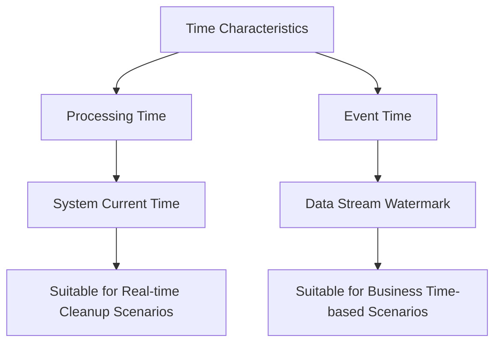
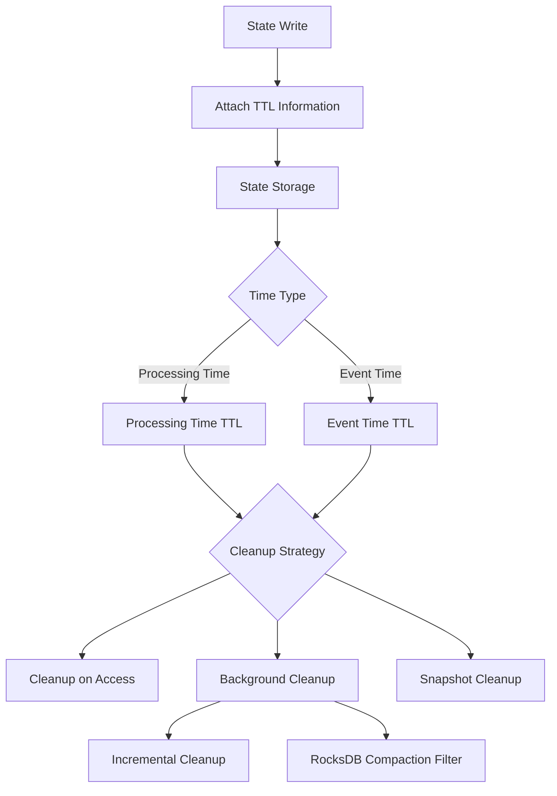

## Introduction

Have you ever experienced this situation: the photos in your phone gallery keep accumulating, taking up more and more space, but many photos are already outdated and you wish there was a way to automatically clean up old photos? Flink's state management faces a similar challenge - state data continuously accumulates, and how to elegantly handle expired data becomes an important topic. FLIP-25 is like installing a smart management system for your data gallery, capable of automatically identifying and cleaning up those "expired photos."

## Why Do We Need State TTL?

Before discussing the specific solution, let's look at why we need the TTL (Time-To-Live) mechanism:

1. Preventing Gallery Overflow
Just like phone storage is limited, Flink's state storage also has capacity constraints. In certain scenarios, such as website visitor analysis, each visitor is like a new photo, generating state data. If these "photos" are never deleted (visitors never return), the gallery will become increasingly full, eventually unable to store new photos.

2. Meeting Photo Privacy Regulations
Just as some privacy regulations prohibit long-term storage of others' photos, EU GDPR and other privacy regulations require personal data to be kept only for a limited time. State TTL acts like an "automatic expiration tag" for photos, ensuring data isn't stored beyond its expiration.

3. Improving Gallery Performance
A gallery filled with useless old photos runs slowly. By promptly cleaning up "expired photos" (state data no longer needed), space can be freed up, allowing the data processing system to run faster and more efficiently.

## Supported Time Characteristics

Imagine you're organizing a digital photo album and have two ways to determine if a photo should be cleaned up: looking at the current date or looking at the photo's capture date. Flink's TTL mechanism works in a similar way:



The solution supports two time characteristics:

1. Processing Time
- As simple as checking your phone's current date
- Easy to configure, ready to use
- Especially suitable for scenarios where you need to know immediately if a photo should be cleaned up

2. Event Time
- Determined by the timestamp in the photo itself
- Requires setting up the Watermark mechanism
- Suitable for managing data based on when the photo was actually taken

## What Is the Specific Solution?

Imagine each state data is like a photo with an "expiration date" tag:



FLIP-25's design is like a smart photo album management system:

### 1. TTL Configuration
Like setting photo retention rules:
- TTL Duration: How long photos can be kept
- Update Type: Whether to refresh the retention period when viewing photos
- State Visibility: Whether expired photos can still be viewed
- Time Type: Whether to use current time or photo capture time to determine expiration
- Cleanup Strategy: How to handle expired photos

### 2. Data Structure Design
Each "photo" comes with a timestamp mark:
```java
class TtlValue<T> {
    T value;           // Actual state value (photo content)
    long lastAccess;   // Last access time (similar to photo timestamp)
}
```

### 3. Cleanup Strategies
Like how a smart album cleans up old photos, there are multiple approaches:

#### Regular Cleanup
- Cleanup on Access: Delete expired photos when browsing the album
- Full Backup Cleanup: Filter out expired photos when backing up the album

#### Background Cleanup
- Incremental Cleanup: Periodically check a portion of photos in the album
- RocksDB Compaction Filter: Clean up expired photos while optimizing and reorganizing the album

## Usage Example

In code, it looks like this:

```java
// Configure TTL, like setting automatic photo cleanup rules
StateTtlConfig ttlConfig = StateTtlConfig
    .newBuilder(Time.days(1))    // Keep photos for 1 day
    .setUpdateType(UpdateType.OnCreateAndWrite)    // Update timestamp when viewing photos
    .setStateVisibility(StateVisibility.NeverReturnExpired)  // Expired photos not visible
    .cleanupFullSnapshot()       // Clean up expired photos during backup
    .setTtlTimeCharacteristic(TtlTimeCharacteristic.ProcessingTime) // Use current time to judge
    .build();

// Create state descriptor and enable TTL
ValueStateDescriptor<String> descriptor = 
    new ValueStateDescriptor<>("myState",`String.class);
descriptor.enableTimeToLive(ttlConfig);  // Turn on automatic cleanup
```

If you want to use the photo's capture time to determine expiration, just change the configuration:

```java
StateTtlConfig ttlConfig = StateTtlConfig
    .newBuilder(Time.days(1))
    .setTtlTimeCharacteristic(TtlTimeCharacteristic.EventTime)
    .build();
```

## Important Considerations

1. About Expiration Time
- Data will definitely live until expiration time: Just like photos within the retention period can definitely be viewed
- Not necessarily cleaned up immediately: Expired photos may not be deleted right away

2. Memory Usage
- Each "photo" needs to record a timestamp: Uses a bit more memory
- Background cleanup also requires resources: The cleanup process also needs some computing power

3. Performance Considerations
- Cleanup will use some resources: Like organizing an album takes time and effort
- RocksDB has specialized optimization: More efficient when dealing with large numbers of photos
- Choose based on actual situation: Different scenarios require different cleanup methods

## Implementation Status

This smart album feature has been improved step by step:

* 1.6: Basic photo expiration functionality (based on current time)
* 1.8: Large album optimization support (RocksDB compaction filter)
* 1.9: Incremental cleanup mechanism optimization (smarter background cleanup)
* 1.13: Support for expiration based on photo capture time (event time TTL)

## Summary

State TTL helps us solve the "what to do when there's too much data" problem. Just like a smart album automatically cleaning up old photos, with this feature, you no longer need to worry about state data accumulating endlessly. Flink will quietly handle everything in the background, making your application run more smoothly and efficiently, like a photo album that never fills up, always keeping enough space for new data.
