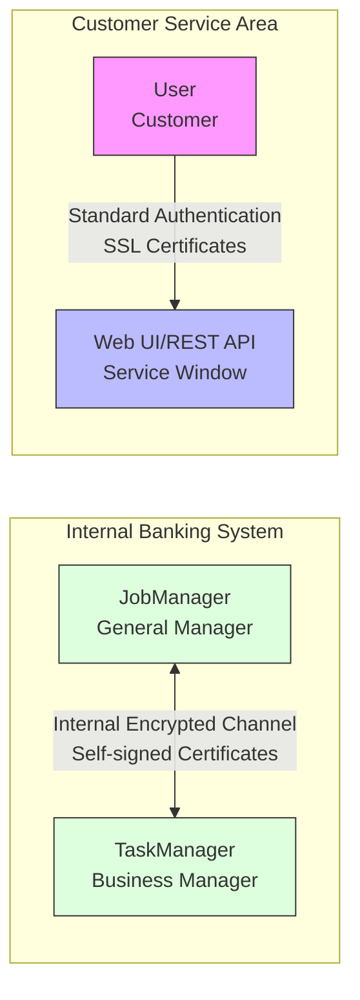

## Introduction

Imagine walking into a bank and discovering it has no security measures - no guards, no surveillance cameras, not even locks on the vaults. Anyone could freely enter the vault, view customer account information, or even take cash and replace it with counterfeit bills. Sounds unbelievable, right? This was the situation with early Flink - it was like a bank without a security system, relying solely on "obscurity" to protect its assets (data).

FLIP-26 is like designing a comprehensive security system for this bank. It not only installs secure access controls at every entrance but also implements a two-way authentication mechanism - just as a bank verifies a customer's ID, the customer should also be able to confirm they're dealing with legitimate bank employees. This "mutual authentication" security mechanism can be applied to various Flink deployment modes, whether it's a standalone small branch or a distributed cluster large bank (such as Kubernetes, YARN, and Mesos environments).


## Bank Security System Design

### Two Security Interaction Scenarios

Imagine Flink as a bank with a complete business system. This bank has two different security interaction scenarios:

1. **Internal Vault Channels**: These are like dedicated channels for bank employees to transfer cash and important documents between themselves. These channels use specially designed security keys and employee cards to verify each other's identity (corresponding to internal communication between JobManager and TaskManager). Each employee has their own security credentials, ensuring only authorized personnel can transfer information between internal systems.

2. **Customer Service Windows**: These are like the bank's external service counters and self-service terminals for customers to query accounts and conduct business (corresponding to Flink's Web UI and REST API). These windows need more standardized authentication mechanisms that are both user-friendly and secure.



### Bank Identity Authentication System

Just as each bank has its own security authentication system, each Flink deployment instance needs its own identity authentication mechanism:

- **Internal Employee Authentication**: Bank employees use specialized badges and passwords (corresponding to self-signed certificates used by Flink internal components). These certificates are like custom security cards designed for internal bank use, used only between internal systems, requiring no external agency certification, but ensuring internal communication security.

- **Customer Service Authentication**: External service windows use nationally recognized standard identity verification systems (corresponding to externally certified SSL/TLS certificates). These certificates are like business licenses issued by financial regulatory authorities, allowing customers to confirm they're dealing with a legitimate bank.

### Key Management System

The bank's key management is like a sophisticated safe deposit box key system:

- **Internal Keys**: Specially crafted keys used only within the bank (self-signed certificates), generated and managed by the bank itself, impossible for outsiders to duplicate. These keys protect communication between the internal vault and employees, similar to the encrypted channels between JobManager and TaskManager.

- **External Keys**: Standardized customer service keys (publicly certified certificates) that comply with industry standards and can be recognized and verified by customer devices (such as online banking software). These keys ensure customers can securely connect to the bank's service windows, just like users accessing Flink's Web UI and REST API.

### Security Strategies for Different Branches

Security strategies vary according to the type and scale of bank branches:

| Branch Type | Direct Service Mode | Proxy Service Mode |
|---------|------------|------------|
| Modern Smart Branch (K8s) | Uses the branch's own security access system<br>(K8s native security mechanisms) | Access through headquarters appointment system<br>(K8s API server proxy) |
| Standard Comprehensive Branch (YARN) | Dual authentication system<br>(YARN security authentication + Flink authentication) | Through front desk unified service platform<br>(YARN AM proxy) |
| Cooperative Franchise Branch (Mesos) | Dual authentication system<br>(Mesos authentication + Flink authentication) | Through partner introduction service<br>(Mesos proxy) |
| Independent Community Branch<br>(Standalone deployment) | Local dual authentication<br>(Local certificates + passwords) | No proxy service<br>(Direct access only) |

This table is like a comparison of security solutions for different types of bank branches. Modern smart branches (K8s environment) use the most advanced security systems, while community branches (standalone deployment) adopt relatively simple but equally effective security measures.

## Bank Security System Development Progress

### Current Status and Future of This Proposal

Building on Flink's existing security framework, this bank-level security solution was originally planned to implement more comprehensive security mechanisms through the Akka communication layer (equivalent to the bank's core security system), currently under discussion in the community. However, since Flink has removed its dependency on Akka starting from version 1.16 (like a bank changing its core security vendor), this specific Akka-based implementation plan will not proceed. Nevertheless, these security requirements still exist in Flink's new architecture and need to be addressed with other technical solutions (just as a bank still needs a security system, just from a different vendor).

It's worth mentioning that early Flink did have serious security vulnerabilities, such as the CVE-2020-17519 unauthorized access vulnerability, similar to discovering a design flaw in a bank vault door where anyone could bypass the front desk and directly enter the vault area. These real security incidents further highlight the necessity of improving security mechanisms.

Let's review how Flink's security system has evolved over the years. It's like a bank upgrading from basic door locks to a comprehensive modern security system:

### Evolution of Flink's Security Framework

#### 1. Establishment and Improvement of Identity Authentication System

- **Version 1.4**: Introduced Kerberos authentication, like a bank implementing a unified customer identification system. No matter which branch you visit, you can be identified through the same ID card. Kerberos allows Flink to securely verify the identity of users and services in the big data ecosystem.

- **Version 1.7**: Added Security Cookie authentication mechanism, like a smart badge system for bank employees. Each employee's badge has a unique encryption chip, ensuring only genuine bank employees can enter internal areas. Similarly, Security Cookie ensures secure communication between Flink internal components, preventing unauthorized components from impersonating legitimate ones.

#### 2. Data Transmission Encryption System

- **Version 1.5**: Implemented SSL/TLS encryption transmission mechanism, like installing bulletproof armor and GPS tracking systems on bank cash transport vehicles. Even if someone intercepts the vehicle (data transmission), they cannot open the armored car or know what's inside. SSL/TLS encryption ensures that data transmitted between Flink components cannot be interpreted even if intercepted.

- **Version 1.10**: Optimized encryption configuration methods, providing more granular encryption control options. This is like a bank upgrading its security system to set different protection levels for items of different values, ensuring security while saving costs.

#### 3. Access Control in High Availability Mode

- **Version 1.6**: Implemented ZooKeeper-based ACL access control in high availability mode. This is like a bank's VIP room access system - not all customers can enter, requiring specific membership cards and permissions. Configuration example:
  ```yaml
  high-availability.zookeeper.client.acl: creator  # Only the creator has full access
  zookeeper.sasl.disable: false  # Enable security authentication
  ```
  
  These configurations are like setting access rules for the bank's VIP room, ensuring only authorized personnel can access critical resources in high availability mode.

#### 4. Web Management Interface Security Reinforcement

- **Version 1.9**: Implemented whitelist-based access control system. This is like a bank's online banking system only allowing login requests from trusted devices, with unfamiliar devices requiring additional verification. Flink's Web UI also uses a whitelist mechanism, allowing access requests only from specific IP addresses.

- **Version 1.11**: Added Security Headers support, optimized XSS protection mechanisms. This is like adding advanced anti-phishing and anti-virus features to the bank's online banking system, where even if hackers try to inject malicious code, it will be blocked by the security system.

#### 5. Modular Security Architecture

- **Version 1.10**: Formally introduced a pluggable security module mechanism. This is like a bank being able to choose different security vendors and systems based on the needs of different branches, all seamlessly integrating into the headquarters' security standards. It's worth noting that Hadoop integration security modules existed before this, but version 1.10 modularized the entire security architecture, making it more flexible. Configuration example:
  ```yaml
  security.context.factory.classes: org.apache.flink.runtime.security.contexts.HadoopSecurityContextFactory
  security.module.factory.classes: org.apache.flink.runtime.security.modules.HadoopModuleFactory
  ```
  
  These configurations are like a bank selecting specific security system vendors. Flink can choose the most appropriate security modules based on the deployment environment, such as security modules integrated with the Hadoop ecosystem.

#### At-a-Glance Security Feature Evolution Table

| **Security Feature** | **Version Milestone** | **Security Problem Solved** | **Bank Security Equivalent** |
|------------|--------------|-----------------|-----------------|
| Kerberos Authentication | 1.4+ | Unified identity authentication, mainly for big data platforms | Nationally standardized ID system |
| SSL/TLS Encryption | 1.5+ | Data transmission encryption, preventing information leakage | Armored cash transport vehicles and confidential document boxes |
| ZooKeeper ACL | 1.6+ | Controls who can access critical resources, used in high availability mode | VIP room and vault access control |
| Cookie Authentication | 1.7+ | Internal component mutual authentication, preventing impersonation | Employee smart badge system |
| Web UI Security | 1.9+ | Protects management interface, prevents unauthorized access | Online banking security system and anti-phishing mechanisms |
| Security Plugin Mechanism | 1.10+ | Can connect to custom security systems | Customizable branch security solutions |

This table is like the upgrade history of a bank's security system. From the most basic access cards (Kerberos authentication) to comprehensive modern security systems (pluggable security modules), Flink's security framework has become increasingly sophisticated, capable of meeting various security requirements from small community banks to large multinational banks (from standalone deployment to large-scale clusters).

## Summary

This security solution is like designing a comprehensive security system for a rapidly developing bank. Although it may not be implemented as originally planned due to the bank changing its core technology vendor (Flink removing Akka dependency), the core security concepts it proposes are still worth learning from:

1. **Comprehensive Identity Authentication**: Just as a bank needs to verify the identity of each employee and customer, Flink's internal system needs a strict component identity authentication mechanism.

2. **Flexible Customer Service**: Different customers have different needs, and banks need to support various service methods. Similarly, Flink's external interfaces need to support diverse authentication methods.

3. **Ecosystem Compatibility**: Modern banks need to seamlessly connect with other financial institutions and payment systems. Likewise, Flink's security mechanisms need to consider interoperability with other components in the big data ecosystem.

The design philosophy of this solution - finding a balance between security and usability - is like modern banks needing to both ensure fund security and provide convenient services. Although specific implementation methods will adjust with changes in technical architecture, the balance between security and usability remains a key factor to consider in system design, just as banks always need to find the optimal balance between tight security and friendly customer experience.
