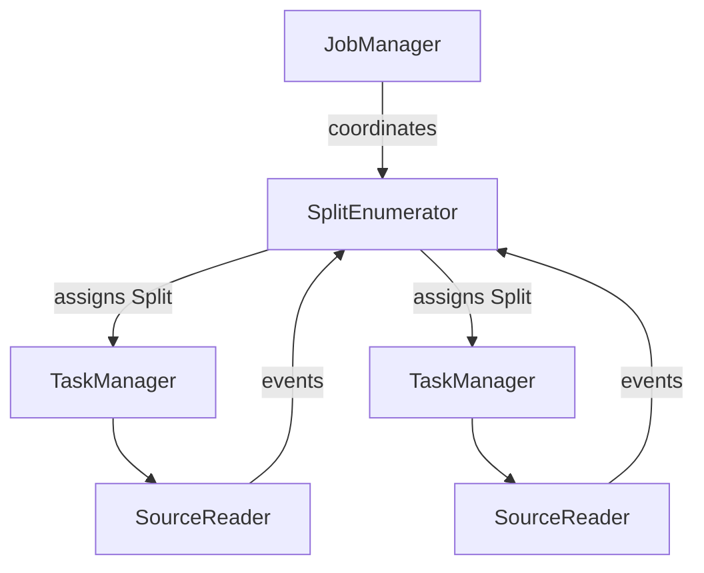

## Background

Imagine managing a busy city courier system: couriers need to collect packages, sorting centers need to process them, and managers need to coordinate personnel. In Flink, the source interface is like such a delivery system, responsible for "collecting" data from various sources and "delivering" it to the processing system. However, before Flink 1.12, this "delivery system" had numerous issues, much like a poorly managed courier company. FLIP-27 aims to transform it into a modern, intelligent delivery system through redesign.

## Why Was a Redesign Needed?

Let's look at what problems existed in this "old delivery system":

### Confused Business Operations
Like a courier company simultaneously running freight transport and express delivery with completely different systems and personnel. Batch processing is like freight transport (handling large volumes at once), while stream processing is like express delivery (continuous package handling), but they use different operating procedures, leading to resource waste and staff having to learn two systems.

### Unclear Responsibilities
Imagine a courier who has to find new customers, plan delivery routes, and make deliveries themselves. In the old interface, data sources were similar, being responsible for both discovering new data (like finding new Kafka partitions) and reading data. It's like having one person act as both salesperson and delivery person - neither role is performed optimally.

### Chaotic Package Management
Package tracking in the old system was like a traditional courier company's tracking system. Each data split (Split) was like a package, but the system didn't provide complete "waybills" for these "packages". Just as couriers handling packages without detailed information don't know their origin, destination, and handling requirements, Splits in the interface were just vague concepts lacking complete lifecycle management.

This problem became more apparent when handling real-time data. Imagine if a courier company needed to arrange deliveries based on package dispatch times, but no sorting center could accurately know when packages were sent - this would lead to delivery chaos. This is similar to stream data sources like Kafka, where the inability to accurately track each partition's event time leads to incorrect processing of cross-partition data chronologically.

Worse still, when courier delivery areas needed adjustment or couriers were temporarily unavailable, package reassignment became very chaotic. This is like when data processing nodes scale or fail, lacking a unified mechanism to ensure split migration consistency and reliability, potentially causing duplicate or missing data processing.

### Security Risks
If chaotic split management is like issues with the package tracking system, then thread safety issues are like warehouse access control system failures. In the old system, data sources used a mechanism called checkpoint lock to control concurrent access, which is like having an old warehouse with just one main gate that everyone must use for entry and exit.

This design created multiple problems: First, like couriers having to queue at the gate every time they enter or exit, all data reading and state update operations need to acquire this "main gate key" (checkpoint lock). Second, during busy periods, congestion at the gate seriously affects work efficiency, like lock contention in high-concurrency scenarios causing performance degradation. Worst of all, sometimes inventory checkers (similar to checkpoint threads) get stuck outside, preventing timely inventory counts - like checkpoint operations being delayed due to inability to acquire locks.

This old-style access control method (global lock-based design) is like using one big lock to manage the entire warehouse, rather than modern warehouses where each area has independent smart access control. This not only affects daily operation efficiency but also makes the entire system difficult to optimize and upgrade.

### Difficult Maintenance
When system updates are needed, it's like having to renovate two completely different warehouses simultaneously. One is a traditional warehouse (batch processing), the other a modern warehouse (stream processing). Each time new features are added or issues fixed, changes must be made in both places, which is time-consuming and error-prone.

## How Does the New Solution Address These Problems?

FLIP-27 addresses each issue through carefully designed new interface architecture:

### Modular Logistics Platform: Unified Source Interface Design
In Flink 1.11 and earlier versions, batch processing used the InputFormat interface while stream processing used the SourceFunction interface, like a logistics company operating two completely different systems for freight and express delivery. The new Source interface unifies these two processing modes through modular design, using boundedness as the core concept to distinguish between batch and stream processing data sources.

The new interface achieves seamless switching between batch and stream processing through unified API and clear boundedness configuration:

```java
// Usage example: same modular platform handling different types of data sources
FileSource<String> source = FileSource
    .forRecordStreamFormat(new TextLineFormat(), Path.fromLocalFile(file))
    .build();

// Continuous processing mode (stream processing)
DataStream<String> stream = env.fromSource(
    source,
    WatermarkStrategy.noWatermarks(),
    "My Source"
);

// Batch processing mode (batch processing): configured through Boundedness
FileSource<String> boundedSource = FileSource
    .forRecordStreamFormat(new TextLineFormat(), path)
    .setBoundedness(Boundedness.BOUNDED)  // Explicitly set as bounded source
    .build();
DataStream<String> batch = env.fromSource(
    boundedSource,
    WatermarkStrategy.noWatermarks(),
    "My Source"
);
```

This unified interface design allows developers to maintain a single codebase supporting both batch and stream processing scenarios, greatly simplifying data source development and maintenance.

### Building a Modern Command and Control System with Source Component Separation: SplitEnumerator/SourceReader Architecture
Like modern logistics companies completely separating headquarters dispatch and frontline delivery, the new Source interface adopts a clear two-tier architectural design. This design achieves complete separation of concerns through SplitEnumerator (central dispatch component running on JobManager) and SourceReader (data reading component running on TaskManager):



The central dispatch component (SplitEnumerator) is like a logistics company's command center, responsible for:
1. Split lifecycle management:
   - start(): Initialize split discovery logic
   - handleSourceEvent(): Handle requests from Readers via SourceEvent
   - addSplitsBack(): Handle split recovery for failed tasks
   - snapshotState(): Save split allocation state during checkpoint creation

2. Dynamic split discovery:
   - Support runtime discovery of new data splits (like new Kafka partitions)
   - Communicate with job coordinator through enumeratorContext
   - Maintain global split allocation state

The data reading component (SourceReader) is like a courier company's delivery point, focused on data processing:
1. Standardized data reading interface:
   ```java
   public interface SourceReader<T, SplitT extends SourceSplit> {
       void start();  // Initialize reader
       void pollNext(ReaderOutput<T> output) throws Exception;  // Read records
       void snapshotState(long checkpointId);  // Create checkpoint
   }
   ```

2. Complete state management:
   - Maintain split-level processing state
   - Support checkpoint creation and recovery
   - Handle dynamic split addition and removal

This event-based (SourceEvent) communication mechanism ensures loose coupling between components while ensuring data processing reliability through comprehensive state management. Each component has clear responsibility boundaries and standardized interfaces, greatly improving system maintainability and extensibility.

### Serializable Smart Package Tracking System: Split State Management and Recovery Mechanism
The new interface designs data splits (Split) as complete serializable entities, like modern logistics systems' smart electronic waybills. Each Split must implement the serialization interface, ensuring its state can be reliably saved and recovered:

SplitEnumerator manages split allocation state through the SplitAssignment class

This system is particularly efficient when handling time-sensitive tasks:

1. Event time alignment

2. Dynamic split discovery and allocation:
   - Support runtime discovery of new splits (like new Kafka partitions)
   - Ensure no split state loss through serialization mechanism
   - Split reallocation based on load balancing strategies

3. The system ensures state consistency through the checkpoint mechanism, with serialization-based state management ensuring reliable system recovery during failures while supporting dynamic load balancing and split reallocation.

### Modern Workflow Management: Mailbox-based Thread Safety Design
The new interface adopts a single-threaded event-driven design pattern, similar to modern logistics' personalized workstation design. Each SourceReader has its own Mailbox (message queue) and dedicated work thread, completely avoiding the concurrent issues brought by using global checkpoint locks in the traditional interface.

This design brings several key improvements:

1. **Single-threaded Event Processing**:
   - All operations (data reading, state updates, checkpoint triggers) execute sequentially in the same thread
   - Completely eliminates lock contention issues
   - Ensures operation atomicity and visibility

2. **Non-blocking I/O Processing**

3. **Clear State Management Boundaries**:
   - Each Reader's state access is strictly limited to its Mailbox thread
   - Cross-component state synchronization through event mechanism
   - Support for fine-grained checkpoint creation and recovery

This Mailbox-based design not only provides better thread safety guarantees but also significantly improves system performance. Tests show that in high-concurrency scenarios, the new interface reduces checkpoint processing time by about 50%, mainly due to eliminating lock contention and more efficient state management.

## What Are the Actual Results?

The new Source interface brings significant improvements in multiple aspects:

1. **Performance Improvements**:
   - Source throughput increased by 20%-30% in some implementations
   - Checkpoint processing time reduced by about 50% (specific values depend on hardware environment)
   - More efficient memory utilization

2. **Development Experience Improvements**:
   - Clear interface responsibilities, easier to implement new data sources
   - Provides common base implementations, reducing duplicate code
   - Unified batch and stream code, significantly reducing maintenance costs

3. **Enhanced Functionality**:
   - Support for more fine-grained watermark control
   - Built-in dynamic split discovery and allocation mechanism
   - Improved fault tolerance and scalability
   - Complete state management and recovery mechanism

4. **Operational Convenience**:
   - Unified monitoring metrics
   - Better problem diagnosis capability
   - Simplified configuration management
   - Flexible deployment options

## Summary

FLIP-27 is an important step in Flink's unified batch and stream processing journey. Through Source interface reconstruction, it not only solved many problems in the original interface but also laid a good foundation for future development. This improvement was implemented in Flink 1.12 (note: FLIP-27 interface was experimental in Flink 1.12, with some features (like KafkaSource dynamic partition discovery) not fully stable until version 1.14) and is now widely used in various data source implementations.

From an architectural design perspective, FLIP-27 demonstrates how to solve problems in complex systems through proper responsibility separation and abstraction. It breaks down complex data source processing into clear components, maintaining simplicity in each component while achieving powerful functionality through component collaboration. This design approach provides valuable reference for the reconstruction and design of other systems.
