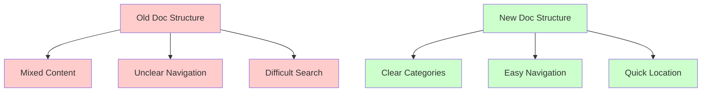
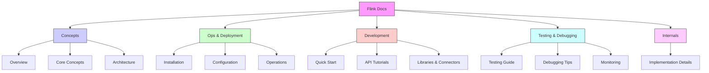

## Introduction

Have you ever experienced this: searching for a book in a library, but the classification is so messy that you can't find it after a long search? Or shopping in a large supermarket where items are placed chaotically, making you circle around several times without finding what you want. Isn't that experience frustrating?

Flink's documentation once faced similar issues. As content grew, users often couldn't find the information they needed. It was like a treasure chest full of good things but in complete disarray - although there were many valuable items inside, finding the one you wanted wasn't easy. FLIP-3 was proposed to address this problem.

Let's first look at the effect of this reorganization:

## Why Reorganize the Documentation?

### Finding Things Was Too Difficult

Imagine walking into a library with no category labels, where all books are randomly placed on shelves. If you need to find a specific book, you'd have to look through every shelf unless you want to check them all. Flink's documentation faced similar issues:

1. Lots of content but insufficient categorization
2. Important documentation buried too deep
3. Users didn't know where to start looking

### Navigation Wasn't Intuitive

Just as a city needs a clear signage system, documentation needs good navigation. The problems then were:

1. Too few top-level menus, with many important content buried in submenus
2. Users often needed multiple clicks to find desired information
3. Related content scattered in different places

## How Does FLIP-3 Solve These Problems?

This improvement plan is like giving the library a major cleanup, not just organizing books but also adding clear category labels. Specifically, all documentation was divided into five major categories:

Let's visualize this new organizational structure:

### 1. Concepts: Building the Foundation

Like learning basic grammar when studying a new language, this section includes:
- System Overview: Quick understanding of what Flink is
- Core Concepts: Explanation of important basic concepts
- System Architecture: Introduction to overall structure
- Project Structure: Understanding component relationships

### 2. Operations & Deployment: Building Systems from 0 to 1

This is like a detailed installation guide, including:
- Download and installation steps
- Various deployment method explanations
- Configuration guides
- Security settings
- Operations guidance

### 3. Development: Hands-on Coding

This section is like a practical tutorial, containing:
- Quick start guides
- Detailed API documentation
- Usage instructions for various features
- Data type guides
- Connector usage instructions

### 4. Testing & Debugging: Ensuring Code Quality

This is like a troubleshooting manual, telling you:
- How to write tests
- How to debug problems
- How to monitor the system
- How to optimize performance

### 5. Internals: Deep System Understanding

For those who want to understand the system deeply, this part explains how Flink works.

## What Benefits Does This Bring?

This reorganization is like turning a messy storage room into a well-organized storage system:

1. Faster Finding: You know which section to look for specific content
2. More Newcomer-Friendly: Clear structure shows beginners where to start
3. More Complete Content: Proper categorization reveals which documents are missing
4. Easier Maintenance: When writing new documentation, it's easy to know where it belongs

## Summary

Like organizing a room, good organization makes life easier. FLIP-3 makes Flink's documentation clearer and more user-friendly through reorganization. Whether you're a beginner or an experienced developer, you can find needed information more quickly.

This improvement teaches us that sometimes "subtracting" (simplifying structure) is more important than "adding" (increasing content). A good documentation system needs not only sufficient content but also clear organization, allowing users to easily access the information they need.
