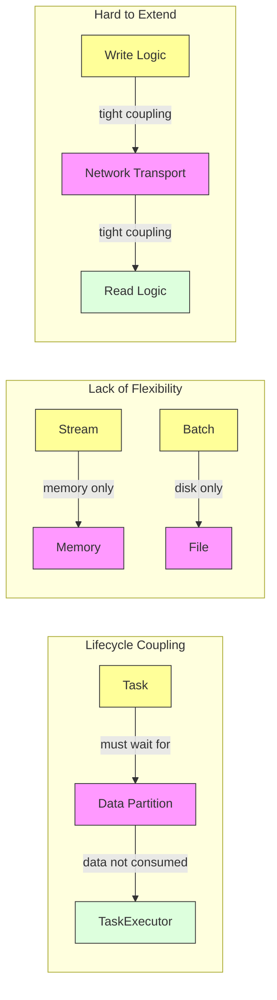
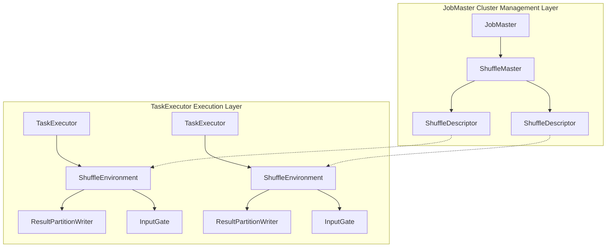

# FLIP-31: Making Flink's Data Transfer More Flexible with Pluggable Shuffle Service

## Introduction

Imagine a busy international airport where different terminals need to transport various passengers and luggage. Traditionally, all transportation is done through fixed ground vehicles, but when a terminal becomes especially crowded or requires special transportation methods (like for valuable cargo), this fixed approach proves insufficiently flexible.

The data exchange (Shuffle) service in Flink is similar to such an airport transportation system. Before FLIP-31, Flink's data exchange service was unified, using the same approach for both stream and batch processing jobs. This was like forcing all passengers and luggage to use the same shuttle bus - not very flexible. FLIP-31 introduces a pluggable shuffle service architecture, allowing the system to choose the most appropriate transport method based on different scenarios.

## Why Improvement Is Needed

Let's examine the main problems with the existing approach through a diagram:



Three main issues exist:

1. **Lifecycle Management Issues**: Like airport ground staff (TaskExecutor) having to wait until all passengers and luggage (data partitions) are properly handled before ending their shift, the current design tightly couples TaskExecutor with data transmission, preventing timely resource release.

2. **Limited Flexibility**: The existing solution forces stream processing tasks to write to memory and batch processing tasks to local files. This is like forcing international flights to use Terminal A and domestic flights Terminal B, even when Terminal A is congested while Terminal B sits empty.

3. **Difficult to Extend**: Adding new data transmission methods (like RDMA-based high-speed transmission) requires modifying both read and write logic simultaneously. This is as complex as trying to renovate an entire airport's ground transportation system while it's operating.

## The Solution

FLIP-31 proposes a pluggable data exchange service architecture that's like equipping an airport with an intelligent dispatch system. Let's look at the detailed solution:

### Overall Architecture Design

The solution introduces three core components at the architecture level:



1. **Cluster Management Layer**
   - JobMaster handles job scheduling and management
   - ShuffleMaster manages lifecycle of all data partitions
   - ShuffleDescriptor describes configuration for each data partition

2. **Execution Layer**
   - TaskExecutor executes specific computation tasks
   - ShuffleEnvironment provides runtime environment for data exchange
   - ResultPartitionWriter/InputGate handle data writing and reading

### Complete Workflow

Taking a data transfer task as an example, here's the complete workflow:

1. **Initialization Phase**
```java
// 1. Create ShuffleMaster
ShuffleMaster<?> shuffleMaster = shuffleServiceFactory.createShuffleMaster(config);

// 2. Create ShuffleEnvironment on each TaskExecutor
ShuffleEnvironment<?, ?> environment = shuffleServiceFactory.createShuffleEnvironment(context);
```

2. **Data Partition Registration**
```java
// 3. Producer task registers data partition
ShuffleDescriptor descriptor = shuffleMaster.registerPartitionWithProducer(
    partitionDescriptor,
    producerDescriptor
).get();

// 4. Create result partition writer
ResultPartitionWriter writer = environment.createResultPartitionWriters(
    taskInfo, descriptor
);
```

3. **Data Transfer Phase**
```java
// 5. Consumer requests data
InputGate reader = environment.createInputGates(
    taskInfo, 
    descriptors,
    metrics
);

// 6. Update partition information
environment.updatePartitionInfo(
    consumerId,
    partitionInfo
);
```

4. **Resource Release Phase**
```java
// 7. Release data partition
shuffleMaster.releasePartitionExternally(descriptor);
```

### Extension Mechanism

The new architecture supports multiple data exchange implementations:

1. **Local Disk Implementation**
```java
public class LocalShuffleServiceFactory implements ShuffleServiceFactory {
    @Override
    public ShuffleEnvironment createShuffleEnvironment(...) {
        return new LocalShuffleEnvironment(
            fileSystem,
            bufferSize,
            ...
        );
    }
}
```

2. **External Storage Implementation**
```java
public class ExternalShuffleServiceFactory implements ShuffleServiceFactory {
    @Override
    public ShuffleEnvironment createShuffleEnvironment(...) {
        return new ExternalShuffleEnvironment(
            storageService,
            networkConfig,
            ...
        );
    }
}
```

### Core Mechanism Implementation

During data transfer, the system goes through several key stages:

1. **Partition Registration and Release Mechanism**
```java
// ShuffleMaster partition lifecycle management
public class ShuffleMasterImpl<T extends ShuffleDescriptor> {
    public CompletableFuture<T> registerPartitionWithProducer(...) {
        // 1. Create partition descriptor
        T descriptor = createShuffleDescriptor(...);
        
        // 2. Register with partition manager
        partitionTracker.startTrackingPartition(
            producerId, 
            descriptor
        );
        
        return CompletableFuture.completedFuture(descriptor);
    }

    public void releasePartition(...) {
        // 3. Safely release partition resources
        partitionTracker.stopTrackingAndReleasePartition(
            producerId,
            partitionId
        );
    }
}
```

2. **Data Read/Write Process**
```java
// Data write handling
public class ResultPartitionWriter {
    public void writeData(ByteBuffer data) {
        // 1. Get available buffer
        BufferBuilder bufferBuilder = requestBufferBuilder();
        
        // 2. Write data
        bufferBuilder.append(data);
        
        // 3. Complete write and notify downstream
        ResultSubpartition target = subpartitions[targetChannel];
        target.add(bufferBuilder.createBufferConsumer());
    }
}

// Data read handling
public class InputGate {
    public Optional<BufferOrEvent> getNext() {
        // 1. Check availability
        if (isAvailable()) {
            // 2. Get next buffer
            return inputChannels.getNextBuffer();
        }
        // 3. Handle backpressure
        return handleBackPressure();
    }
}
```

3. **Failure Recovery Mechanism**
```java
public class ShuffleEnvironment {
    public void handleTaskFailure(ExecutionAttemptID taskId) {
        // 1. Identify affected partitions
        Collection<ResultPartitionID> affected = 
            findAffectedPartitions(taskId);
            
        // 2. Trigger local recovery
        for (ResultPartitionID partitionId : affected) {
            // Only restart necessary tasks
            restartProducerTask(partitionId);
        }
    }
}
```

## Benefits of Implementation

Compared to the traditional approach, the new architecture brings significant improvements:

|    Feature    | Traditional | FLIP-31 Approach |
|---------------|-------------|------------------|
| Resource Management | Fixed Binding | Flexible Scheduling |
| Extensibility | Poor | Good |
| Implementation | Single | Pluggable |
| Lifecycle | Tight Coupling | Independent Management |
| Failure Recovery | Global Restart | Local Recovery |

## Application in Flink

FLIP-31 was implemented in Flink 1.9. The implementation was divided into several phases:

1. **Basic Architecture Implementation**
   - Introduced ShuffleMaster to JobMaster for partition lifecycle management
   - Introduced ShuffleEnvironment to TaskExecutor for data exchange logic encapsulation
   - Implemented ShuffleServiceFactory interface and its default Netty-based implementation

2. **Partition Management Optimization**
   - Implemented partition result registration and deregistration process
   - Enhanced resource release mechanism based on ShuffleMaster
   - Optimized NetworkEnvironment construction method
   - Refactored ResultPartitionManager to decouple from Task

3. **Metrics Collection Integration**
   - Introduced InputGateWithMetrics for data inflow metrics collection
   - Moved network metrics settings to NetworkEnvironment
   - Introduced extensible metrics grouping layout

To use this feature, you can specify the ShuffleServiceFactory implementation in the configuration file:

```yaml
shuffle-service-factory.class: org.apache.flink.runtime.shuffle.NettyShuffleServiceFactory
```

The current default implementation is based on Netty network communication, maintaining compatibility with previous behavior. In the future, other data exchange services can be implemented as needed, such as:
- RDMA-based high-performance implementation
- External storage support implementation
- Implementation for specific environments (like Kubernetes)

## Summary

FLIP-31 has solved several key issues in Flink's data transfer through the introduction of a pluggable shuffle service architecture:

1. Decoupling TaskExecutor from data transfer for more flexible resource management
2. Simplifying the addition of new data transfer implementations through standardized interfaces
3. Improving system reliability through independent lifecycle management

Just as modern airports can choose different transport methods based on passenger and luggage requirements, with FLIP-31, Flink can select the most appropriate data exchange method based on actual needs, making data processing more efficient and flexible in different scenarios.
