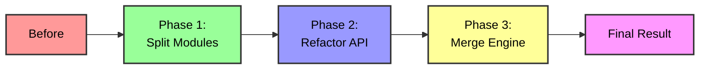
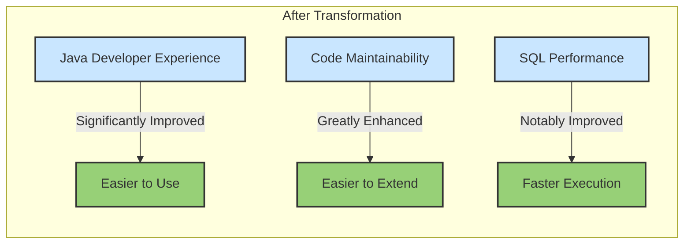

## Introduction

Imagine having a messy room - clothes, books, and toys scattered everywhere without any organization. This was the state of Flink's Table & SQL API in early 2019. Though powerful, the code structure had become complex and difficult to maintain due to historical reasons. FLIP-32 was like a major room cleanup, not only organizing existing items but also making space for future furniture additions.

## Why Was This Cleanup Needed?

Let's continue with the room organization metaphor to understand the problems at that time:

```mermaid
graph TD
    subgraph "Problem 1: Wrong Language Choice"
    A1[Mixed Seasonal Clothes] -->|Corresponds to| B1[Scala as Primary Language<br>Java as Secondary]
    end
    
    subgraph "Problem 2: Poor Space Layout"
    A2[Items Stored Without Categories] -->|Corresponds to| B2[Table and Stream/DataSet<br>APIs Tightly Coupled]
    end
    
    subgraph "Problem 3: Hard to Expand"
    A3[Room Already Full] -->|Corresponds to| B3[Difficult to Integrate Blink<br>Engine and New Features]
    end
    
    style A1 fill:#8b8bcd,stroke:#333,stroke-width:2px,color:#fff
    style B1 fill:#a8a8e0,stroke:#333,stroke-width:2px,color:#fff
    style A2 fill:#8b8bcd,stroke:#333,stroke-width:2px,color:#fff
    style B2 fill:#a8a8e0,stroke:#333,stroke-width:2px,color:#fff
    style A3 fill:#8b8bcd,stroke:#333,stroke-width:2px,color:#fff
    style B3 fill:#a8a8e0,stroke:#333,stroke-width:2px,color:#fff
```



### Problem 1: Wrong Language Choice
Like a closet mixing clothes from all seasons, the Table & SQL API was initially written in Scala. While Scala offered elegant syntax features, this made it less smooth for Java users, even though Java remains Flink's most important API language.

### Problem 2: Poor Space Layout
Like books, toys, and clothes all piled together, the Table & SQL API was tightly coupled with DataSet and DataStream APIs. This design made it difficult to use Table & SQL independently and hindered future development.

### Problem 3: Hard to Add New Items
Like a room that's already full making it difficult to add new furniture, the code structure made adding new features challenging. This was particularly evident when trying to integrate the Blink SQL engine, where the existing architecture showed its limitations.

## The Cleanup Plan

This "spring cleaning" was very systematic, like hiring an organization expert:



### Phase 1: Module Split
Like categorizing items in a room, the code was reorganized into several clear modules:

- flink-table-common: Basic interfaces and common classes
- flink-table-api-java: Java API module
- flink-table-api-scala: Scala API module
- flink-table-planner: SQL engine and optimizer
- flink-table-runtime: Runtime execution code

### Phase 2: API Improvements
Similar to finding the most suitable storage method for each category of items, this phase mainly improved API design:

- Unified batch and stream processing interfaces
- Simplified TableEnvironment usage
- Enhanced type system capabilities

### Phase 3: Engine Integration
Like installing new furniture in a well-organized room, this phase integrated the Blink SQL engine, bringing more powerful SQL optimization capabilities and better performance.

## Actual Results

This transformation was completed in Flink 1.14, bringing significant improvements:



## Usage Example

After the restructuring, using the Table API became simpler and more intuitive:

```java
// New API Example
TableEnvironment tEnv = TableEnvironment.create();

tEnv.executeSql("CREATE TABLE Orders ("+
    "order_id BIGINT,"+
    "price DECIMAL(10, 2),"+
    "order_time TIMESTAMP(3)"+
    ") WITH (...);");

// Execute SQL query
tEnv.executeSql(
    "SELECT TUMBLE_START(order_time, INTERVAL '1' HOUR) as hour_start,"+
    "       SUM(price) as total_amount"+
    "FROM Orders"+
    "GROUP BY TUMBLE(order_time, INTERVAL '1' HOUR)"
).print();
```

## Summary

The completion of FLIP-32 was like a successful spring cleaning - not only refreshing the room but also reserving space for future growth. This transformation made Flink's Table & SQL API more powerful and user-friendly, laying a solid foundation for future feature expansion. Just as a clean and organized room can improve quality of life, the restructured Table & SQL API has made the development experience more enjoyable. This improvement, completed in Flink 1.14, marks an important step for Flink in the stream processing SQL domain.
