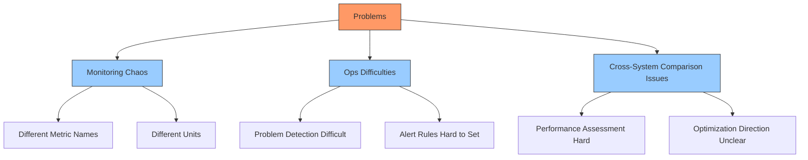
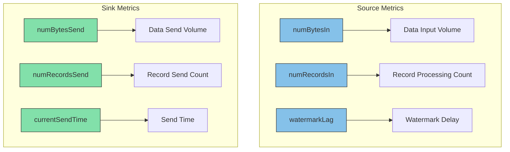

## Introduction

In a busy airport control room, standardized flight status reporting is crucial. When each airline reports differently — some using miles per hour while others use kilometers per hour, some using feet for altitude while others use meters, and some reporting in real-time while others delay — air traffic controllers cannot work efficiently. Early versions of Flink connectors faced the same issue: each connector recorded its status in its own way with different naming conventions, severely impacting development and operations efficiency.

FLIP-33 introduced a unified metrics standard, establishing "air traffic control regulations" for Flink connectors. This improvement, implemented in Flink 1.14, put connector monitoring and operations on the right track, significantly boosting efficiency.

## Why Do We Need Unified Metrics?



### 1. Monitoring Consistency Issues
Air traffic control requires all aircraft to report position, speed, and altitude in a unified format. Similarly, connectors need to report basic operational status. Before standardization, Kafka connector and File connector often used different names for the same metrics, causing monitoring chaos.

### 2. Operational Efficiency Issues
When system problems occur, operators must quickly locate the cause. But when each connector reports problems in its own way, troubleshooting becomes like translating documents in multiple languages, naturally reducing efficiency.

### 3. Cross-Comparison Difficulties
When comparing different connector performances, non-unified metrics make comparisons meaningless, like one country using GDP while another uses GNP to measure their economy — no meaningful conclusions can be drawn.

## What Changes Did FLIP-33 Bring?



### Standardized Source Metrics

For data source connectors, FLIP-33 defined a series of standard metrics:

| Metric Name | Type | Unit | Description | Required |
|-------------|------|------|-------------|----------|
| numBytesIn | Counter | Bytes | Total input data volume | Yes |
| numRecordsIn | Counter | Records | Total processed records | Yes |
| numRecordsInErrors | Counter | Records | Error record count | Yes |
| currentEmitEventTimeLag | Gauge | ms | Event time delay | Yes |
| watermarkLag | Gauge | ms | Watermark delay | Yes |
| sourceIdleTime | Gauge | ms | Idle time | No |
| pendingRecords | Gauge | Records | Pending record count | No |

### Standardized Sink Metrics

For data sink connectors, these standard metrics were defined:

| Metric Name | Type | Unit | Description | Required |
|-------------|------|------|-------------|----------|
| numBytesSend | Counter | Bytes | Total sent data volume | Yes |
| numRecordsSend | Counter | Records | Total sent records | Yes |
| numRecordsSendErrors | Counter | Records | Send error count | Yes |
| currentSendTime | Gauge | ms | Send time | No |

These metrics form the connector's monitoring dashboard:

- **Counter Metrics**: Record cumulative processing volume, reflecting total workload
- **Rate Metrics**: Show processing capacity per unit time, reflecting real-time performance
- **Gauge Metrics**: Display current running status, monitoring instant performance

## How to Use These Metrics?

Using standardized metrics is straightforward. Here's an example with Kafka Source:

```java
// Get metrics group
MetricGroup kafkaSourceMetrics = getRuntimeContext().getMetricGroup();

// Register required metrics
Counter numBytesIn = kafkaSourceMetrics.counter("numBytesIn");
Counter numRecordsIn = kafkaSourceMetrics.counter("numRecordsIn");

// Update metrics
numBytesIn.inc(record.serializedValueSize());
numRecordsIn.inc();
```

These metrics can be collected and displayed through Flink's monitoring systems (like Prometheus), allowing you to:

1. Monitor connector performance in real-time
2. Set reasonable alert thresholds
3. Conduct performance analysis and optimization
4. Quickly locate problems

## What Does This Mean for Developers?

For developers, FLIP-33 brought several important changes:

1. **Standardized Interface**: New connectors only need to implement standard metric interfaces
2. **Backward Compatibility**: Existing custom metrics can be retained alongside standard metrics
3. **Better Tool Support**: Unified metrics facilitate monitoring tool development

## Summary

FLIP-33 established unified metrics standards for Flink connectors, ensuring all connectors describe their working status in the same way. This standardization improvement not only simplified monitoring processes but also brought stronger maintainability and observability to the entire Flink ecosystem.

The standardized metrics system provides developers and operators with:
- Clear connector performance comparison perspective
- Efficient problem troubleshooting capability
- Accurate system status understanding

This improvement, implemented in Flink 1.14, marks an important step in Flink's observability domain. The unified connector metrics standard, like aviation industry's air traffic control regulations, makes the entire system run more orderly and efficiently.
