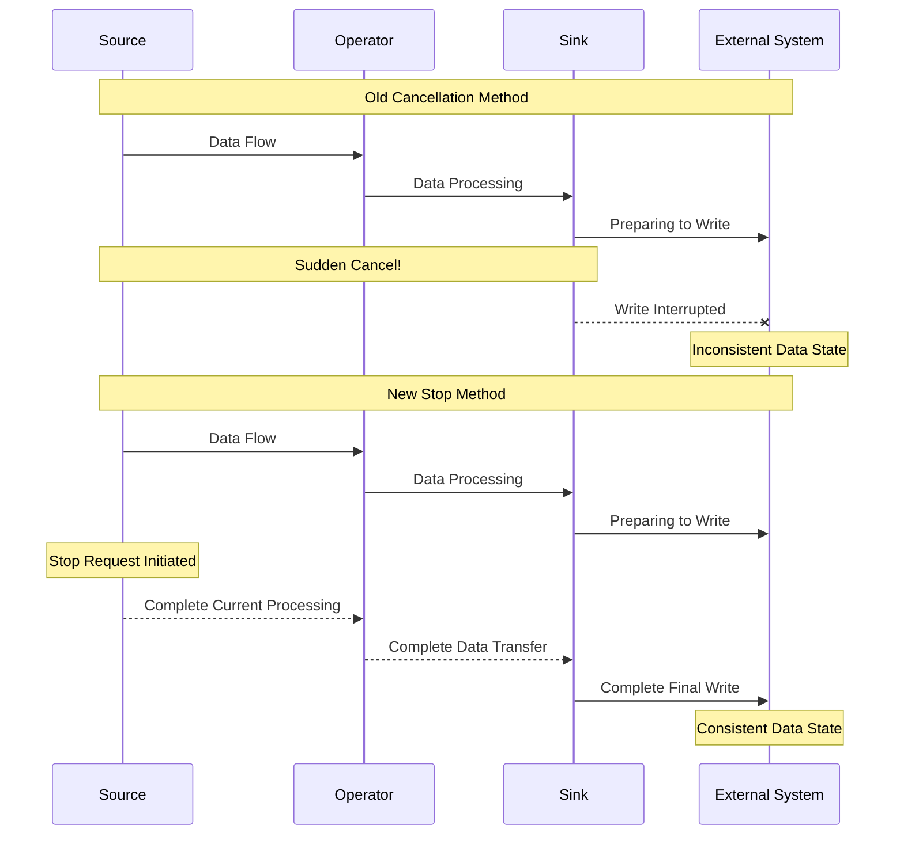
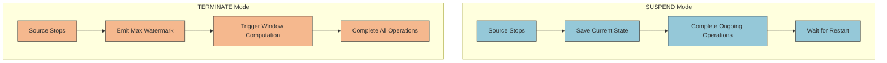

## Introduction

Imagine a train that needs to stop or terminate its journey. If you suddenly pull the emergency brake, the train will stop, but passengers might fall and luggage might scatter - clearly not an ideal way to stop. A train should slow down gradually, giving passengers time to prepare and come to a smooth stop at the platform. Flink's job termination mechanism needs this kind of grace.

## Why Was a New Stop Mechanism Needed?

In early versions of Flink, stopping jobs primarily relied on the "Cancel with Savepoint" mechanism. This was like a train conductor doing two things simultaneously:

1. Taking a snapshot of the current scene (savepoint)
2. Immediately pulling the emergency brake (canceling the job)

This approach had a critical issue: after taking the snapshot and immediately pulling the brake, the train is still running at high speed, and many passengers (data) haven't had time to properly settle. In technical terms, this means some ongoing operations (like file writes, database transactions) might not complete correctly.



## New Solution: SUSPEND and TERMINATE

Like trains having different stopping modes, FLIP-34 introduces two new job stopping modes:

### SUSPEND Mode (Temporary Stop)
This is like a train making a temporary stop at a platform:
- Only temporary stop, will restart in the future
- Preserves all "passenger states" (doesn't trigger final window computations)
- Ensures all ongoing operations complete
- Job state marked as FINISHED, indicating normal stop

### TERMINATE Mode (Final Destination)
This is equivalent to a train reaching its final destination:
- Permanent stop, no future restart
- Triggers all "arrival notifications" (emits maximum watermark, triggers final window computations)
- Ensures all data is correctly processed and saved
- Job state also marked as FINISHED



The main differences between the two modes lie in how they handle event time semantics:

| Feature | SUSPEND | TERMINATE |
|---------|----------|------------|
| Purpose | Temporary Stop | Permanent Stop |
| Event Time Timers | Keep Inactive | Trigger All Timers |
| Window Computation | Maintain Current State | Complete All Computations |
| State Handling | Save As-Is | Clean Up and Persist |
| External System Operations | Complete Ongoing Operations | Complete All and Close Connections |

## Implementation Details

The new stop mechanism is like a well-designed train scheduling system, including these key components:

1. **Synchronous Savepoint**
   - Job manager issues stop signal
   - All tasks synchronously save state
   - Wait for save confirmation

2. **Graceful Shutdown**
   - Sources stop receiving new data
   - Emit maximum watermark in TERMINATE mode
   - Wait for all operations to complete

3. **State Transition**
   - Job state changes to FINISHED
   - Clean up related resources

## Implementation Status

This improvement was initially implemented in Flink 1.9, with significant updates in Flink 1.15. It now supports more flexible usage:

### Savepoint Format Options

Two savepoint formats are now available:

1. **Canonical Format**:
   - Unified format across state backends
   - Provides best compatibility
   - Suitable for version migration and state schema changes

2. **Native Format**:
   - Introduced in Flink 1.15
   - Uses state backend's native format (like RocksDB's SST files)
   - Provides better performance

### Ownership Mode Selection

Three ownership modes were introduced to control savepoint file lifecycle:

1. **NO_CLAIM Mode (Default)**:
   - Flink doesn't take ownership of savepoint
   - Allows multiple jobs to start from same savepoint
   - First checkpoint will be complete checkpoint

2. **CLAIM Mode**:
   - Flink takes full ownership of savepoint
   - May automatically clean up unneeded savepoint files
   - Cannot start multiple jobs from same savepoint

3. **LEGACY Mode (Deprecated)**:
   - Backward compatibility mode
   - Will be removed in Flink 2.0

### Command Examples

```bash
# Suspend job (using canonical format by default)
$ flink stop [jobId]

# Terminate job using native format
$ flink stop --type native --terminate [jobId]

# Trigger savepoint asynchronously
$ flink savepoint [jobId] [targetDirectory] -detached

# Restore with specified ownership mode
$ flink run -s [savepointPath] -claimMode [NO_CLAIM|CLAIM] [otherArgs]
```

## Summary

FLIP-34, by introducing SUSPEND and TERMINATE modes, makes Flink job stopping process more graceful and controllable. Like a modern train scheduling system, it ensures:

1. Data Processing Integrity - All ongoing operations are properly handled
2. State Management Reliability - Savepoint generation and state persistence are more reliable
3. External System Consistency - Ensures interactions with external systems complete normally

This improvement makes Flink more mature and reliable when handling job stops, providing better support for production environments that require frequent stops, upgrades, and maintenance.
