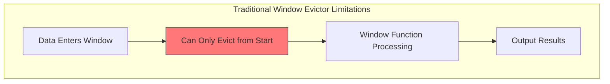
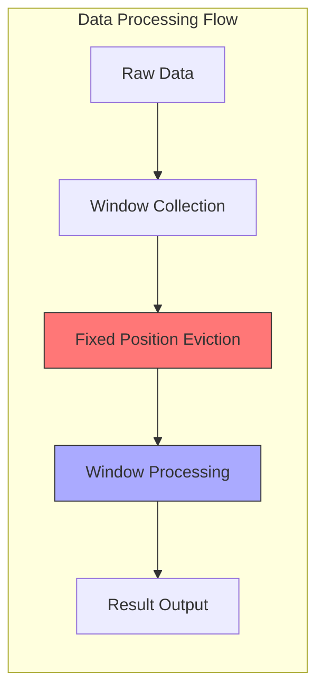
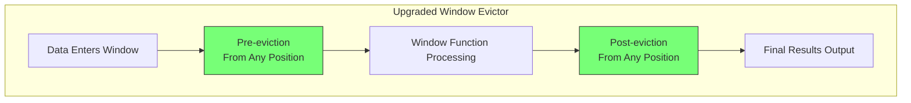

## Introduction

In Flink, Windows are an important mechanism for segmenting unbounded data streams. Each window collects data over a period of time, allowing us to compute and process this finite dataset. However, not all data within a window is valuable in real applications. That's why Flink provides the Window Evictor mechanism, which can clean up unnecessary data from windows according to specific rules.

For example, imagine you're processing sensor data, with each window containing temperature readings from a 10-minute period. Some readings might be anomalous values produced by malfunctioning sensors. If these data points aren't cleaned up promptly, they'll affect subsequent calculation results. The Window Evictor is the component responsible for this data cleanup work, ensuring that only valid data participates in calculations.

Think of this mechanism as a librarian who needs to organize books returned during a specific time period. Under the old rules, you could only process books starting from the earliest returns, and you had to decide which books to process before shelving them. Sometimes, though, you might want to decide which books need repair after organizing them, or you might want to determine the processing order based on book condition rather than return time.

This was the problem faced by Flink's Window Evictor before FLIP-4. It could only evict data from the beginning of the window before the window function processed the data. Like a librarian restricted to working in a fixed way, it wasn't flexible enough. FLIP-4's goal was to break these limitations and make data eviction smarter and more flexible.

## What Was Wrong with the Old Approach?

Let's understand the limitations of the original Window Evictor through a more intuitive example:



There were two main limitations:

The first limitation was "can only evict from the beginning." Like requiring a librarian to always start processing from the earliest returned books, even if some recently returned books need immediate attention. In real applications, newer data might be more important, or we might want to decide what to keep based on the data's content rather than its position.

The second limitation was "can only evict before processing." This is like requiring the librarian to decide which books to process before organizing them, rather than identifying issues during the organization process. In data processing, sometimes we need to see the processing results before deciding whether to evict certain data.

Let's look at how these limitations impact different scenarios:



For example:
1. In sensor data processing, you might want to keep data based on quality rather than time order
2. In trading systems, you might need to decide whether to exclude some anomalous transactions after calculating batch statistics

## How Does FLIP-4 Solve This?

FLIP-4 brought two important improvements to the Window Evictor:



### More Flexible Eviction Position

Now, the evictor can evict data from any position in the window based on specific needs, no longer limited to starting from the beginning. This is like allowing the librarian to process books based on their actual condition rather than just their return order.

### Smarter Processing Timing

Two processing timings were introduced:
The system performs data eviction at two points: once before the window function processes data (evictBefore) and once after processing (evictAfter). This design allows us to decide whether to further evict data based on processing results.

## How Is It Implemented?

FLIP-4 achieves these features through improved interface design. The new Evictor interface includes two core methods:
```java
void evictBefore(Iterable<TimestampedValue<T>> elements, 
                 int size, 
                 W window, 
                 EvictorContext evictorContext);

void evictAfter(Iterable<TimestampedValue<T>> elements, 
                int size, 
                W window, 
                EvictorContext evictorContext);
```

The system also provides several pre-built implementations. CountEvictor evicts data based on count, DeltaEvictor evicts based on value differences, and TimeEvictor evicts based on time. Each implementation can be flexibly configured to execute before or after the window function. For example, for DeltaEvictor:

```java
// Default configuration: evict before window function
DeltaEvictor.of(threshold, deltaFunction)

// Or explicitly specify eviction before window function
DeltaEvictor.of(threshold, deltaFunction, false)

// Configure eviction after window function
DeltaEvictor.of(threshold, deltaFunction, true)
```

The third parameter doEvictAfter controls the eviction timing: when set to false (the default), eviction occurs before window function processing; when set to true, eviction occurs after processing. CountEvictor and TimeEvictor provide similar configuration options.

## What Benefits Does It Bring?

This upgrade brings tangible benefits to Flink users:

First, processing logic becomes more flexible. Like freeing librarians from fixed rules, you can now decide how to process data based on actual needs.

Second, functionality becomes more powerful. By enabling eviction both before and after the window function, we can implement more complex data processing logic. Before processing, we can evict obviously unnecessary data to save processing time. After processing, we can further filter data based on processing results.

## How is Window Evictor Different from Window Function Filtering?

After understanding how the Window Evictor works, you might wonder: why not just write filtering logic in the window function? Why use a Window Evictor? Let's explain the difference using the library example:

Imagine you're managing a library's book organization process. Using Window Evictor is like actually removing unsuitable books during organization (perhaps moving them to a repair area or removing them from circulation), while filtering in the window function is like marking these books with sticky notes - they're still in their original position but won't be counted in the final statistics.

### 1. Different Processing Levels

Window Evictor works at the window management level, deciding which data can stay in the window. Like a librarian removing damaged books before organizing, these books are actually removed from the shelves. Filtering in the window function happens during business processing, like books marked with sticky notes - they're still on the shelves but won't be counted in statistics.

### 2. Different Performance Impact

With Window Evictor, evicted data is removed from the window state storage, saving storage space. Like removing unnecessary books promptly so shelves don't get too crowded. When filtering in the window function, all data remains in state storage, like marked books still occupying shelf space.

### 3. Different Use Cases

Window Evictor is better suited for scenarios like:
```java
// Example: eviction based on statistical information
.evictor(DeltaEvictor.of(
    3 * stdDev,  // Data exceeding 3 standard deviations will be evicted
    value -> value.getMetric()
))
```

While window function filtering is better for simple business rules:
```java
@Override
public void process(Context context, Iterable<Reading> readings) {
    for (Reading r : readings) {
        if (r.getValue() != null) {  // Simple null check
            // Process valid data
        }
    }
}
```

### 4. Different Flexibility

Window Evictor provides finer-grained control, allowing eviction at two timing points and from any position in the window. Like a librarian being able to filter books both before and after organization, and from any shelf position. In comparison, filtering in the window function is much simpler, only deciding whether to use certain data during processing.

In practice, these two approaches aren't mutually exclusive. You can use Window Evictor for eviction logic based on statistical information or complex rules, while keeping simple data validity checks in the window function.

## Practical Usage Tips

### 1. Choose the Right Eviction Strategy

When choosing an evictor, decide based on actual business requirements. If you only care about data quantity, CountEvictor is a good choice. When you need to filter data based on value differences, use DeltaEvictor. If your scenario is primarily time-related, TimeEvictor would be better.

### 2. Choose Appropriate Eviction Timing

Choosing when to evict is also important. For data that definitely won't participate in calculations, it's better to evict it before the window function executes to improve processing efficiency. If you need to see processing results before deciding whether to evict certain data, choose post-processing eviction.

### 3. Consider Performance Impact

Pay attention to performance balance when using this feature. Since evicting both before and after the window function brings additional computational overhead, weigh this against actual needs. For scenarios with very large data volumes, consider evicting some data before window function execution to reduce subsequent processing load.

### 4. Smooth Migration

If you're already using an older version of Evictor, note some changes during upgrade. CountEvictor's behavior remains basically unchanged, so you can use it confidently. DeltaEvictor's behavior has changed - it now checks all elements instead of stopping at the first match. For compatibility, all evictors default to executing before the window function.

## Case Studies

Let's look at how to apply these new features through two specific cases.

### Case 1: Real-time Data Quality Control

Suppose you're operating a temperature monitoring system in a smart factory. Each sensor sends temperature data every second, but data quality might vary due to various reasons (sensor malfunction, network jitter, etc.). In this scenario, we can use the improved Window Evictor like this:

```java
DataStream<SensorReading> sensorData = ...

sensorData
    .keyBy(SensorReading::getSensorId)
    .window(TumblingEventTimeWindows.of(Time.seconds(10)))
    .evictor(DeltaEvictor.of(
        5.0,  // temperature difference threshold
        (reading) -> reading.getTemperature(),
        true   // execute eviction after window function
    ))
    .process(new ProcessWindowFunction<...>() {
        @Override
        public void process(
            String sensorId,
            Context context,
            Iterable<SensorReading> readings,
            Collector<ProcessedReading> out) {
            
            // Calculate average temperature and standard deviation
            double avgTemp = calculateAverage(readings);
            double stdDev = calculateStandardDeviation(readings, avgTemp);
            
            // Output results, DeltaEvictor will remove data with large deviations afterward
            out.collect(new ProcessedReading(sensorId, avgTemp, stdDev));
        }
    });
```

In this case, we first calculate the average and standard deviation of all temperature data in the window, then use DeltaEvictor after window function execution to remove anomalous values that deviate by more than 5 degrees. The advantage is that we can more accurately judge which data is anomalous after understanding the overall data distribution.

### Case 2: Financial Transaction Anomaly Detection

Let's look at an example from the financial domain. Suppose we need to monitor stock trading data and identify potential anomalous trades. Here we can use both pre- and post-eviction:

```java
DataStream<StockTrade> trades = ...

trades
    .keyBy(StockTrade::getSymbol)
    .window(SlidingEventTimeWindows.of(Time.minutes(5), Time.minutes(1)))
    .evictor(new CustomTradeEvictor() {
        @Override
        public void evictBefore(
            Iterable<TimestampedValue<StockTrade>> elements,
            int size,
            Window window,
            EvictorContext ctx) {
            
            // Before processing, remove obvious anomalies (e.g., negative prices or zero volume)
            Iterator<TimestampedValue<StockTrade>> iterator = elements.iterator();
            while (iterator.hasNext()) {
                StockTrade trade = iterator.next().getValue();
                if (trade.getPrice() <= 0 || trade.getVolume() == 0) {
                    iterator.remove();
                }
            }
        }

        @Override
        public void evictAfter(
            Iterable<TimestampedValue<StockTrade>> elements,
            int size,
            Window window,
            EvictorContext ctx) {
            
            // After calculating statistics, remove potential suspicious trades
            // e.g., price fluctuations exceeding 3 standard deviations
            double avgPrice = getWindowAvgPrice(ctx);
            double stdDev = getWindowPriceStdDev(ctx);
            double threshold = 3 * stdDev;

            Iterator<TimestampedValue<StockTrade>> iterator = elements.iterator();
            while (iterator.hasNext()) {
                StockTrade trade = iterator.next().getValue();
                if (Math.abs(trade.getPrice() - avgPrice) > threshold) {
                    iterator.remove();
                    // These suspicious trades can be logged for further analysis
                    logSuspiciousTrade(trade);
                }
            }
        }
    })
    .process(new TradingAnalysisFunction());
```

In this case, we created a custom trade evictor that works in two steps:
1. Before window function execution, it removes obviously invalid trade records, such as negative prices or zero volume.
2. After window function execution, it identifies and removes potential anomalous trades based on calculated statistics (average price and standard deviation). These removed trades won't affect the final analysis results but are logged separately for further analysis by the risk control team.

These two cases demonstrate how the improved Window Evictor can work in real scenarios. It can not only achieve more precise data quality control but also support more complex business logic.

## Summary

FLIP-4 has made Flink's Window Evictor smarter. Like a modern library management system, it's no longer constrained by fixed rules but can flexibly process data based on actual needs. By allowing data eviction from any position and both before and after processing, it greatly improves the flexibility and efficiency of data processing.

This improvement might seem simple, but it opens up many new possibilities. Like providing librarians with better tools to better serve readers, the upgraded Window Evictor can help us achieve more precise and efficient data processing. This flexibility is particularly important in scenarios like real-time data processing.
