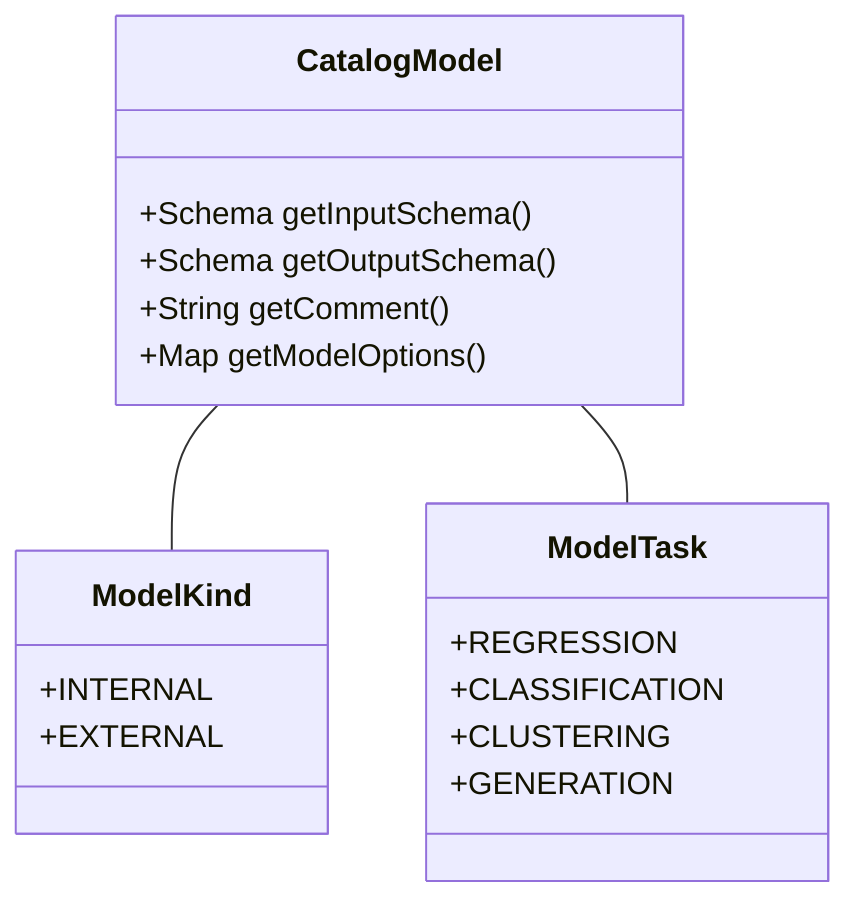
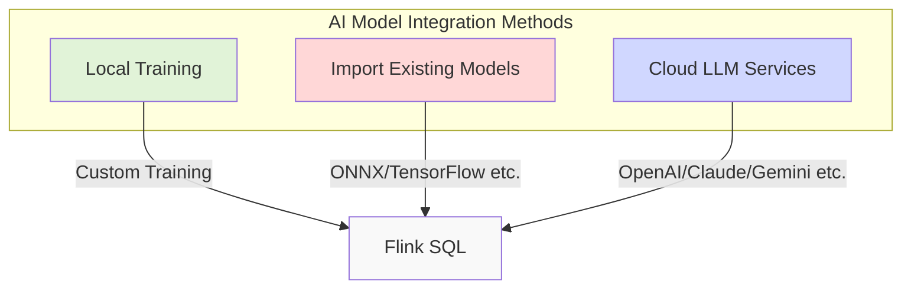

## Introduction

ChatGPT and generative AI are reshaping the entire tech world. The rise of large language models (LLMs) has not only changed how people interact with computers but also brought new opportunities and challenges to data processing. This FLIP aims to enable native support for AI models, including LLMs, in Flink SQL, breathing new life into data processing in the generative AI era.

## Why Do We Need This Feature?

Imagine a data analyst processing customer feedback data. In the traditional workflow, they need to constantly switch between multiple systems:


This fragmented workflow becomes particularly cumbersome in the LLM era: First, it relies on external orchestration systems to coordinate different stages, like efficiently passing data from Flink to ChatGPT API. Second, data transfer between different systems increases complexity, especially creating security risks when handling sensitive data. Furthermore, when models and prompts need updating, change management and data lineage tracking become exceptionally difficult. Finally, when processing real-time data streams, maintaining multiple systems is not only costly but also introduces significant latency and error risks.

This FLIP aims to solve these problems by directly supporting machine learning models in Flink SQL.

## Design Solution: How to Implement?

### Models as First-Class Citizens

The core idea of this FLIP is treating machine learning models as "first-class citizens" in Flink SQL. Like tables, models can be created, updated, deleted, and queried.

Let's see how models are defined in the new design:



A model primarily contains the following information: First, it needs to define input/output data formats (Schema) to ensure correct data flow. Second, models can be internal or external, determining storage and access methods. Models also need to specify their task type (regression, classification, etc.), which relates to their use cases. Finally, each model needs corresponding parameter configurations to ensure proper operation and optimization.

### SQL Syntax Extension

To support model operations, Flink SQL adds several new syntaxes:

```sql
-- Import external model
CREATE MODEL my_import_model
INPUT (f1 INT, f2 STRING)
OUTPUT (label FLOAT)
WITH(
  'task' = 'regression',
  'type' = 'import',
  'format' = 'ONNX',
  'ONNX.path' = 'http://storage.googleapis.com/models/model.onnx'
);

-- Use remote model service
CREATE MODEL my_remote_model
INPUT (f1 INT, f2 STRING)
OUTPUT (label STRING, probs ARRAY<FLOAT>)
WITH(
  'task' = 'classification',
  'type' = 'remote',
  'provider' = 'openai',
  'openai.endpoint' = 'https://api.openai.com/v1/chat',
  'openai.api_key' = '******'
);

-- Use model for prediction
SELECT * FROM ML_PREDICT(my_model, DESCRIPTOR(f1, f2));
```

### AI Model Integration Methods



This design supports three ways of using AI models: First, training small models directly in Flink, like classifiers and regression models. Second, importing pre-trained models, supporting standard formats like ONNX. Finally, calling cloud-based LLM services, including ChatGPT, Claude, and Gemini.

## Current Progress

This FLIP is actively under development. From Jira progress, basic model syntax parsing and Catalog change support are complete, while temporary model support and model evaluation features are currently in development.

Community voting has passed, and it's expected to be officially released in future Flink versions.

## What Will the World Look Like After Implementation?

When this feature is fully implemented, the workflow between data processing and machine learning will become more seamless:


Data teams can directly call LLMs like ChatGPT through SQL to process text data while using AI models for real-time prediction and generation in stream processing. They can uniformly manage all AI model versions and permissions, and completely track the entire process from raw input to AI-processed output. Most importantly, this integration method significantly reduces development and deployment costs for both traditional machine learning and generative AI applications.

## Summary

FLIP-437 represents a key upgrade for Flink in the generative AI era. By providing AI capabilities, including LLMs, at the SQL level, it makes the combination of data processing and AI technology unprecedentedly smooth. This not only makes traditional machine learning tasks easier but also opens a door for Flink into generative AI. Although still under development, its forward-looking design has gained community approval. In the near future, the powerful combination of Flink+AI will bring more possibilities to data processing.
