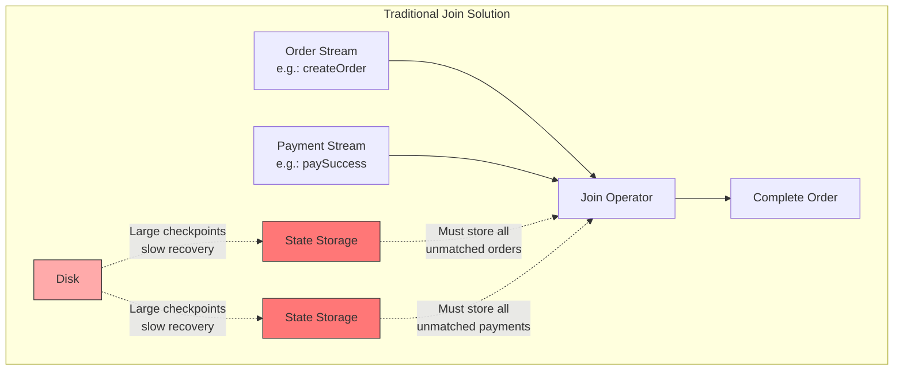
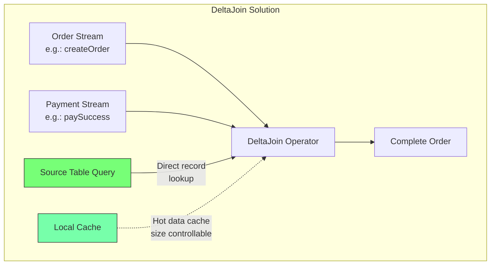
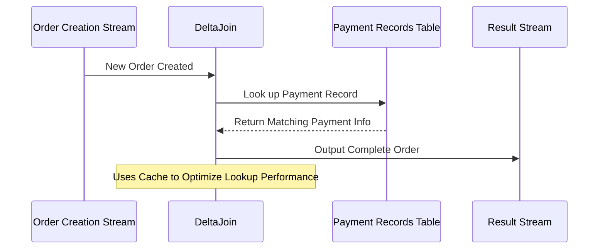
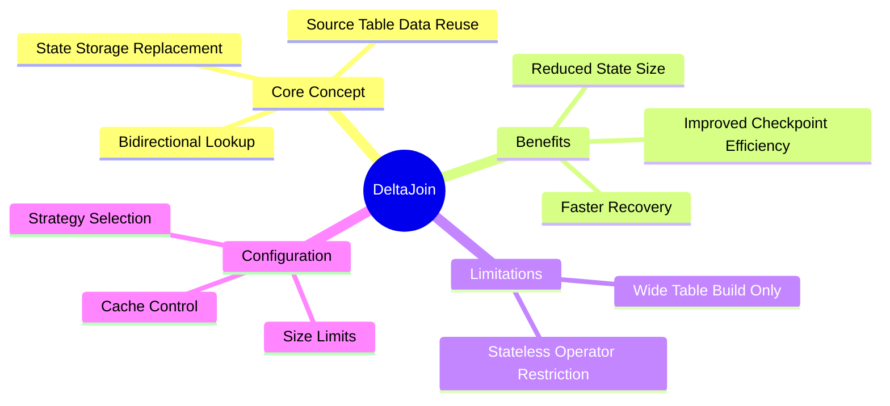

## Introduction

Imagine this scenario: an e-commerce platform needs to process order data in real-time, linking order creation information with payment success information to promptly update order status, shipping, and subsequent processing. This process generates two data streams: the order creation stream and the payment success stream. As time progresses, unmatched orders and payment data accumulate, causing the Join operation's state space to grow increasingly large, like an ever-expanding balloon that might eventually burst the entire system. This FLIP proposes a new solution called DeltaJoin to address this issue.

## Why DeltaJoin?

In Flink's stream processing tasks, Join node state has always been a persistent challenge:

1. State grows continuously over time, like a snowball rolling larger and larger
2. Large states cause tasks to slow down, like running with an increasingly heavy backpack
3. Checkpoint saving and recovery times increase, affecting task stability

While setting TTL (Time To Live) can help clean up expired data, this method isn't suitable for all scenarios and doesn't address the root cause.

## What is DeltaJoin?

DeltaJoin's core concept is to use bidirectional lookup to reuse source table data instead of storing Join states. This might sound abstract, so let's illustrate with diagrams:

## How DeltaJoin Works

Let's illustrate DeltaJoin's operation through a sequence diagram:

DeltaJoin's workflow includes these key steps:

1. **Data Arrival**: When a new order is created, DeltaJoin receives the order creation event.
2. **Match Finding**: DeltaJoin looks up corresponding payment information in the payment records table based on join conditions.
3. **Cache Optimization**: DeltaJoin caches frequently used payment records for improved efficiency.
4. **Result Output**: Once a matching payment record is found, DeltaJoin associates the order creation info with payment info and outputs a complete order record.

## Configuration Options

DeltaJoin provides several configuration options:

| Option | Values | Default | Description |
|--------|---------|---------|-------------|
| table.optimizer.delta-join.strategy | AUTO/FORCE/NONE | AUTO | Whether to enable DeltaJoin |
| table.exec.delta-join.cache-enable | true/false | true | Whether to enable caching |
| table.exec.delta-join.left-cache-size | numeric | 10000 | Left table cache size |
| table.exec.delta-join.right-cache-size | numeric | 10000 | Right table cache size |

The strategy options mean:
- AUTO: Optimizer tries DeltaJoin first, falls back to regular Join if conditions aren't met
- FORCE: Forces DeltaJoin use, throws error if conditions aren't met
- NONE: Doesn't use DeltaJoin

## Current Progress

This FLIP is currently in the discussion phase, with work focused on:
1. Finalizing implementation details
2. Developing performance benchmarks
3. Adding more test cases

## Summary

DeltaJoin's design philosophy is practical - rather than storing large amounts of state data during joins, it makes efficient use of source table data itself. This approach not only reduces resource consumption but also improves system reliability. While there are currently some limitations and the architecture requires a storage engine capable of both stream reading and point queries, this direction shows great promise. We look forward to seeing more improvements and breakthroughs in future versions.
