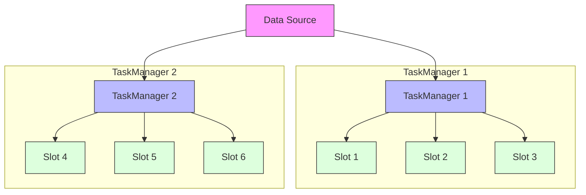
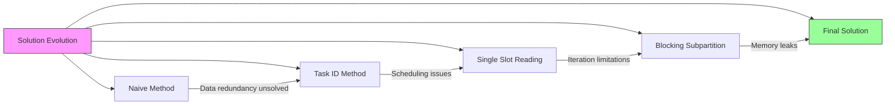
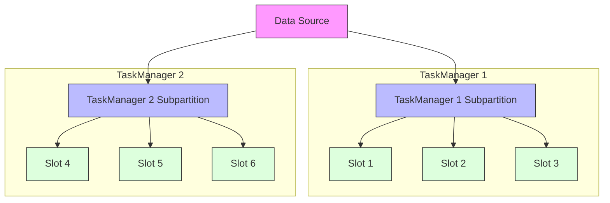

## Introduction

Imagine you're a class representative who needs to distribute important study materials to your classmates. If the class is divided into several groups, what would you do? Would you make one copy for each group and let the group leader distribute it to members, or make a copy for each student? Obviously, the first method is more paper-efficient and effective.

Flink's early broadcast variable distribution mechanism was like giving a copy to each student, even when some students were in the same TaskManager (equivalent to a group). This not only wastes network bandwidth but also affects overall performance. FLIP-5 was proposed to address this issue.

## What Was Wrong with the Old Approach?

Let's illustrate the current problem with an example:

In the above example, a TaskManager has multiple Slots (processing slots). When using broadcast variables, the same data is sent to each Slot, even when these Slots are on the same TaskManager. This leads to two main problems:

1. Network Traffic Waste: Multiple Slots on the same TaskManager receive identical copies of the data.
2. Performance Degradation: As the number of Slots per TaskManager increases, the amount of data transferred increases proportionally.

Experimental data shows that when the number of Slots per TaskManager increases from 1 to 16, processing time significantly increases:
- 1 Slot: about 6.8 seconds
- 16 Slots: over 37 seconds

## What Solutions Did FLIP-5 Propose?

The research team proposed several solutions. Let's look at the most important ones:

### Final Solution: Redesigning Data Distribution Mechanism

The core idea of the final solution is a complete overhaul of the broadcast data distribution mechanism. Specifically:

1. **One Subpartition per TaskManager**: Each TaskManager creates and uses only one subpartition to receive broadcast data, instead of creating one for each Slot. This is like giving one copy of materials to each class leader (subpartition) rather than to each student (Slot).

2. **Redirecting Execution Edges**: This solution requires modifying Flink's execution graph, redirecting all execution edges to a single subpartition. This is like unifying multiple scattered transmission paths into one main route:

3. **Data Sharing Mechanism**:
   - One task in the TaskManager is designated as the "primary reader," responsible for reading data from the subpartition
   - This task deserializes the data and stores it in a TaskManager-level shared memory area
   - Other tasks on the same TaskManager can read data directly from this shared memory area, avoiding repeated network transfers and deserialization
   - This is like having the class leader (primary reader) get the materials first, make a copy for the classroom (shared memory), and other students can view it directly in the classroom without asking the teacher

4. **Smart Release Mechanism**:
   - The primary reader task sends a release signal after completing data processing
   - Other tasks send "completion" signals after using the shared data
   - The system tracks the status of all tasks and only releases resources when confirmed that all tasks no longer need the data
   - This mechanism ensures data isn't cleared until all tasks have finished using it

This solution brought significant improvements:

1. **Performance Improvement**:
   - Greatly reduced data transfer volume and network load
   - Processing time remains stable even with increased Slot count
   - Experimental data shows processing time remains around 6-7 seconds even when increasing from 1 to 16 Slots

2. **Resource Utilization Optimization**:
   - Data only needs to be transmitted and stored once per TaskManager
   - More efficient memory usage, avoiding duplicate data storage
   - Significantly reduced number of network connections

3. **Better Scalability**:
   - System performance no longer significantly degrades with increased Slots per TaskManager
   - Better suited for large-scale deployment scenarios

## Why Was This FLIP Abandoned?

Although this FLIP proposed good optimization ideas, it was ultimately abandoned for several main reasons:

1. Native Iteration Support Issues: The improvement plan had compatibility issues with Flink's Native Iteration functionality.
2. Implementation Complexity: Fully solving the problem required significant changes to Flink's scheduling system.
3. Other Higher Priority Improvements: The community chose to prioritize other more urgent issues.

## Summary

Although FLIP-5 wasn't ultimately adopted, the problems it identified and the solutions it proposed are valuable. It reminds us to pay special attention to data transfer efficiency when handling distributed data. While this specific improvement wasn't implemented, the Flink community continued to optimize broadcast variable performance through other means. This is the charm of the open-source community — finding the most suitable solutions through continuous attempts and discussions.
