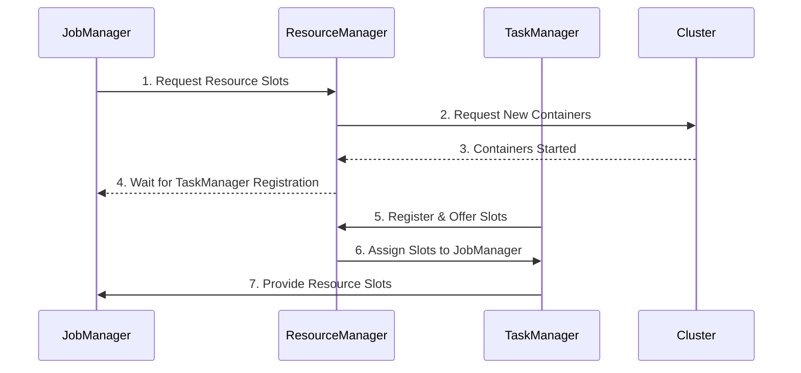
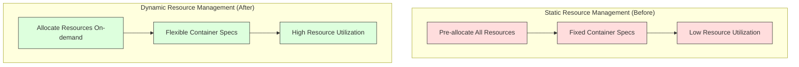
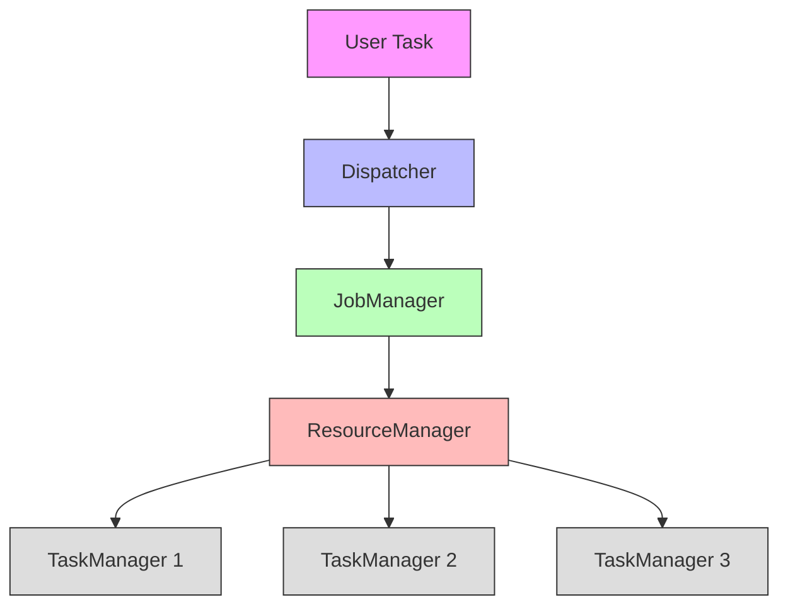
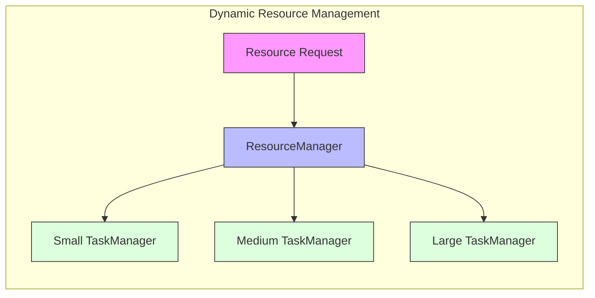
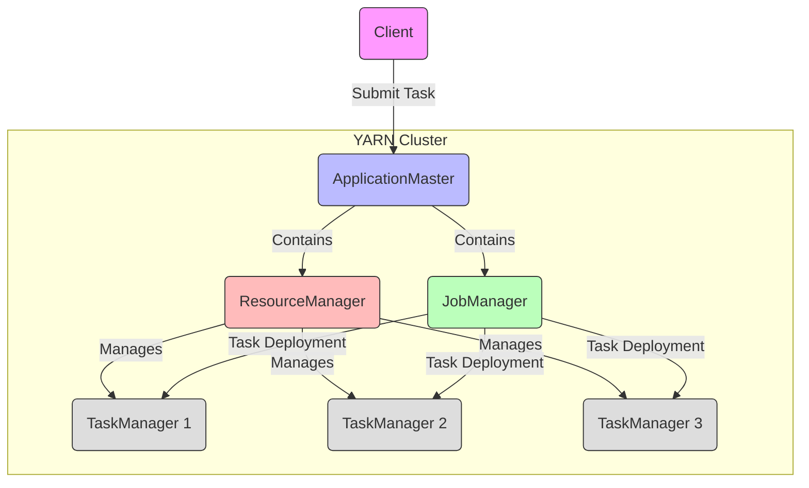
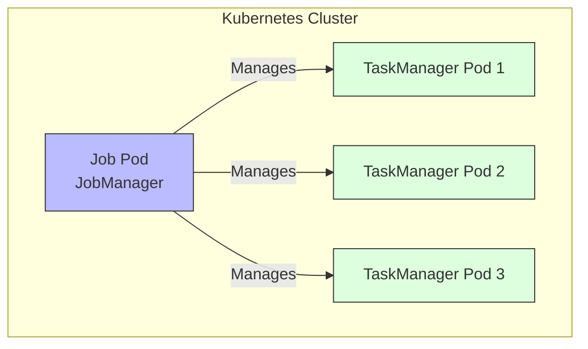
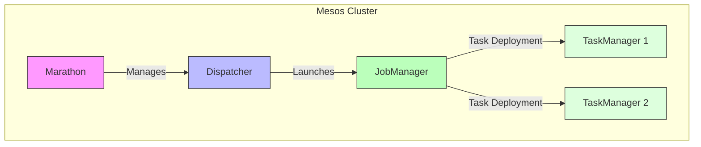

## Introduction

Imagine you're organizing a large party. You need to arrange staff, allocate space, and coordinate activities in different areas. Some servers might only need to work during specific time slots, some areas might need more or fewer people. If you can flexibly manage these resources, the party will run more smoothly.

Flink faces similar challenges when running on clusters. As a distributed system, it needs to run efficiently on different cluster management systems like YARN, Mesos, and Kubernetes. FLIP-6 was proposed to address this challenge, making Flink better at utilizing features of these cluster management systems.

Let's first look at the changes this improvement brings:

## Why Was This Improvement Needed?

Before FLIP-6, Flink had some frustrating issues when running on clusters:

### Rigid Resource Allocation

Like a restaurant having to reserve all tables at once during booking, Flink tasks needed to request all required resources at startup. This caused two problems: potentially reserving too many resources causing waste, and difficulty in adding resources later if needed.

### One-Size-Fits-All Containers

Imagine if all restaurant tables had to be four-seaters - inconvenient for both couples and groups of six. Flink faced a similar issue on YARN - all containers had to be the same size, unable to adjust based on actual needs.

### Complex Deployment Process

Deploying Flink tasks in Docker or Kubernetes environments required first starting the framework, then submitting tasks - like having to build the stage before starting the show. This two-step process felt unnatural.

## How Does FLIP-6 Solve These Problems?

Let's understand the new architecture introduced by FLIP-6 through a simple diagram:

### Single-Task JobManager

The most important change in FLIP-6 is making each JobManager responsible for just one task. It's like assigning a dedicated stage manager to each performance, rather than having one manager handle multiple shows. This brings several benefits:

1. Clearer Responsibilities: Each JobManager only needs to focus on its assigned task
2. Better Isolation: Problems in one task won't affect others
3. Easier Management: Resources can be released immediately after task completion

### Flexible ResourceManager

The ResourceManager became a smarter resource manager that can:

1. Allocate Resources On-demand: Assign TaskManagers based on actual task requirements
2. Adjust Resources Dynamically: Add or reduce resources during task execution
3. Support Different Specifications: Launch TaskManagers with different configurations (memory, CPU)

## Performance on Different Cluster Managers

### On YARN

Improvements on YARN are particularly noticeable:

Main improvements:
- More Direct Task Submission: Clients can launch tasks directly on YARN
- More Efficient Resource Usage: Request and release containers as needed
- Better Isolation: Resources for different tasks don't interfere

### On Kubernetes

In containerized environments:
- More Natural Deployment: Deploy entire tasks directly using Docker images
- Simpler Integration: Fully aligned with containerization principles
- Easier Scaling: Leverage Kubernetes' auto-scaling capabilities

### On Mesos

In Mesos environments:
- Better Resource Scheduling: Fully utilize Mesos' fine-grained resource management
- More Flexible Deployment: Support multiple deployment modes
- Stronger Fault Tolerance: Leverage Mesos' service discovery mechanism

## What Specific Improvements Were Made?

### First Improvement: Dynamic Resource Allocation

Flink can now dynamically request and release resources based on actual task needs. Like a restaurant adjusting seating based on customer numbers, this improves resource utilization.

### Second Improvement: Heterogeneous Container Support

Support for using different container specifications within the same task. For example, compute-intensive operations can use more CPU resources, while memory-intensive operations can use larger memory configurations.

### Third Improvement: Simplified Deployment Process

Especially in container environments, Flink tasks can now be deployed like regular containerized applications, eliminating the two-step process.

## Practical Usage Tips

### 1. Choose the Right Deployment Mode

Choose the appropriate deployment mode based on your specific needs:
- Use per-job mode for quick single task launches
- Consider session mode for running multiple short tasks
- Prioritize native container deployment in containerized environments

### 2. Resource Configuration Recommendations

- Configure appropriate container specifications based on operation types
- Reserve suitable resource margins for tasks
- Monitor resource usage and adjust configurations accordingly

### 3. High Availability Configuration

- Configure ZooKeeper for JobManager high availability
- Use persistent storage for checkpoints
- Set reasonable heartbeat timeout periods

## Summary

FLIP-6's improvements make Flink run more efficiently and flexibly on various cluster management systems. It's like equipping Flink with an intelligent resource scheduling system that can dynamically adjust resources based on actual needs, making task execution smoother.

This improvement also lays a solid foundation for Flink's future development. As cloud-native technologies evolve, containerization and dynamic resource management become increasingly important, and FLIP-6's improvements enable Flink to better adapt to these technology trends.

Notably, this FLIP has been completed and released in Flink 1.5. Its successful implementation marks a new height in Flink's resource management and deployment capabilities, providing users with a better experience.
