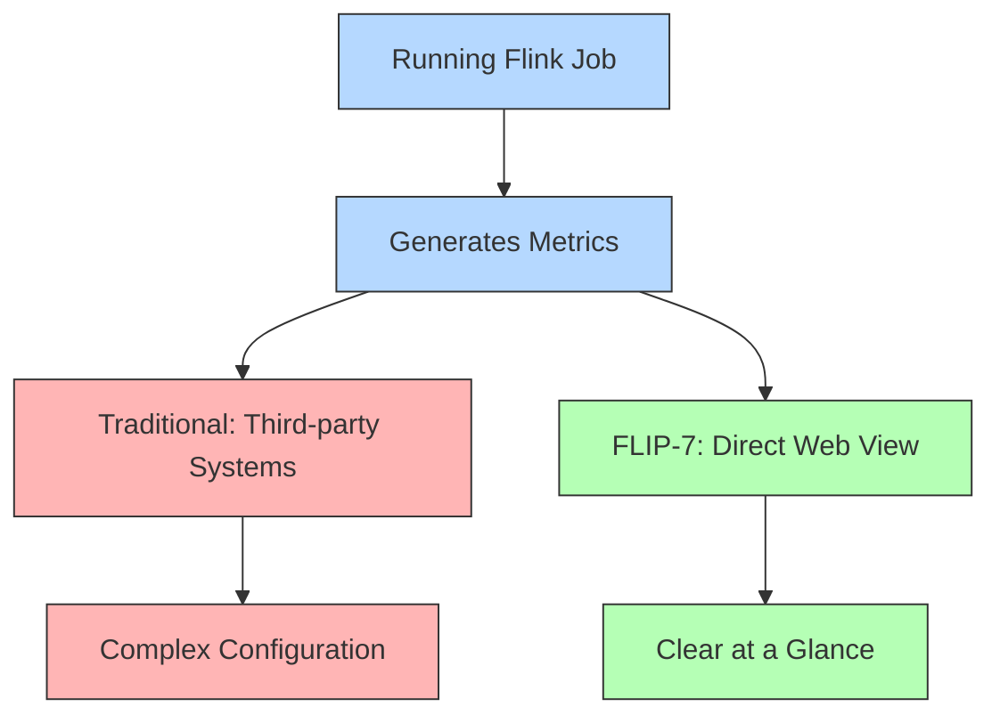
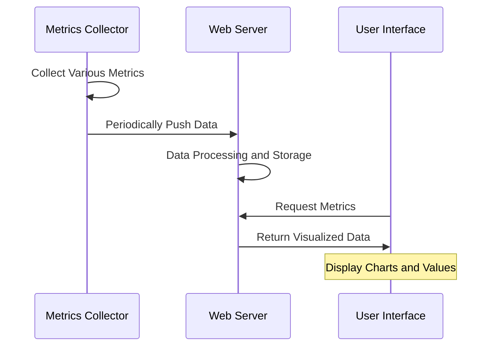

## Introduction

Running a Flink job but not sure how it's performing? It's like driving a car with mud-covered windows, unable to see the road conditions. In early versions of Flink, although the system collected many monitoring metrics, this data was buried deep in the system and required external monitoring systems to view, making it quite inconvenient to use. FLIP-7 aims to solve this problem by displaying these important monitoring metrics directly in Flink's web interface.

## Why Do We Need to See Monitoring Metrics on the Web?

Just as modern cars have dashboards showing speed, fuel level, and engine temperature, Flink's monitoring metrics need an intuitive "dashboard." This brings several clear benefits:

### 1. Early Problem Detection
The job's running status can be seen directly on the web page. If any tasks are processing too slowly or using too much memory, it's immediately apparent. Like a car's dashboard warning, it alerts you before problems escalate.

### 2. Better Performance Understanding
By observing processing speed, latency, and other metrics, you can clearly know if the system is running efficiently. It's like watching your speedometer while driving, knowing whether to speed up or slow down.

### 3. More Accurate Tuning
With this visualized data, system parameter adjustments no longer rely on guesswork. For instance, if you see a task consistently using lots of memory, you know to increase its memory configuration.

## What Specific Improvements Were Made?

FLIP-7 made these main improvements:

### 1. Interface Improvements
Added new monitoring pages to Flink's web interface, showing:
- Task processing speed
- Memory usage
- Data backpressure
- Network transfer status

### 2. Data Update Mechanism
- Periodic automatic data refresh
- Options to view real-time data or historical trends
- Support for different time range selections

### 3. Display Optimizations
Multiple display methods were adopted to make data easier to understand:
- Numeric Display: Shows specific values directly
- Trend Charts: Shows data change trends
- Status Indicators: Uses different colors to indicate system status

## Usage Recommendations

Here are some tips to help you better monitor your system using this new feature:

### Key Metrics to Monitor

| Metric Type | What to Focus On | Why It's Important |
|-------------|------------------|-------------------|
| Throughput | Records processed per second | Reflects system processing capacity |
| Latency | Data processing wait time | Impacts real-time requirements |
| Backpressure | Data processing backlog | Warns of system bottlenecks |
| Resource Usage | CPU, memory utilization | Prevents resource exhaustion |

### Proper Refresh Rate Usage
- Increase refresh rate when running critical tasks
- Lower rate for long-term monitoring to reduce system load

## Summary

FLIP-7 is like installing a modern dashboard in Flink, making system operating conditions clearly visible. This improvement greatly enhances Flink's usability, allowing operations staff to better control system running conditions and promptly detect and resolve issues.

While the visualization of monitoring metrics might seem like a simple improvement, it greatly enhances user experience, similar to the transformation of cars from having no dashboard to having modern instrumentation, making system operation status clear at a glance. Through FLIP-7, Flink has taken another important step in usability.
