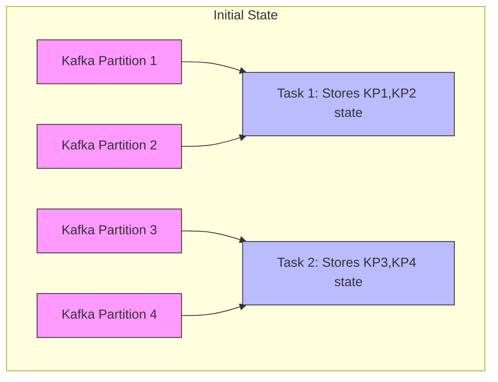
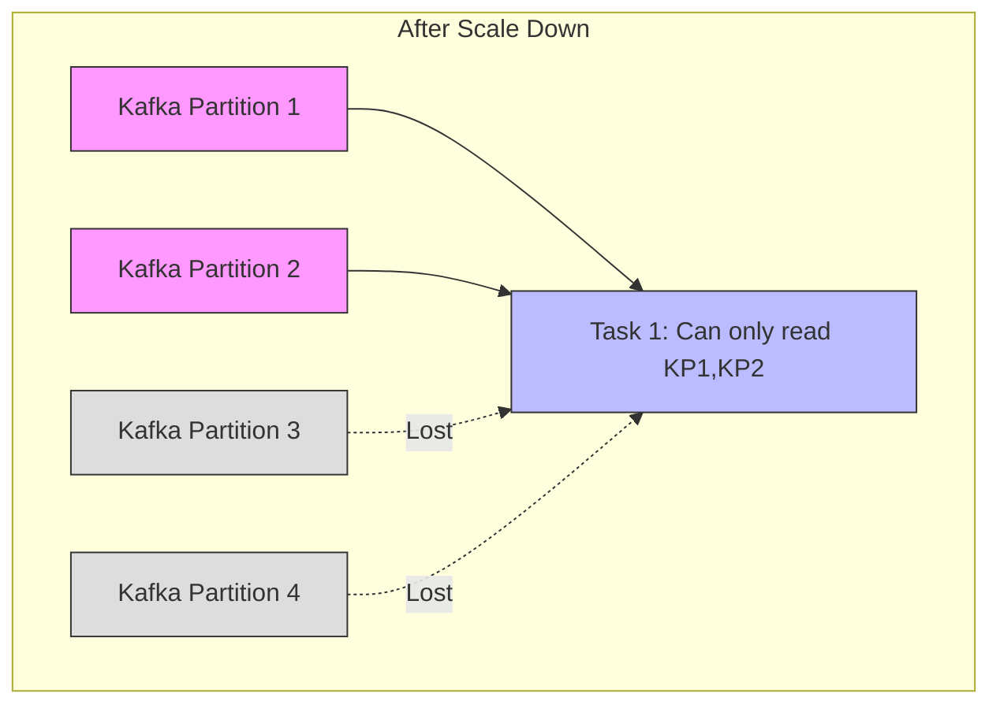
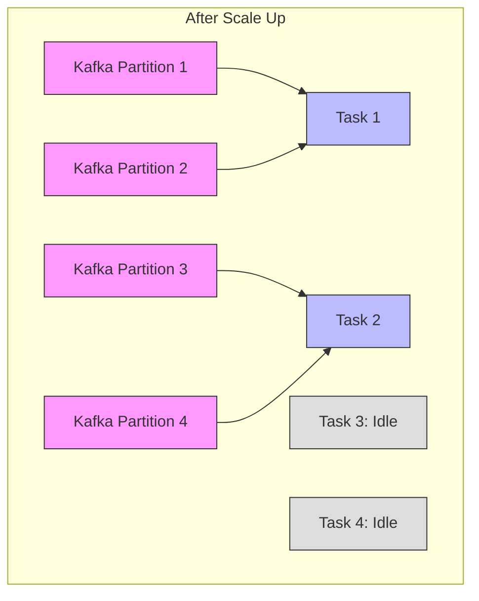
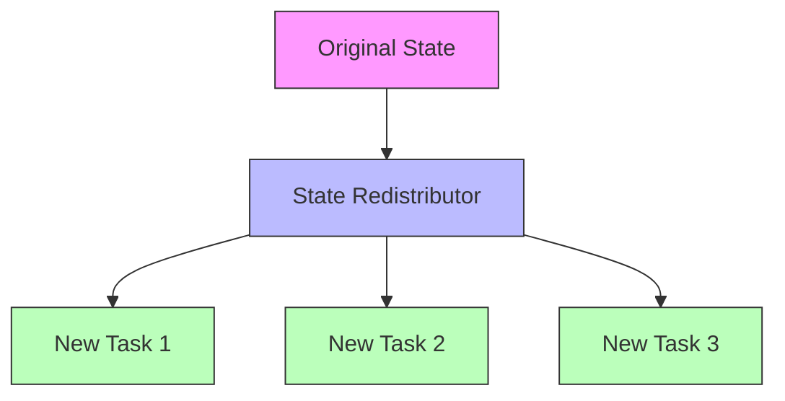
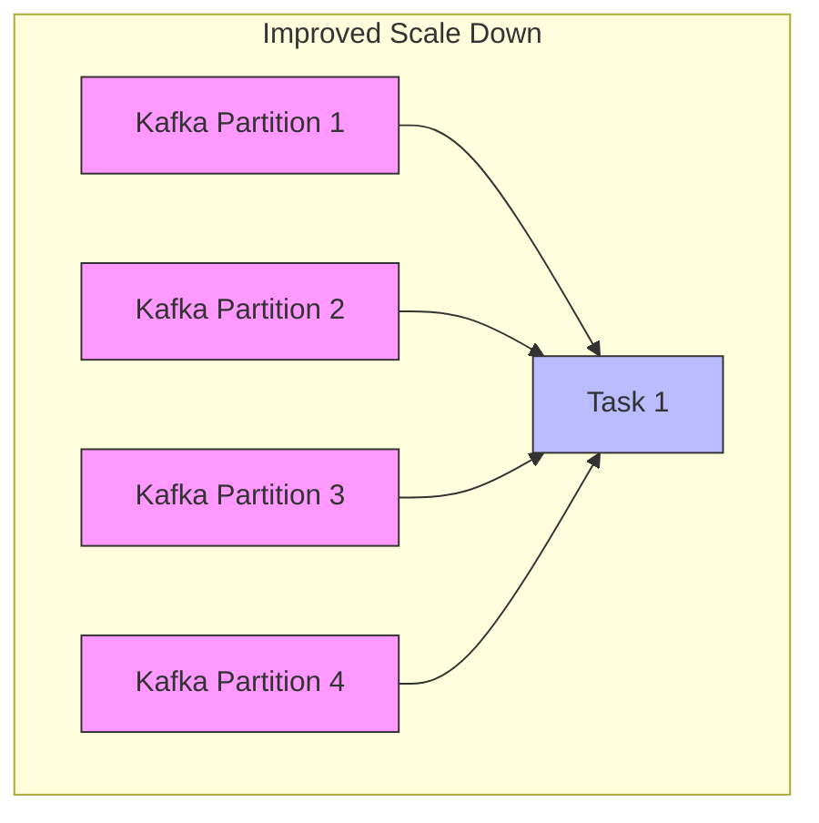
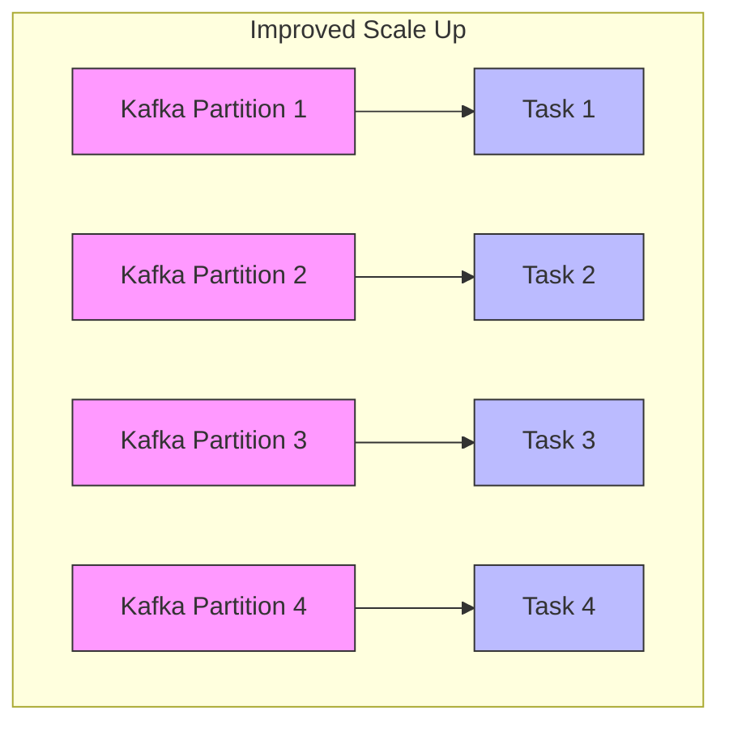

## Introduction

In distributed systems, data scalability is a crucial feature. Imagine a busy restaurant kitchen: if only one chef is responsible for all dishes, they'll be overwhelmed when orders increase. But if you can increase or decrease the number of chefs and workstations as needed, and each chef can take over others' work, the entire kitchen can operate efficiently.

## What is Non-Partitioned State?

In Flink, states are primarily divided into two types: partitioned state and non-partitioned state.

Partitioned State is state associated with specific keys. For example, when processing user shopping behavior, each user's shopping cart state is partitioned state, naturally distributed to different tasks based on user ID. Redistributing this type of state is relatively simple because the keys themselves provide a natural basis for redistribution.

Non-Partitioned State is overall state associated with task instances, independent of specific keys. For example:
- Kafka consumers need to record consumption position (offset) for each partition
- File sources need to record processed file positions
- Counters need to maintain overall count values

This type of state originally exists as a whole within each task, and when task count needs to be increased or decreased, it faces the challenge of how to split or merge these states.

## Why Was This Improvement Needed?

Let's first illustrate the current situation with a specific example. Suppose we're using a Kafka source that's responsible for reading from 4 Kafka partitions and using 2 Flink tasks to process:



In previous versions, two major problems occurred when changing task count:

### Problems When Scaling Down

When reducing tasks from 2 to 1:



State belonging to Task 2 (offsets for KP3, KP4, etc.) would be lost, preventing continued processing of these partitions.

### Problems When Scaling Up

When increasing tasks from 2 to 4:



New Tasks 3 and 4 would remain idle because the system didn't know how to redistribute existing state to these new tasks.

## How Does FLIP-8 Solve This?

FLIP-8 introduces a new mechanism allowing non-partitioned state to flexibly migrate between tasks. This improvement includes three core components:

### 1. State Storage Improvement
Introduced a new state management interface OperatorStateStore that can store state as lists. It's like distributing cafeteria tasks among multiple chefs, each responsible for preparing certain ingredients and dishes.

```java
public interface OperatorStateStore {
    // Can register multiple state lists, each redistributable between tasks
    <T> ListState<T> getListState(String stateName, 
                                 TypeSerializer<T> serializer) 
        throws Exception;
}
```

### 2. State Redistribution Strategy
Designed flexible state redistribution strategy interfaces:



This mechanism allows users to customize how state is distributed between tasks. The system currently provides a round-robin distribution strategy by default, like evenly distributing a pot of food among multiple chefs' workstations.

### 3. Simplified User Interface
To make this feature easier for developers to use, two levels of interfaces are provided:

- CheckpointedFunction: Full-featured interface for scenarios requiring fine control
- ListCheckpointed: Simplified interface for basic state management needs

```java
// Simplified interface example
public interface ListCheckpointed<T extends Serializable> {
    // Put data in list when saving state
    List<T> snapshotState(long checkpointId) throws Exception;
    // Read data from list when restoring state
    void restoreState(List<T> state) throws Exception;
}
```

## What Are the Results?

Let's look at the improved behavior of the Kafka source:

### When Scaling Down:



All states merge into remaining tasks, ensuring no data loss.

### When Scaling Up:



States are evenly distributed among all tasks, fully utilizing new computing resources.

## Has This Improvement Been Implemented?

Yes, this improvement was implemented in Flink 1.2.0. In practice, it not only solved the scaling issues for Kafka connectors but also provided a good solution for other scenarios requiring non-partitioned state management.

## Implementation Details

To ensure this feature's reliability and performance, the implementation includes these key designs:

### Type Serialization
Each state has its own serializer, ensuring that even if state data format changes, old checkpoints and savepoints can still be correctly restored. It's like giving each chef standardized recipes, ensuring dish taste and quality remain consistent even when chefs change.

### Safe State Management
During state redistribution, the system ensures:
1. State Integrity - No data loss
2. Consistency - All task states update synchronously
3. Failure Recovery - Can roll back to previous state if redistribution fails

### Performance Optimization
The system uses lazy deserialization strategy, only deserializing when state is actually needed, reducing unnecessary performance overhead.

## Summary

FLIP-8's implementation makes Flink more flexible and powerful in handling non-partitioned state. It's like equipping a restaurant with an intelligent task scheduling system that can dynamically adjust chef workload distribution based on dining peaks, making the entire kitchen operate more efficiently and reliably. This improvement not only enables better Kafka connector operation but also provides a general solution for other scenarios requiring dynamic scaling.
