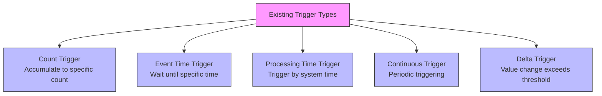
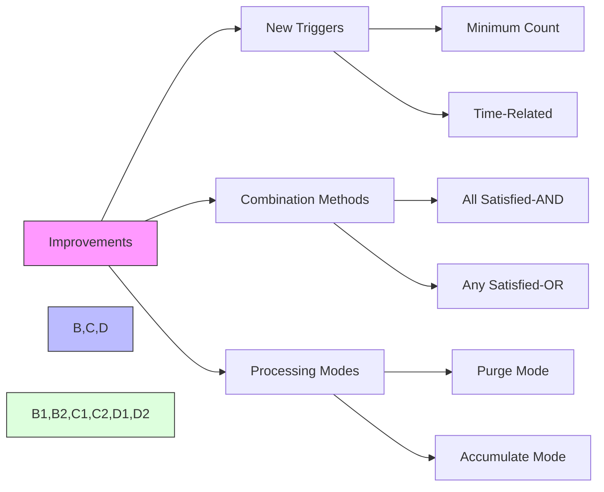

## Introduction

Imagine an alarm system: sometimes you want to wake up at a fixed time (like 7 AM), sometimes after a specific duration (like 8 hours), and sometimes when there's enough sunlight. In daily life, these wake-up conditions can be freely combined - like "ring at 7 AM or after 8 hours of sleep, whichever comes first."

Triggers in Flink are like such an alarm system, determining when to process data. Unfortunately, the triggers at that time weren't as flexible - they couldn't combine multiple conditions like an alarm clock. FLIP-9 aimed to solve this problem, making trigger rule writing as simple and intuitive as setting an alarm. However, this proposal was ultimately shelved - why?

## What Was Wrong with the Existing Triggers?

These triggers were usable but had two obvious limitations:

### Couldn't Be Combined

Like an alarm clock that can only set either "fixed time" or "timer" alarms, but not "ring at fixed time or when timer expires, whichever comes first." In Flink, you couldn't combine conditions like "data accumulates to a certain amount" and "reaches a certain time point."

### Inflexible Handling of Late Data

Suppose the alarm rang but you didn't wake up - should it keep ringing or wait for the next time? Similarly with delayed data. While the system allowed setting a wait time, you couldn't specify special handling rules for these "late" arrivals. It's like not being able to set a rule like "if I don't wake up the first time, ring every 5 minutes until I do."

## What Improvements Did FLIP-9 Propose?

FLIP-9 proposed a more flexible approach:

1. **New Basic Triggers**:
   - Like an alarm that can ring by time ("7 AM") or duration ("8 hours of sleep")
   - In Flink, this means triggering by data volume or time

2. **Combination Methods**:
   - Can say "trigger only when all conditions are met" (like "wake up when alarm rings AND it's light")
   - Or "trigger when any condition is met" (like "wake up when alarm rings OR it's light")

3. **Two Processing Modes**:
   - Reset after triggering: like resetting the alarm for next time
   - Continue accumulating: like snooze mode, continue timing after ringing

## Why Wasn't It Adopted?

This proposal was ultimately shelved for several main reasons:

1. **Too Complex to Implement**: Making the system support such flexible combinations was like turning a simple alarm clock into a smart home system - too much work.
2. **Limited Actual Demand**: Most users were satisfied with basic trigger methods, just like most people only need a simple alarm clock.
3. **High Maintenance Cost**: More complex features mean more difficult maintenance and upgrades, like smart products being more prone to issues than simple ones.

## Summary

The case of FLIP-9 shows that some ideas, while looking good on paper, might face unexpected difficulties in implementation. Sometimes, keeping things simple is the wiser choice. Although this proposal wasn't adopted, the problems it discussed and the decision-making process provided good references for subsequent improvements.

If you're using Flink now, you can implement special trigger requirements through custom triggers. While this might require writing more code, it's actually more flexible and easier to understand and maintain.
