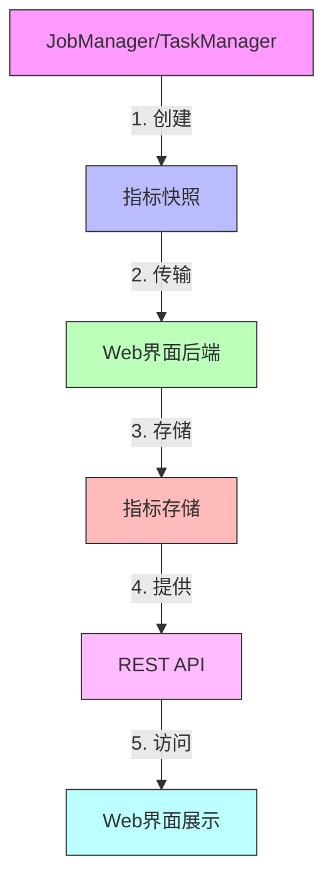
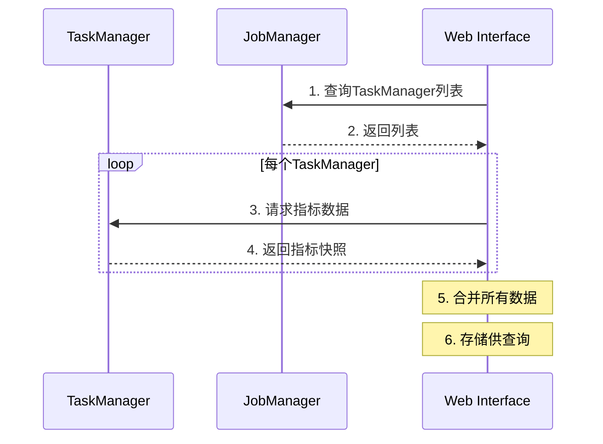
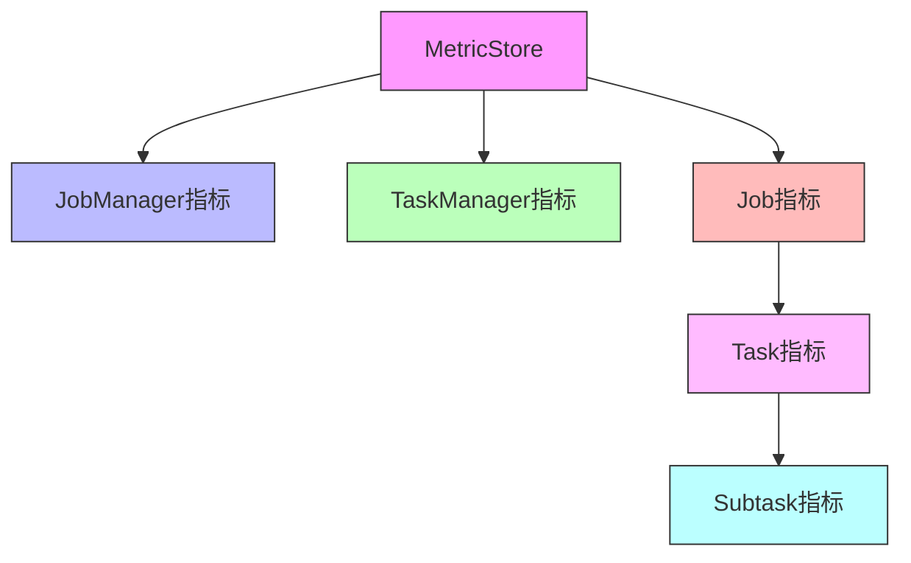

# FLIP-7 指标可视化：让 Flink 运行状态一目了然

## 开篇

想象一下你正在开车，但是仪表盘被挡住了 - 你看不到速度、油量、发动机温度等信息。这样开车是不是很没有安全感？同样的，在运行 Flink 作业时，如果看不到各种运行指标，你可能也会感到"盲人摸象"。FLIP-7 就是要解决这个问题，把 Flink 的各种运行指标都展示到网页界面上，让你对系统运行状态了如指掌。

## 为什么要做这个改进？

在 FLIP-7 之前，Flink 已经有了完善的指标收集系统，可以收集到很多有价值的运行数据。但是这些数据就像被锁在保险箱里的宝藏，没有一个便捷的方式去查看和使用它们。考虑到大多数用户都会通过 Web 界面来监控和管理 Flink 作业，把这些指标展示在 Web 界面上就成为了一个自然而然的选择。

让我们看看这个改进的整体架构：

这个架构图展示了指标数据从产生到最终展示的完整流程。每一步都经过精心设计，保证数据能够高效地流转和展示。

## 具体改进了什么？

### 1. 智能的指标收集

首先，在 JobManager 和 TaskManager 上实现了 MetricQueryService。它就像一个勤劳的记录员，随时准备把收集到的指标整理成易于传输的格式。这些指标的名称遵循一个统一的格式规范：

| 指标类型 | 格式模板 |
|---------|---------|
| JobManager指标 | `0:<user_scope>.<name>` |
| TaskManager指标 | `1:<tm_id>:<user_scope>.<name>` |
| Job指标 | `2:<job_id>:<user_scope>.<name>` |
| Task指标 | `3:<job_id>:<task_id>:<subtask_index>:<user_scope>.<name>` |
| Operator指标 | `4:<job_id>:<task_id>:<subtask_index>:<operator_name>:<user_scope>.<name>` |

这种设计很巧妙：开头的数字（0-4）像是图书馆的分类编号，让系统可以快速找到需要的指标类型。

### 2. 高效的数据传输

这个时序图展示了数据是如何从各个组件收集到 Web 界面的。系统采用"按需获取"的策略，只有当用户实际查看指标时才会触发数据获取，这样可以避免不必要的网络传输。

### 3. 结构化的数据存储

系统设计了一个层次化的存储结构，就像一个精心组织的档案室：

### 4. 便捷的访问接口

开发了一系列 REST API，让指标数据可以被轻松获取：

| 接口路径 | 用途 |
|---------|------|
| /jobmanager/metrics | 获取JobManager指标 |
| /taskmanagers/:taskmanagerid/metrics | 获取TaskManager指标 |
| /jobs/:jobid/metrics | 获取Job指标 |
| /jobs/:jobid/vertices/:vertexid/metrics | 获取Task指标 |

## 实际使用效果如何？

这个改进在 Flink 1.2 版本中发布，它带来了几个明显的好处：

1. **直观的监控体验**：就像现代汽车的仪表盘，各种运行指标一目了然。

2. **及时发现问题**：通过观察指标变化趋势，能够提前发现潜在问题。

3. **优化效率提升**：有了详细的指标数据，调优工作就能更有针对性。

## 实用建议

1. **合理使用刷新间隔**：Web界面默认每10秒刷新一次指标数据，可以根据需要调整这个间隔。

2. **关注重要指标**：不同场景下关注的指标不同，建议根据实际需求筛选最重要的指标进行监控。

3. **建立监控预警**：可以基于这些REST API开发自动预警系统，当指标异常时及时通知相关人员。

## 总结

FLIP-7 就像是为 Flink 安装了一个现代化的仪表盘，让运行状态清晰可见。这个改进看似简单，但它大大提升了 Flink 的可用性和用户体验。正如一位用户说的："有了这个功能，我终于不用再像以前一样'猜'系统的运行状态了。"

虽然这个改进已经在 Flink 1.2 版本中发布，但它为后续的监控系统优化奠定了良好的基础。这也告诉我们：好的系统不仅要能把事情做对，还要能让用户清楚地知道事情是否做对了。
