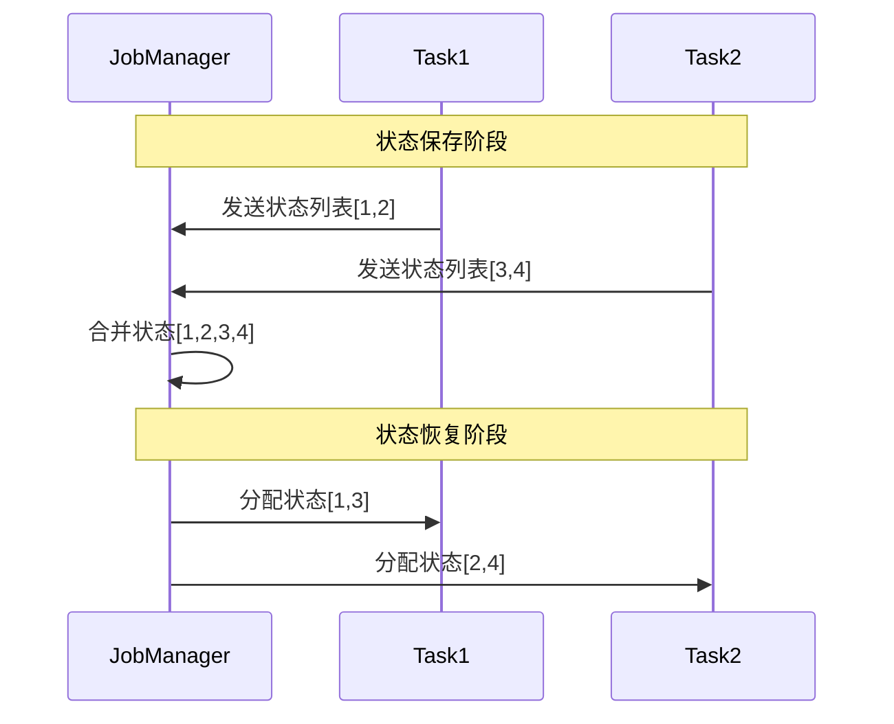
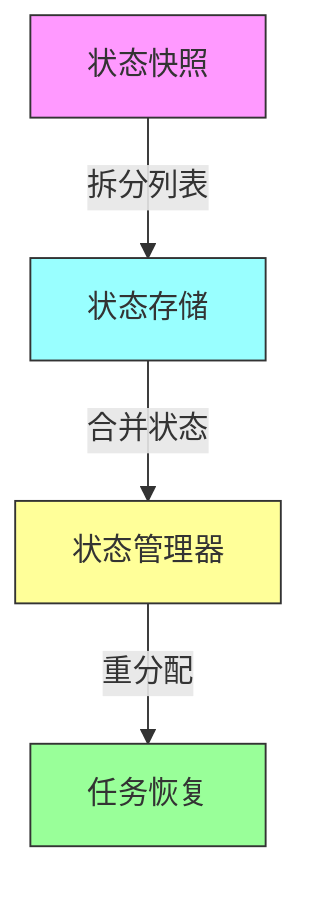

# FLIP-8：状态管理大升级：让非分区状态也能自由伸缩

## 开篇

想象你是一个图书管理员，负责管理一个大型图书馆的借阅系统。系统需要记录每一本书的借阅状态。随着图书馆规模扩大，你需要增加更多的工作人员来处理借阅请求。但问题来了：每个工作人员都需要能看到全部的借阅记录才能工作。这就像Flink中的非分区状态（Non-Partitioned State）在处理任务扩展时遇到的困境。

## 为什么需要这个改进？

在具体介绍FLIP-8的解决方案前，让我们先看看它要解决的问题：

```mermaid
graph TD
    subgraph "原始场景：2个任务处理4个Kafka分区"
        KP1[Kafka分区1] --> S1[Source任务1]
        KP2[Kafka分区2] --> S1
        KP3[Kafka分区3] --> S2[Source任务2]
        KP4[Kafka分区4] --> S2
        S1 --> |保存状态| ST1[状态(KP1,KP2)]
        S2 --> |保存状态| ST2[状态(KP3,KP4)]
    end
    
    style KP1 fill:#f9f,stroke:#333
    style KP2 fill:#f9f,stroke:#333
    style KP3 fill:#f9f,stroke:#333
    style KP4 fill:#f9f,stroke:#333
    style S1 fill:#9ff,stroke:#333
    style S2 fill:#9ff,stroke:#333
    style ST1 fill:#ff9,stroke:#333
    style ST2 fill:#ff9,stroke:#333
```

这个场景下存在两个主要问题：

### 1. 缩容问题

当我们把任务数从2个减少到1个时：

```mermaid
graph TD
    subgraph "缩容场景：只有一个任务能恢复状态"
        ST1[原状态(KP1,KP2)] --> S1[任务1]
        ST2[原状态(KP3,KP4)] --> |无法恢复| XX[丢失]
        
        style ST1 fill:#ff9,stroke:#333
        style ST2 fill:#fcc,stroke:#333
        style S1 fill:#9ff,stroke:#333
        style XX fill:#f55,stroke:#333
    end
```

### 2. 扩容问题

当我们把任务数从2个增加到4个时：

```mermaid
graph TD
    subgraph "扩容场景：新增的任务无法分担工作"
        ST1[状态(KP1,KP2)] --> S1[任务1]
        ST2[状态(KP3,KP4)] --> S2[任务2]
        ID1[空闲] --> S3[任务3]
        ID2[空闲] --> S4[任务4]
        
        style ST1 fill:#ff9,stroke:#333
        style ST2 fill:#ff9,stroke:#333
        style S1 fill:#9ff,stroke:#333
        style S2 fill:#9ff,stroke:#333
        style S3 fill:#ddd,stroke:#333
        style S4 fill:#ddd,stroke:#333
        style ID1 fill:#fcc,stroke:#333
        style ID2 fill:#fcc,stroke:#333
    end
```

## FLIP-8 的解决方案

FLIP-8提出了一个优雅的解决方案，主要包含两个关键创新：

### 1. 状态列表化

不再把状态作为一个整体存储，而是将其拆分成可以独立管理的列表：

```java
public interface CheckpointedList<T extends Serializable> {
    // 将状态保存为列表
    List<T> snapshotState(long checkpointId, long checkpointTimestamp) throws Exception;
    
    // 从列表恢复状态
    void restoreState(List<T> state) throws Exception;
}
```

### 2. 自动重分配机制

系统能够自动处理状态的分配：



## 具体实现细节

FLIP-8引入了两种新的状态处理接口：

| 接口类型 | 特点 | 使用场景 |
|---------|------|----------|
| CheckpointedList | 自动重分配状态 | 简单的状态管理需求 |
| CheckpointedUnionedList | 完全自定义分配逻辑 | 复杂的状态管理需求 |

### 工作流程示意



## 当前状态

FLIP-8已经完成并在Flink 1.2版本中发布。它的核心功能包括：

1. 支持非分区状态的动态扩缩容
2. 提供了两种灵活的状态管理接口
3. 自动的状态重分配机制
4. 向后兼容已有的状态管理方式

## 实践建议

1. **选择合适的接口**
   - 简单场景使用CheckpointedList
   - 需要精细控制时使用CheckpointedUnionedList

2. **状态设计建议**
   - 将状态设计成可独立的小单元
   - 避免状态之间的强依赖
   - 合理评估状态大小

3. **性能优化**
   - 使用延迟反序列化机制
   - 合理规划状态大小
   - 监控状态分配情况

## 总结

FLIP-8是Flink在状态管理领域的一个重要进步。就像图书馆从每个工作人员都需要完整借阅记录，升级到了一个现代化的分布式管理系统，工作人员可以按需访问和更新借阅记录。这个改进让Flink在处理非分区状态时变得更加灵活和高效，为构建可伸缩的流处理应用提供了更好的支持。

这个方案既保持了现有接口的稳定性，又提供了新的能力，让用户可以根据需求选择合适的方案。正如一位工程师说的："好的系统不仅要能正确工作，还要能优雅地适应变化。" FLIP-8正是让Flink在处理状态伸缩时变得更加优雅。
