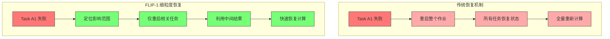
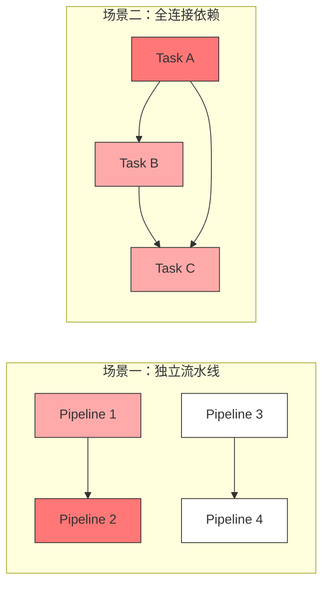

# FLIP-1 任务挂了怎么办：Flink 的明智恢复方案

## 开篇

你有没有遇到过这样的情况：正在开会，一群人讨论得热火朝天，突然有个人掉线了。最糟糕的是，主持人说："好，我们从头开始重新来一遍！"。所有人都一脸懵：明明就一个人掉线，为啥要大家都重来？这不是浪费时间吗？

在 Flink 的早期版本中，任务失败的处理方式就是这样的 —— 一个任务出问题，所有任务都得重新开始。今天我们要聊的 FLIP-1，就是专门解决这个"一人错全员遭殃"的问题。这个改进分两个阶段：Flink 1.3 版本引入了"局部恢复"机制，到了 Flink 1.9 版本又在处理中间数据方面做了升级。

## 老方案有啥问题？

想象你在管理一个大型电商的订单处理系统。系统中有 100 个任务并行工作，每个任务负责处理一部分订单。突然，其中一个任务出了问题，按照老方案，所有 100 个任务都要停下来重新开始。这带来了三个大问题：

### 第一个问题：浪费资源
就像开会时一个人掉线就让所有人重新开会一样荒唐，一个任务出错就要所有任务重启同样浪费。特别是在"双十一"这样的大促期间，你能想象一个小故障导致整个订单系统重启的场景吗？

### 第二个问题：恢复太慢
全部重启意味着所有任务都要重新准备：重新分配机器资源、重新加载之前保存的状态、重新建立任务之间的连接...就像是一个大型会议要重新组织，所有人重新找位置、重新连接网络、重新准备材料，非常耗时。

### 第三个问题：网络太挤
所有任务同时恢复状态时，就像是一个办公室里所有人同时下载同一个文件，网络肯定会变得很慢。而且这种集中下载可能会影响到其他系统的正常运作。

这种情况在不同类型的任务中表现也不一样：

对于流处理任务（就是需要持续不断处理数据的任务），如果任务之间有紧密的联系，比如订单系统中的"下单-支付-发货"这种环节，那一个环节出问题确实会影响整个流程。但如果是独立的任务，比如不同地区的订单处理，就没必要都重启。

对于批处理任务（一次性处理一大批数据的任务）就更惨了，因为它们不保存中间状态，一旦出错就得从头算起。就像统计报表时，Excel崩溃了，之前的计算全得重来一遍。

## FLIP-1 是怎么解决的？

让我们先直观地看一下传统恢复机制和FLIP-1的区别：

FLIP-1 的方案很巧妙，分两步走：

### 第一步：像积木一样拆分任务

首先，它把任务分成了一个个"积木块"。每个积木块里的任务是有关联的，而不同积木块之间是相对独立的。这样当一个任务出问题时，只需要重启它所在的那个"积木块"，其他积木块可以继续工作。

举个例子：假设你在处理不同城市的订单数据。北京的订单处理系统（A1和A2两个任务）和上海的订单处理系统（B1和B2两个任务）是独立的。如果北京的A1任务出了问题，只需要重启A1和A2，上海的B1和B2可以继续正常工作。

但是，如果任务之间有数据要互相交换，情况就会复杂一些。比如A2需要把数据传给B1，那么当A1出问题时，可能就需要连B1一起重启。这就像是多米诺骨牌，要看它们之间是否有连接。

让我们来看两个不同的场景：

### 第二步：聪明地管理中间数据

第二阶段主要解决数据的传递问题。系统设计了三种存储方式：

1. **可靠保存型**：就像是给每个任务都配了个小U盘，随时可以保存数据，需要时可以很方便地恢复。

2. **内存暂存型**：相当于在内存里开了个小本本，记录一些临时数据。这种方式速度快，但掉电就没了，适合那些短期记录。

3. **完整批次型**：这种是专门为批处理设计的，就像是等一批货物全部到齐了才发车。虽然要等待的时间长一些，但是保证了数据的完整性。

## 具体怎么实现的？

实现上主要抓住两个关键点：

首先是有个"总指挥"（JobMaster）来协调整个恢复过程。它就像一个项目经理，知道每个任务的状态，合理分配资源，确保数据正确传递。系统还加入了"心跳"机制，就像是定时喊话"你还在吗？"，确保每个任务都是活着的。

其次是提供了三种恢复策略：
- 全部重启（这是最保险的方式）
- 只重启出问题的任务（这是最轻量的方式）
- 智能重启相关区域（这是最平衡的方式）

## 带来了哪些好处？

这些改进给 Flink 带来了实实在在的好处：

首先是省资源了。就像医生治病，现在可以只给病人看病，不用所有人都去医院体检了。

其次是恢复更快了。因为能够精确定位问题，就像是维修电路，知道哪里短路了直接修那里就行，不用把整个电路板都换掉。

## 实际使用有什么建议？

在使用 FLIP-1 的新机制时，有一些实用小贴士可以帮你玩转这个功能：

### 1. 选择合适的故障恢复策略

就像医生看病要对症下药一样，对于不同类型的作业要选择合适的恢复策略：
- 如果你的任务之间都是独立的（比如不同城市的订单处理），可以尝试使用 RestartPipelinedRegionStrategy
- 如果特别在意数据一致性，那就用最保险的 RestartAllStrategy
- 但要注意，有些场景（比如有 colocation 约束的作业）不适合用细粒度恢复

### 2. 合理规划检查点

设置检查点要像游戏存档一样讲究：
- 频率要适中：太频繁会影响性能，太少又怕出事故后损失太大
- 考虑数据量：数据量大的时候，存个检查点也挺费事，要权衡好
- 要有监控：万一检查点老是失败，那可能就要查查是不是哪里出问题了

### 3. 关于中间结果管理

数据存储方面要注意：
- 给 TaskExecutor 预留足够的磁盘空间
- 记得设置清理策略，不能让数据越攒越多
- 如果经常断开连接，可以考虑给心跳超时加个缓冲时间

### 4. 实用监控建议

监控要像照顾小孩一样细心：
- 经常看看失败率：某个任务老失败，八成是有隐患
- 盯着恢复时间：如果越来越慢，可能需要优化了
- 关注资源使用：特别是磁盘空间，别让中间结果把硬盘塞满了

## 总结

让我们回顾一下 FLIP-1 给我们带来的改变。

还记得开头说的那个会议的例子吗？现在，当一个人掉线时，我们不用让所有人重新开会了，只需要让相关的几个人重新对齐就好。这就是 FLIP-1 做到的事情 —— 它让 Flink 在处理任务失败时变得更加智能。

具体来说，FLIP-1 带来了三个重要的进步：

第一是"精准救火"。就像现代消防，不会因为一个房间着火就把整栋楼都浇水，而是精确定位火源，进行局部灭火。FLIP-1 就是这样，通过识别任务之间的依赖关系，做到了精准重启。

第二是"聪明存储"。它设计了三种不同的数据存储方式，就像我们在生活中也会根据不同的场景选择存储方式：重要文件放U盘，临时记录写便签，大件物品进仓库。这样的设计让数据的存储和恢复都变得更加高效。

第三是"灵活应变"。通过提供不同的恢复策略，让用户可以根据自己的需求来选择。就像看病一样，有时候需要全面体检，有时候只需要开几副药就够了。

这些改进不仅让 Flink 在处理任务失败时更加高效，也为未来的发展打下了基础。虽然技术永远在进步，但 FLIP-1 已经为我们带来了一个更可靠、更高效的 Flink。正如一个老师说的："不是不犯错误最重要，而是知道如何优雅地处理错误。" FLIP-1 正是让 Flink 在处理错误时变得更加优雅。
