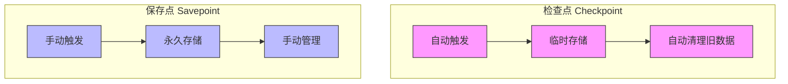
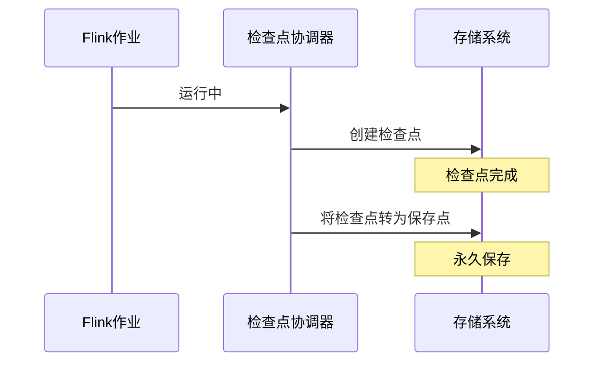
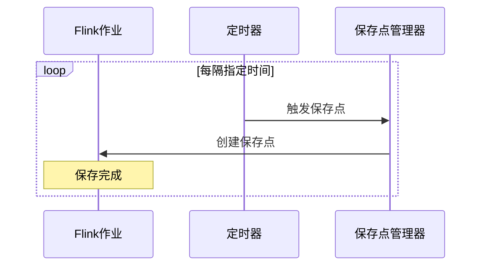

# FLIP-10: 统一检查点和保存点：让数据备份更简单

## 开篇

备份数据就像给重要文件拍照一样 - 有时需要自动定期拍照（检查点），有时需要手动拍下重要时刻（保存点）。在Flink早期版本中，这两种"拍照"方式各自为政，使用起来不够方便。FLIP-10就是要把这两种方式统一起来，让数据备份变得更加简单和灵活。

## 检查点和保存点有什么区别？

在理解FLIP-10之前，先来看看这两种"拍照"方式的区别：



让我们用收拾房间来打个比方：
- 检查点就像是妈妈定期帮你整理房间，整理完就把多余的东西扔掉
- 保存点则像是你搬家前的大扫除，需要自己决定什么时候做，东西也会完整保留下来

当前这种设计带来了一些不便：
1. 如果程序出现严重问题需要重启，最近的检查点可能已经被自动删除了
2. 想要定期创建保存点，还得手动操作或写脚本
3. 没有开启检查点的程序，连保存点都无法创建

## FLIP-10 带来了什么改变？

FLIP-10的核心是要打破检查点和保存点之间的界限，让它们能够互相转换。具体来说：

### 1. 持久化检查点



这就像是给房间整理增加了一个新选项：整理完后可以选择把重要的整理记录保存下来，以后随时可以回到这个状态。

### 2. 定期保存点



相当于给保存点加了个"定时提醒"功能，不用每次都记着手动保存。

## 具体怎么实现的？

FLIP-10通过以下方式实现了这些改进：

### 1. 配置方面

使用起来很简单，主要通过CheckpointConfig配置：

```java
// 启用持久化检查点
env.getCheckpointConfig()
   .enablePersistentCheckpoints("/path/to/save");

// 启用定期保存点
env.getCheckpointConfig()
   .enablePeriodicSavepoints(1, TimeUnit.HOURS, "/path/to/save");
```

### 2. 保存位置的统一

为了让管理更简单，所有的保存点都统一存储到文件系统中。就像是把所有的照片都存在同一个相册里，方便查找和管理。


### 3. 备份协调器的改进

检查点协调器（CheckpointCoordinator）现在变得更聪明了：
- 总是会被创建，即使没有开启定期检查点
- 可以处理持久化检查点
- 能够自动触发保存点
- 提供完整的日志记录和REST API支持

## 带来了哪些好处？

这些改进给Flink用户带来了实实在在的便利：

### 1. 更好的容错性
如果程序遇到无法恢复的错误，最近的检查点会被自动保存下来，就像是给数据多了一层保护。

### 2. 运维更方便
- 不用手动触发保存点
- 统一的存储位置让管理更简单
- 通过REST API可以方便地查看所有备份点

### 3. 更灵活的使用方式
即使没有开启检查点的程序，也可以创建保存点了，就像是给了用户更多的选择权。

## 实际使用建议

在使用这些新功能时，有几点建议：

1. 合理选择保存位置：
- 确保有足够的存储空间
- 选择稳定可靠的存储系统
- 注意文件系统的性能

2. 设置保存频率：
- 考虑数据的重要性
- 权衡存储空间的使用
- 避免过于频繁影响性能

3. 监控和维护：
- 定期检查保存点的状态
- 及时清理不需要的保存点
- 关注存储空间的使用情况

## 总结

FLIP-10让Flink的数据备份系统变得更加统一和智能。就像是把两个不同的相册系统整合在一起，既保留了各自的特点，又让使用变得更加方便。这些改进不仅让数据备份更可靠，也让运维工作更轻松。这就是技术进步的意义 - 把复杂的事情变得简单，把繁琐的工作变得高效。
