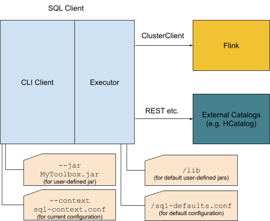
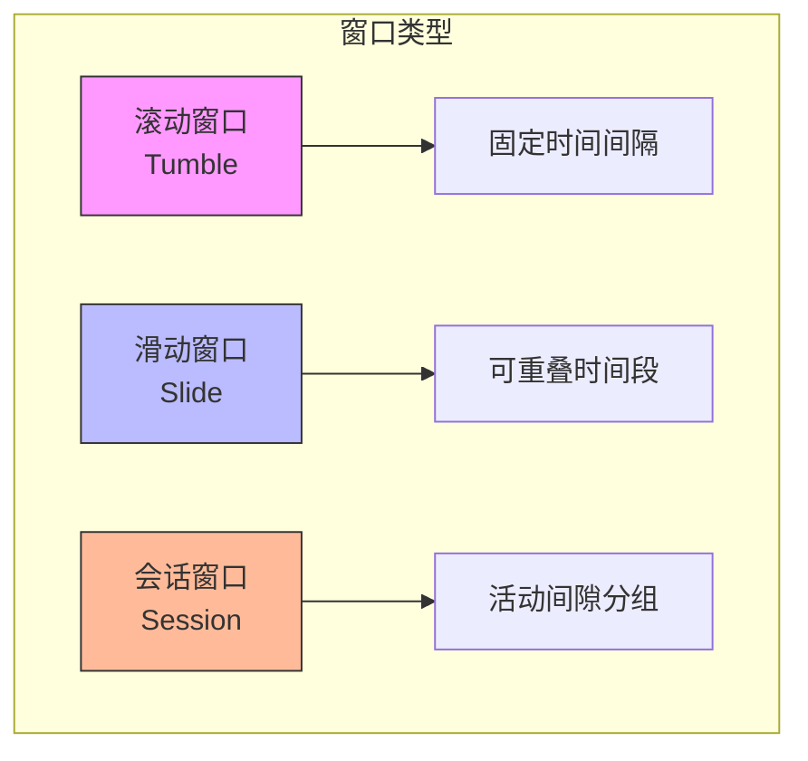
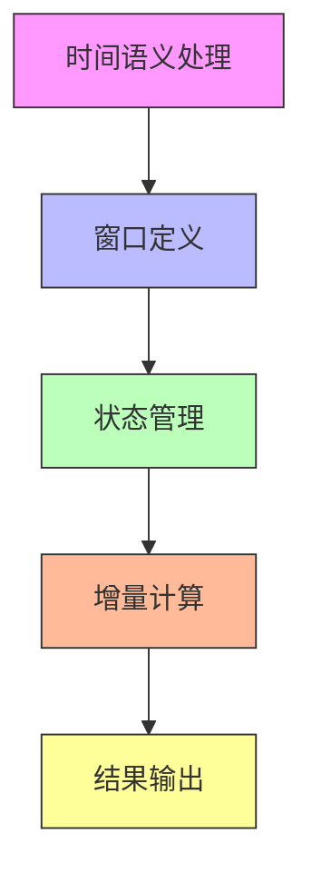

# FLIP-11：Table API让流式聚合更简单

Table API作为Flink的一个声明式API，让数据处理变得更直观和简单。FLIP-11的目标就是要让Table API也能优雅地处理流式数据的聚合操作。

## 它解决了什么问题？

想象有这样一个场景：某个电商平台需要实时统计每个商品的销售情况。这个需求看似简单，实际上涉及了几个关键问题：

1. 如何给无界的数据流分组？毕竟不可能等到所有数据都到齐再统计
2. 对于迟到的数据该如何处理？
3. 如何保证计算结果的准确性？

在FLIP-11之前，Table API只支持最基础的投影（projection）、选择（selection）和联合（union）操作。要实现上述统计功能，开发人员往往需要直接使用DataStream API编写复杂的代码。

让我们用一张图来直观地对比改进前后的差异：

```mermaid
graph LR
    subgraph "FLIP-11之前"
    A[原始数据] --> B[基础过滤]
    B --> C[手动实现聚合逻辑]
    C --> D[自行处理时间窗口]
    D --> E[结果输出]
    end
    
    subgraph "FLIP-11之后"
    F[原始数据] --> G[Table API]
    G --> H[内置窗口聚合]
    H --> I[结果输出]
    en](image.png)d

style F fill:#97c2fc
style G fill:#97c2fc
style H fill:#97c2fc
style I fill:#97c2fc
```

## 核心改进

FLIP-11引入了两种主要的聚合机制：

### 1. 分组窗口聚合（Group-Window Aggregates）

这种机制主要用于处理需要按时间或行数进行分组的场景。比如"每5分钟统计一次商品销量"这样的需求。

支持三种窗口类型：



### 2. 行窗口聚合（Row-Window Aggregates）

这种机制更适合"基于当前行前后范围进行计算"的场景。比如"计算每个订单金额与前10个订单的平均值的差异"。

## 具体怎么用？

让我们看几个实际的例子：

```scala
// 示例1：每10分钟统计一次商品销量
val result = tableEnv.from("sales")
  .window(Tumble over 10.minutes on 'rowtime as 'w)
  .groupBy('productId, 'w)
  .select('productId, 'price.sum)

// 示例2：统计每个订单与前5个订单的价格差异
val result = tableEnv.from("orders")
  .rowWindow(SlideRows preceding 5.rows following 0.rows as 'w)
  .select('orderId, 
          'price,
          'price.avg over 'w as 'avgPrice)
```

## 技术实现

实现这个功能涉及几个关键点：



1. **时间语义处理**：支持事件时间（Event Time）和处理时间（Processing Time）
2. **窗口定义**：提供灵活的窗口定义机制
3. **状态管理**：高效管理计算过程中的中间状态
4. **增量计算**：对于窗口聚合，采用增量计算方式提高效率
5. **结果输出**：支持多种输出方式和格式

## 使用建议

1. 选择合适的窗口类型：
   - 固定统计周期用滚动窗口
   - 需要平滑结果用滑动窗口
   - 基于活动周期分组用会话窗口

2. 时间窗口的注意事项：
   - 合理设置窗口大小，太小会增加计算压力，太大会影响实时性
   - 根据数据特点选择合适的时间语义
   - 谨慎处理迟到数据

3. 状态清理：
   - 及时清理过期状态
   - 合理设置状态存活时间（TTL）

## 总结

FLIP-11的实现让Flink的Table API在处理流式聚合时变得更加强大和易用。它不仅提供了丰富的聚合功能，还在性能和易用性上做了很好的平衡。

目前该功能已在Flink 1.4.0版本中发布，并在后续版本中得到了进一步优化。如果你的项目涉及流式数据的聚合处理，Table API会是一个很好的选择。
