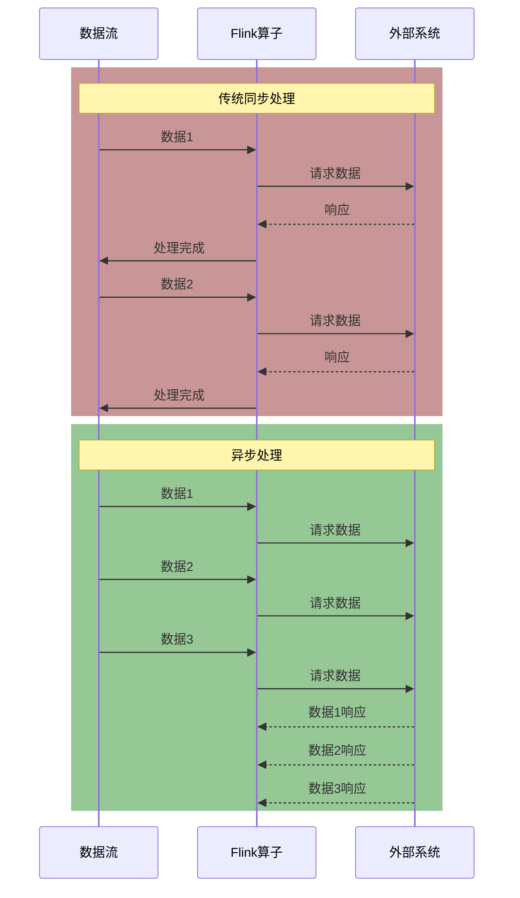
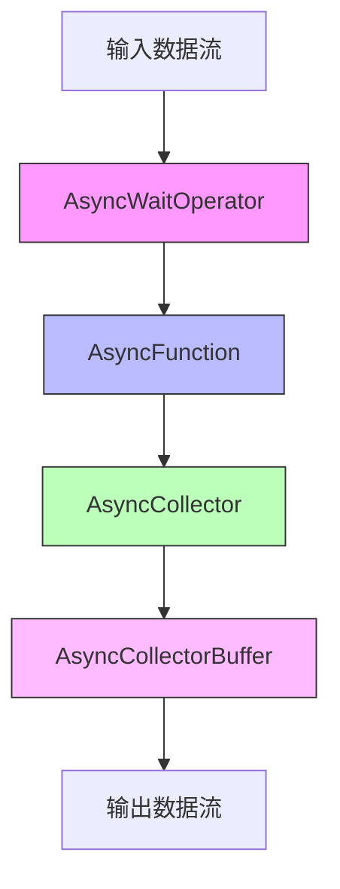

# FLIP-12: 异步I/O：让Flink处理外部系统数据更高效

## 开篇

想象一下，你在一个餐厅点餐。传统的点餐方式是：服务员接到你的订单后，站在你的桌子旁等待厨房做好菜才能去服务下一位客人。这样显然效率很低，实际上服务员完全可以在等待的时间里去服务其他客人。这个FLIP就好比是让Flink学会了"多线程服务员"的工作方式！

## 为什么需要异步I/O？

在流处理中，经常需要访问外部系统来丰富数据流。比如：
- 查询数据库获取用户信息
- 调用外部API获取商品详情
- 请求第三方服务进行数据验证

传统的同步访问方式会带来一个大问题：整个处理过程会因为等待外部系统响应而变慢。这就像服务员必须等到厨房做好一个菜才能继续服务一样，效率很低。



上面的图展示了同步和异步处理的区别：同步处理就像是一个"串行"的过程，而异步处理则允许同时发起多个请求，大大提高了效率。

## 解决方案核心设计

异步I/O的设计就像设计了一个高效的餐厅服务系统，包含以下关键角色：



1. **服务台**（AsyncWaitOperator）：负责接收顾客点单
2. **服务员**（AsyncFunction）：负责将订单送到厨房，但不会等待
3. **点单小票**（AsyncCollector）：记录每个订单的状态
4. **订单管理器**（AsyncCollectorBuffer）：统筹安排所有订单的处理

## 两种服务模式

就像餐厅可以选择不同的出餐方式，异步I/O也提供了两种模式：

| 模式 | 特点 | 适用场景 |
|-----|------|---------|
| 有序模式 | 严格按照数据到达的顺序输出 | 需要保证数据处理顺序的场景，如顺序事件处理 |
| 无序模式 | 谁先处理完就先输出谁 | 对数据顺序没有严格要求，追求最大吞吐量的场景 |

## 使用示例

假设我们需要在数据流中查询HBase数据库，下面是两种常见的使用方式：

1. 使用回调方式：
```java
public class HBaseAsyncFunction implements AsyncFunction<String, String> {
    private transient Connection connection;
    
    @Override
    public void asyncInvoke(String key, AsyncCollector<String> collector) {
        Get get = new Get(Bytes.toBytes(key));
        Table table = connection.getTable(TableName.valueOf("test"));
        ((AsyncableHTableInterface) table).asyncGet(get, 
            new MyCallback(collector));
    }
}

// 创建数据流
DataStream<String> stream = AsyncDataStream.unorderedWait(
    inputStream, 
    new HBaseAsyncFunction(), 
    100,    // 超时时间（毫秒）
    20      // 并发请求上限
);
```

2. 使用Future方式：
```java
public class HBaseAsyncFunction implements AsyncFunction<String, String> {
    private transient Connection connection;
    
    @Override
    public void asyncInvoke(String key, AsyncCollector<String> collector) {
        Get get = new Get(Bytes.toBytes(key));
        Table table = connection.getTable(TableName.valueOf("test"));
        
        ListenableFuture<Result> future = table.asyncGet(get);
        Futures.addCallback(future,
            new FutureCallback<Result>() {
                public void onSuccess(Result result) {
                    collector.collect(
                        Collections.singletonList(
                            Bytes.toString(result.getValue(
                                Bytes.toBytes("f"), 
                                Bytes.toBytes("c")
                            ))
                        )
                    );
                }
                
                public void onFailure(Throwable t) {
                    collector.collect(t);
                }
            }
        );
    }
}
```

## 需要注意的问题

1. **资源共享**：如果多个任务需要共享连接（如数据库连接），可以使用static修饰符，但要注意线程安全。

2. **状态管理**：异步I/O操作的状态会被自动保存，在作业失败时可以恢复之前的处理进度。

3. **性能调优**：
   - 合理设置并发请求数
   - 监控超时情况
   - 根据实际需求选择有序或无序模式

## 目前状态

这个FLIP已经在Flink 1.2版本中实现。它显著提升了Flink处理外部数据的效率，尤其是在需要频繁访问外部系统的场景中。目前该功能已经被广泛应用在生产环境中，比如：
- 实时数据流关联数据库
- 调用外部服务进行实时推荐
- 访问缓存系统进行数据补充

## 总结

FLIP-12为Flink带来了高效的异步I/O处理能力，就像餐厅引入了专业的工单系统，让每个服务员都能高效地处理多个订单。通过将同步操作转变为异步操作，大大提升了处理效率，同时保持了代码的简洁性和可维护性。这个改进让Flink在处理复杂数据流时更加得心应手，特别是在需要频繁与外部系统交互的场景中。
