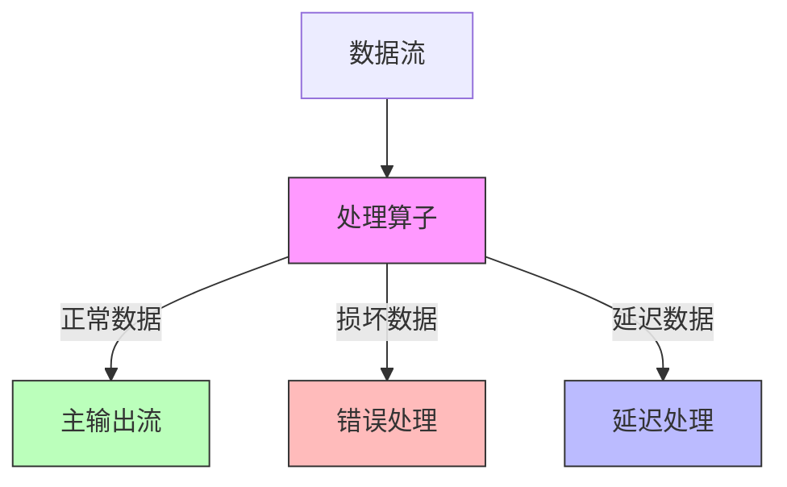
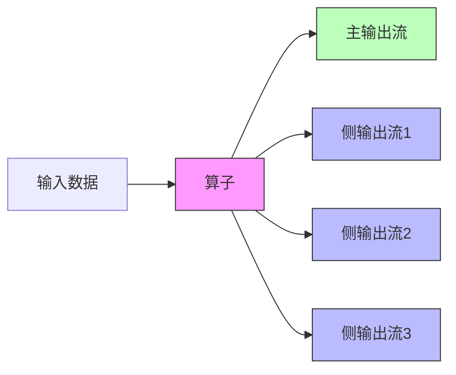
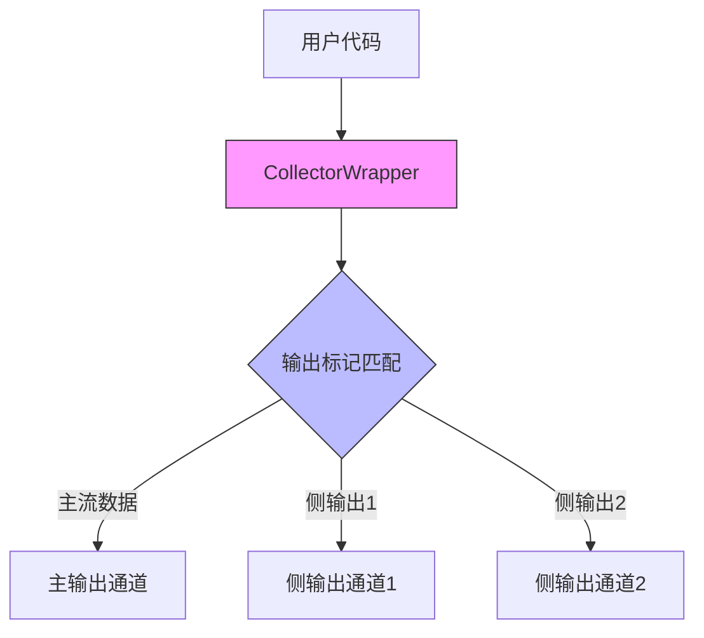

# FLIP-13：Side Outputs：给Flink添加"副驾驶座"

## 开篇

想象一下在一条传送带上分拣快递包裹。传统的方式是：一个工人只能把包裹放到一个出口。如果遇到破损的包裹，要么停下整条传送带处理，要么就直接丢弃。这样处理显然不够灵活。如果能让工人可以把不同类型的包裹分别放到不同的出口，事情就会变得简单多了。这就是Side Outputs（侧输出）要解决的问题。

## 为什么需要Side Outputs？

在实际工作中，数据流处理经常会遇到这样的情况：



上图展示了一个典型场景：一个处理算子需要将数据分成多个流向不同的目的地。在没有Side Outputs之前，处理这种情况会很麻烦：
1. 数据损坏时整个任务可能陷入"失败->重启->再失败"的循环
2. 对于窗口计算，延迟到达的数据只能被丢弃

## 解决方案：给算子装上"分流器"

Side Outputs的设计就像给每个算子都装上了一个"分流器"，可以根据需要将不同类型的数据输出到不同的流中。这个设计主要包含两个核心概念：



1. **OutputTag**：用来标记和区分不同的输出流
2. **CollectorWrapper**：包装了收集器，能够将数据输出到不同的流

## 使用场景对比

| 场景 | 传统方式 | 使用Side Outputs |
|-----|---------|----------------|
| 处理损坏数据 | 要么停止任务，要么直接丢弃 | 输出到专门的错误处理流 |
| 处理延迟数据 | 只能丢弃 | 可以输出到延迟处理流 |
| 数据分类处理 | 需要多个独立任务 | 在同一个任务中完成分流 |
| 调试和监控 | 难以跟踪特定类型的数据 | 可以单独收集关注的数据 |

## 使用示例

下面是一个处理订单数据的例子，展示如何使用Side Outputs处理不同情况：

```java
// 定义输出标记
final OutputTag<Order> invalidOrders = new OutputTag<Order>("invalid-orders") {};
final OutputTag<Order> lateOrders = new OutputTag<Order>("late-orders") {};

// 处理订单流
SingleOutputStreamOperator<Order> mainStream = orderStream
    .process(new ProcessFunction<Order, Order>() {
        @Override
        public void processElement(Order order, Context ctx, Collector<Order> out) {
            // 检查订单有效性
            if (!order.isValid()) {
                // 输出无效订单到侧输出流
                ctx.output(invalidOrders, order);
                return;
            }
            
            // 检查订单时间
            if (order.getTimestamp() < ctx.timerService().currentWatermark()) {
                // 输出延迟订单到侧输出流
                ctx.output(lateOrders, order);
                return;
            }
            
            // 输出正常订单到主流
            out.collect(order);
        }
    });

// 获取并处理无效订单流
DataStream<Order> invalidOrderStream = mainStream.getSideOutput(invalidOrders);
invalidOrderStream.addSink(new InvalidOrderHandler());

// 获取并处理延迟订单流
DataStream<Order> lateOrderStream = mainStream.getSideOutput(lateOrders);
lateOrderStream.addSink(new LateOrderHandler());
```

## 内部实现原理

Side Outputs的实现采用了巧妙的设计：



1. **输出标记**：每个侧输出流都有一个唯一的OutputTag
2. **包装收集器**：使用CollectorWrapper包装原有的收集器
3. **类型安全**：OutputTag继承自TypeHint，确保类型安全
4. **运行时区分**：通过标记区分不同的输出流并路由到正确的目标

## 目前状态

这个FLIP已经在Flink中实现，目前是一个广泛使用的功能。它的实现分为两个阶段：
1. 第一阶段保持向后兼容，主要是添加RichCollector接口
2. 第二阶段进行更深入的框架重构，以支持更灵活的多输出场景

## 总结

Side Outputs为Flink添加了更灵活的数据处理能力，就像给传送带加装了多个出口。这个改进让数据处理更加优雅：不用担心坏数据会导致整个任务失败，也不用放弃延迟到达的数据。通过简单的API设计，用户可以轻松地实现复杂的数据分流处理逻辑，使得整个数据处理流程更加清晰和高效。
