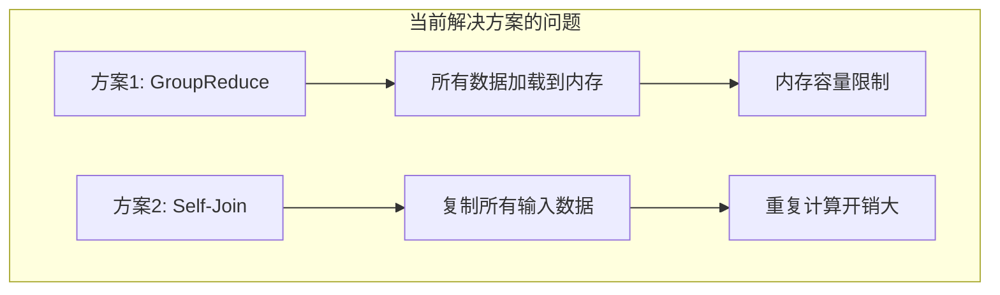
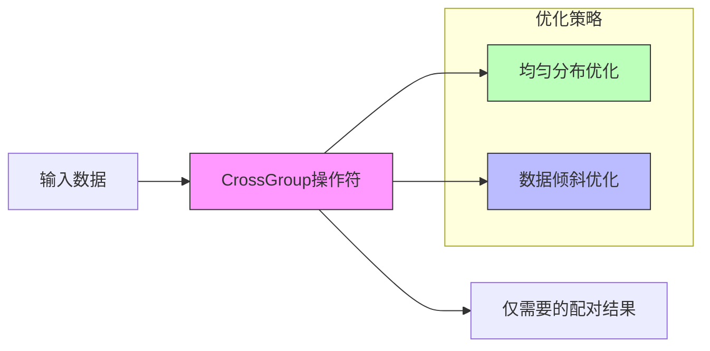
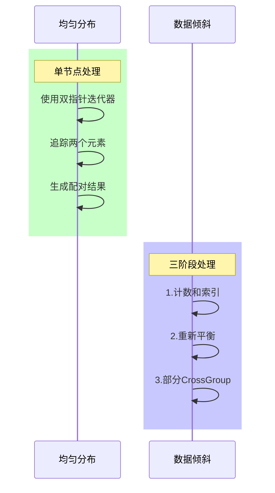

# FLIP-14：CrossGroup操作符：更高效的数据配对方案

## 开篇

想象一下在一个老式图书馆里，要给每本书找到它的"好朋友"（相似的书）。传统的方法要么是把所有书都搬到一张大桌子上一本本对比（内存受限），要么是把每本书都复制一份再去比较（数据重复）。这两种方式都不够优雅。FLIP-14就是要解决这个问题，提供一个更聪明的方式来处理这种"配对"操作。

## 为什么需要CrossGroup操作符？

在处理图数据时，经常需要对同一组内的数据进行两两配对比较。比如：
- 计算社交网络中的好友推荐
- 查找网络中的三角形关系
- 计算项目之间的相似度

目前有两种解决方案，但都不够完美：

| 方案 | 优点 | 缺点 |
|-----|------|-----|
| GroupReduce | 灵活性高，可以自定义配对逻辑 | 需要将整组数据装入内存，容易出现内存溢出 |
| Self-Join | 实现简单，系统自动处理 | 需要复制数据，产生完整笛卡尔积，效率低 |

## 新方案：CrossGroup操作符

CrossGroup操作符的设计就像是给图书馆配备了一个聪明的图书管理员，知道如何高效地匹配书籍而不需要把所有书都搬到桌子上。

### 核心设计特点

1. **智能配对**：不需要产生完整的笛卡尔积，只生成需要的配对
2. **内存友好**：使用迭代器方式处理，不需要一次性加载所有数据
3. **分布优化**：针对数据分布情况提供不同的优化策略

### 处理流程

针对不同的数据分布特点，CrossGroup提供了两种处理模式：

对于均匀分布的数据，使用简单的迭代器就能高效处理。而对于数据倾斜的情况，则采用三阶段处理方式来确保负载均衡。

## 使用场景

CrossGroup操作符特别适合以下场景：

| 场景 | 示例 | 优势 |
|-----|------|-----|
| 图分析 | 社交网络好友推荐 | 高效处理图中的节点关系 |
| 相似度计算 | 项目推荐系统 | 避免产生不必要的配对 |
| 网络分析 | 三角形关系检测 | 更好的内存使用效率 |
| 双偏图处理 | 用户-商品关联分析 | 针对性能优化数据倾斜 |

## 目前状态

这个FLIP目前处于重新打开（Reopened）状态。虽然该功能最初被设计用于优化Flink的Gelly（图计算）模块中的多个场景，包括：
- AdamicAdar相似度计算
- Jaccard指数计算
- 三角形关系检测
- 双偏图投影方法

但目前该改进方案正在重新评估中，可能会有新的设计和实现方案出现。有兴趣的开发者可以关注JIRA上的最新进展。

## 总结

CrossGroup操作符为Flink带来了一个更优雅的数据配对解决方案。它就像一个经验丰富的图书管理员，既知道如何高效地匹配书籍，又能根据不同情况选择最合适的匹配策略。这个改进让Flink在处理图分析、相似度计算等场景时变得更加高效，同时也为用户提供了一个更简单的编程模型。
