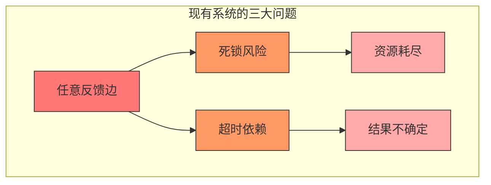
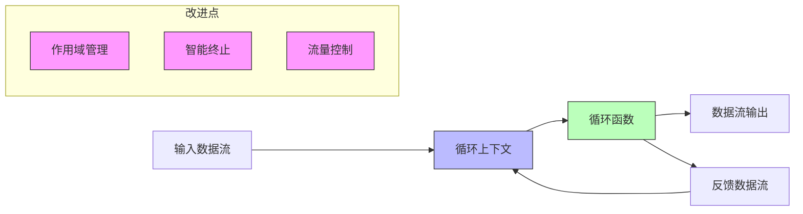
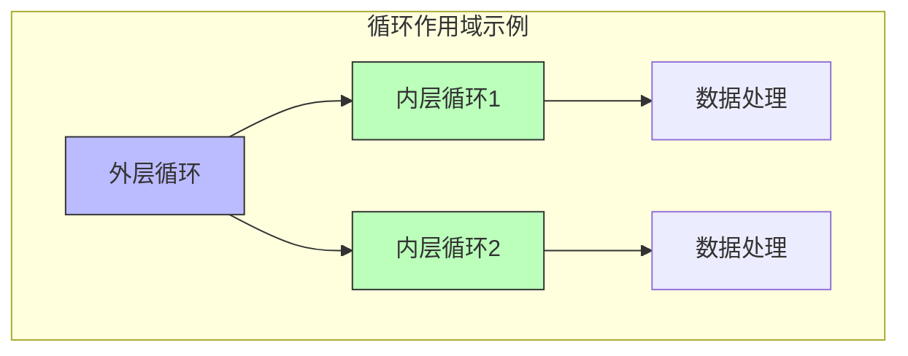
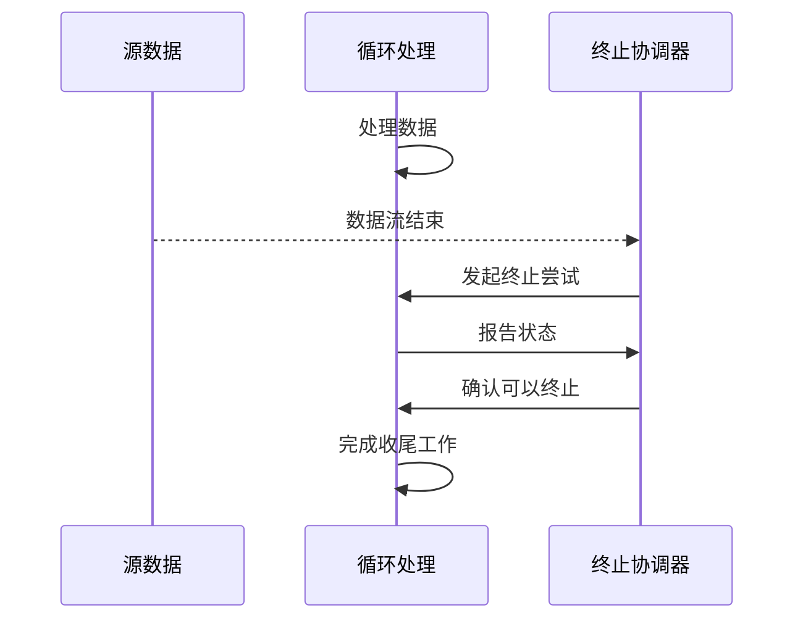
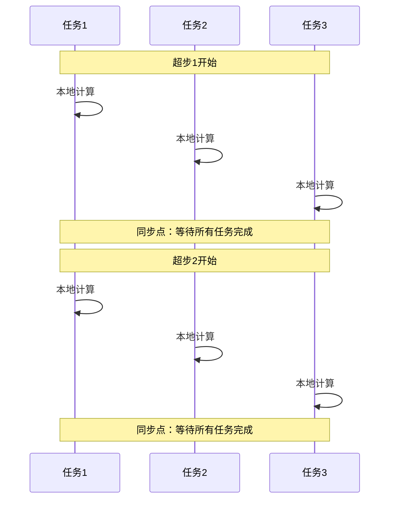

# FLIP-15：让循环更聪明：Flink流处理中的迭代优化

## 开篇

想象一个超大型的购物中心里的客流控制系统。有时候，顾客需要多次经过同一个区域（比如美食区），而且不同区域之间还会互相产生人流。现有的系统有个问题：要么给每个区域设置一个固定的等待时间，要么就不知道什么时候该关门。这种方式显然不够灵活。FLIP-15就是要解决这个问题，让系统能够更智能地处理这种循环流动的场景。

## 当前问题

现有的Flink流处理迭代模型存在三个主要问题：



| 问题 | 表现 | 影响 |
|-----|------|-----|
| 循环结构不规范 | 可以任意添加反馈边，没有作用域限制 | 难以保证正确性，维护困难 |
| 终止机制不可靠 | 依赖固定超时时间 | 可能过早结束或等待过长 |
| 反压处理不当 | 环形数据流容易死锁 | 影响系统稳定性 |

## 新方案：StreamScope和智能终止

新方案就像给购物中心设计了一个智能管理系统，主要包含三个改进：



### 1. 引入循环作用域（StreamScope）

每个循环都有自己的"地盘"，就像购物中心的每个功能区域：



### 2. 新的API设计

新API设计得更加直观和安全。以购物中心的客流分析为例：

```java
// 定义循环逻辑
DataStream<Customer> result = customerFlow.iterate(new LoopFunction<Customer, Customer>() {
    @Override
    public Tuple2<DataStream<Customer>, DataStream<Customer>> loop(DataStream<Customer> input) {
        // 分析客流
        DataStream<Customer> analysis = input.map(new AnalyzeCustomerFlow());
        
        // 将部分客流反馈到循环开始
        DataStream<Customer> feedback = analysis
            .filter(new NeedsRecheck())
            .map(new PrepareForNextIteration());
            
        // 返回需要继续处理的流和最终结果流
        return new Tuple2<>(feedback, analysis.filter(new IsComplete()));
    }
});
```

### 3. 智能终止机制

不再依赖固定超时时间，而是采用分布式协调的方式来确定何时结束处理：



## 反压处理优化

针对循环场景的反压问题，提供了两种策略：

| 策略 | 优点 | 缺点 | 适用场景 |
|-----|------|-----|---------|
| 反馈优先 | 预测性强，避免磁盘写入 | 可能降低吞吐量 | 低延迟要求场景 |
| 动态优先级 | 整体吞吐量高 | 单次迭代延迟可能增加 | 高吞吐量要求场景 |

## 目前状态与演进

这个FLIP的发展历程比较有趣。它最初是为了解决DataSet API中的迭代问题，但随着Flink的发展，整个迭代处理架构也在不断演进：

1. **早期阶段**：本FLIP提出了两个主要的原型分支：
   - Loops + StreamScope API的实现
   - 作业终止机制的改进

2. **架构转型**：从Flink 1.12开始，DataSet API已经被软弃用，官方推荐以下替代方案：
   - 使用Flink ML Iterations进行机器学习迭代计算
   - 使用Table API和SQL进行批处理
   - 使用DataStream API的BATCH执行模式

3. **当前建议**：对于需要使用迭代功能的场景：
   - 新项目建议直接使用Flink ML Iterations或Table API
   - 已有项目如果使用的是旧版本的迭代API，建议按照新的最佳实践进行迁移

## 迭代计算的并行处理

在分布式环境中，迭代计算引入了一个重要概念：超步同步（Superstep Synchronization）。



这种同步机制确保了：
1. 每个并行任务都在同一个逻辑步骤上
2. 终止条件的评估在所有任务完成当前超步后进行
3. 数据的一致性得到保证

## 对现有程序的影响

实施这个改进后，需要注意以下几点：

1. 需要移除代码中的迭代超时设置
2. 循环逻辑需要改用新的LoopFunction或CoLoopFunction方式
3. 二元操作（如union、connect等）只能在相同循环上下文中使用
4. 不同作用域的算子之间不能进行操作链接（chain）

## 总结

FLIP-15通过引入循环作用域和智能终止机制，让Flink在处理循环流时变得更加可靠和高效。就像升级了购物中心的智能管理系统，既能准确掌握每个区域的情况，又能灵活地控制客流。这个改进消除了固定超时的限制，提供了更加优雅的编程模型，同时还解决了死锁风险。虽然这个改进还在开发中，但它代表了Flink在流处理领域的重要进步。
