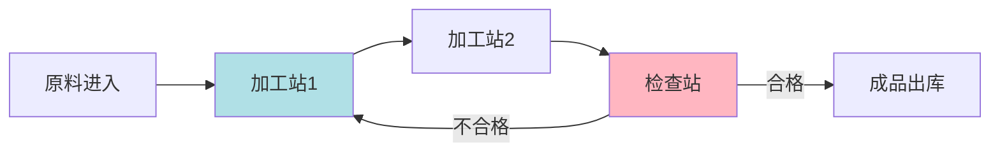
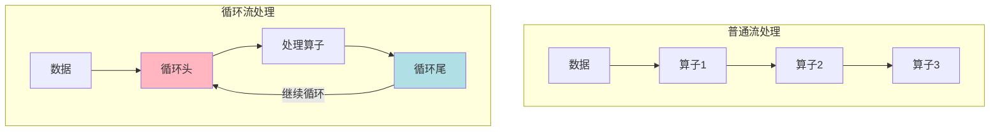
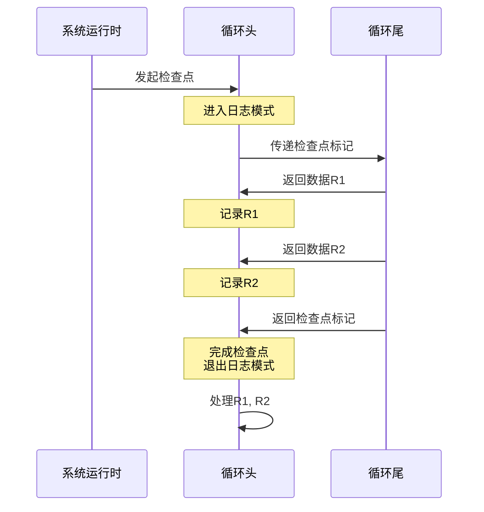

# FLIP-16：让循环流处理变得可靠：Flink中迭代作业的状态恢复方案

## 开篇

在一些数据处理场景中，数据需要被反复处理多次才能得到最终结果。比如在机器学习训练过程中，同一批数据要经过反复迭代才能得到最优模型；又如在图计算中，需要多轮传播才能获得最终结果。这种循环处理模式在 Flink 的流处理中也很常见。但是，如果在循环过程中系统出现故障，该如何保证数据不丢失、不重复呢？这就是 FLIP-16 试图解决的问题。

## 难点何在？

### 循环处理的特殊性

让我们用一个简单的比喻来理解这个问题。想象一个工厂的生产线，普通的流水线是直线型的：原料从一端进入，经过加工后从另一端出来。但有些特殊产品可能需要在某个环节重复处理，就形成了一个环形生产线。

在这个环形生产线中，如果系统需要进行备份（在 Flink 中称为检查点），就会遇到一个棘手的问题：正在循环的产品该如何处理？

### 现有方案的局限

在普通的流处理中，Flink 使用一种叫做"异步屏障快照"的方法来创建检查点。它就像是给流水线上打一个标记，标记之前的产品都处理完了才进行备份。但在循环流程中，这个方法就遇到了困境：

如果等待循环中的所有数据都处理完再做检查点，可能会等待很长时间，甚至永远等不到。这就像是在等一个永远结束不了的游戏。

## FLIP-16 的解决思路

FLIP-16 提出了一个巧妙的解决方案。其核心思想是：与其等待所有循环数据处理完，不如先把它们暂存起来。具体来说：

1. 当检查点开始时，循环头进入"日志模式"
2. 在日志模式下，从循环尾返回的数据会被记录下来，而不是直接继续处理
3. 当检查点完成后，这些记录的数据会被重新投入处理

这个过程可以用下面的时序图来展示：

## 为什么这个方案被放弃了？

虽然这个方案看起来很有希望，但最终还是被放弃了。主要原因是：

1. **内存消耗问题**：在日志模式下，需要在内存中保存所有循环返回的数据。如果循环数据量很大，可能会导致内存不足。

2. **实现复杂性**：要在现有的检查点机制中加入这个特殊处理，需要修改很多核心代码，可能会影响系统的稳定性。

3. **运行开销**：频繁地进入和退出日志模式，以及数据的记录和重放，都会带来额外的性能开销。

## FLIP-16 的启示

这个 FLIP 虽然没有被采纳，但它的探索过程具有重要参考价值：

它凸显了循环流处理中的数据一致性是一个亟待解决的技术难题。

整个探索过程也体现了分布式系统设计的复杂性 - 一个看似优雅的方案在实际应用中可能会遇到意想不到的挑战。

这个案例也很好地展示了系统设计不仅要考虑功能正确性，还需要权衡实现的可行性和运行的效率。

对于那些需要在流处理中使用循环的场景，目前的建议是：
- 尽量将循环逻辑转换为可以批处理的形式
- 在应用层面处理循环中断和恢复的逻辑
- 或者使用其他更适合迭代计算的处理框架

## 总结

FLIP-16 试图解决分布式流处理系统中一个具有挑战性的问题：如何保证循环数据处理的可靠性。虽然它提出的解决方案最终因为实现难度和性能问题而被放弃，但这个探索过程为之后的研究提供了有价值的参考。
