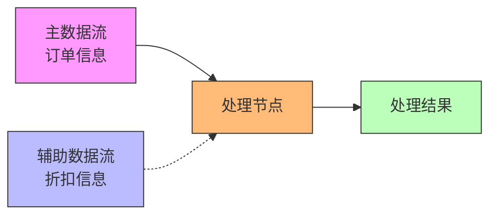
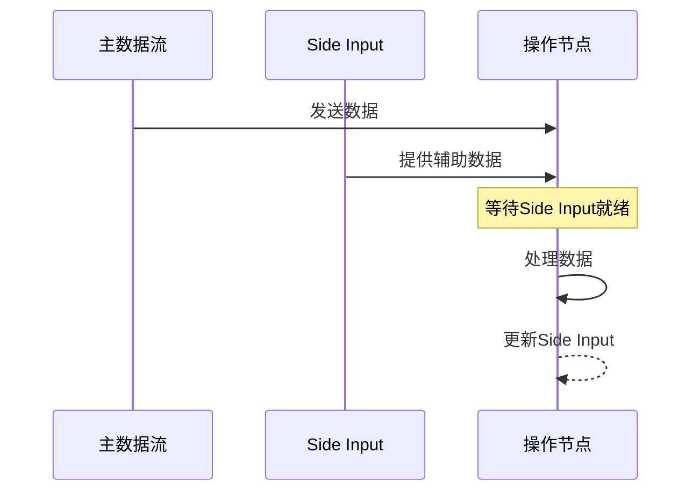

# FLIP-17: 流处理API的辅助数据特性

## 开篇

想象一个工厂的流水线：主线上飞速流过各种产品，而旁边的工作台上放着质检手册、参数表等参考资料。工人在加工产品时，随时可以查看这些资料来指导工作。在Flink的流处理中，也存在类似的场景：在处理主数据流时，常常需要参考一些辅助数据来指导处理过程。这就是FLIP-17要解决的问题 - 给DataStream API添加side inputs（辅助输入）功能。

## 为什么需要Side Inputs？

让看一个具体的例子：假设正在处理一个网上商城的订单流，需要根据不同商品的折扣信息来计算最终价格。折扣信息存储在另一个数据流中，而且会随时更新。这就需要一个能力：在处理订单的同时，还能随时获取最新的折扣信息。



这个例子展示了Side Inputs的典型应用场景。它主要解决四类问题：

1. **主流和静态数据的联接**
2. **主流和缓慢变化数据的联接**
3. **动态过滤和数据扩充**
4. **基于窗口的数据联接**

## Side Inputs是如何工作的？

Side Inputs的工作方式就像工厂流水线旁的参考资料架，工人可以随时查阅所需信息。具体工作流程是：



这里有几个关键设计：

### 1. 数据等待机制

就像在工厂流水线上，工人需要等待相关的技术参数和质检标准准备就绪才能开始加工。系统会：
- 暂存主数据流的元素
- 等待Side Input数据就绪
- 然后再开始处理

### 2. 存储方式选择

提供了三种数据存储方式：
1. 可靠保存 - 类似于工厂的技术文档库，所有规范和标准都完整存档
2. 内存暂存 - 像是工位上的临时参数表，随用随取但可能会丢失
3. 完整批次 - 就像等待一个完整的生产批次的质检报告，所有数据齐全才开始使用

## 使用场景举例

比如要做一个实时的商品推荐系统：

```java
// 主数据流：用户的浏览记录
DataStream<String> mainStream = ...
// Side Input：实时的商品评分数据
DataStream<String> sideStream = ...

// 创建一个Side Input包装器
SingletonSideInput<String> productRatings = 
    new SingletonSideInput<>(sideStream);

// 在主处理逻辑中使用Side Input
mainStream
    .filter(new RichFilterFunction<>() {
        boolean filter(String product) {
            // 获取商品的实时评分
            String rating = getRuntimeContext()
                .getSideInput(productRatings);
            // 根据评分过滤
            return shouldRecommend(product, rating);
        }
    }).withSideInput(productRatings);
```

## 当前状态

这个FLIP目前还在讨论中，主要面临两个技术挑战：

1. **数据缓冲问题**：
当前的设计会缓存主数据流的元素直到Side Input就绪。这可能导致内存压力过大。

2. **网络栈限制**：
另一种方案是阻塞输入直到数据就绪，但现有的网络栈还无法支持"部分阻塞"（即阻塞一个输入但不阻塞另一个）。

目前的开发进度如下表所示：

| 阶段 | 状态 | 说明 |
|------|------|------|
| 设计讨论 | 进行中 | 正在讨论多种实现方案 |
| 基础框架 | 未开始 | 等待设计方案确定 |
| 核心功能 | 未开始 | 计划分两阶段实现 |
| 窗口支持 | 未开始 | 作为第二阶段功能 |

## 设计权衡

在实现方案上存在三种选择：

1. 复用双输入算子
2. 在StreamTask层面管理
3. 支持N元输入

每种方案都有其优缺点：

| 方案 | 优点 | 缺点 |
|------|------|------|
| 复用双输入算子 TwoInputStreamOperator | 实现简单，便于原型验证 | 扩展性受限 |
| StreamTask管理 | 接口清晰 | 增加系统复杂度 |
| N元输入 | 灵活性强，扩展性好 | 实现复杂 |

## 总结

Side Inputs将为Flink的流处理带来更灵活的数据处理方式。就像工厂流水线上不仅有主生产线，还配备了各种参考资料和辅助工具，让整个生产过程更加高效精准。虽然这个功能还在开发中，但它展示了Flink在提升流处理能力方面的持续努力。
