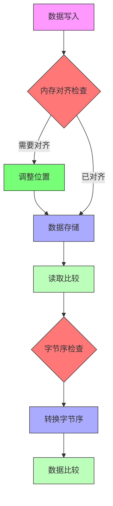
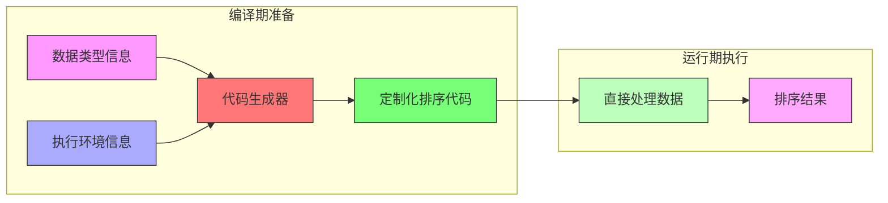

# FLIP-18: 让排序飞起来：代码生成让性能提升一大截

## 开篇 

想象一条工业生产线，需要把不同种类的产品按照特定规格分类排序。如果用同一台通用的分拣机器来处理所有产品，每次都要先测量产品尺寸、调整分拣参数，显然效率不高。更好的方式是为每种产品定制专门的分拣设备，提前设定好参数，直接开始工作。在Flink 1.2.0版本之前，所有数据的排序都使用同一个通用的排序器（NormalizedKeySorter），就像那台需要反复调整的通用分拣机。FLIP-18的目标就是通过代码生成技术，为不同类型的数据"定制"专门的排序代码，让排序更加高效。

## 原有排序方案的不足

在Flink 1.2.0中，所有的排序操作都使用NormalizedKeySorter来处理。这就像是一个通用的分拣工具，不管是分拣信件、包裹还是文件，都用同样的流程。具体来说，原来的排序过程是这样的：

当需要对数据进行排序时，系统会先把数据写入内存段（MemorySegment）。为了保证数据能正确地存储和比较，每次写入和读取数据时都要进行一系列检查：



这种设计有几个明显的不足：

第一是内存操作效率低。每次复制和交换数据时，都要检查数据是否对齐到内存边界。就像搬家时每搬一件家具都要量一遍门的宽度，其实这些尺寸完全可以提前知道。使用Unsafe.copyMemory时的对齐检查就占用了大量不必要的CPU时间。

第二是字节序处理繁琐。Flink会把数据按大端序格式存储，但现代计算机大多使用小端序。这就导致在数据比较时需要频繁地进行字节序转换。按照快速排序的比较次数，一个数据可能要被转换O(log n)次，非常浪费资源。

第三是通用代码的局限性。为了处理各种不同类型的数据，代码中加入了很多条件判断和通用处理逻辑。这就像是用瑞士军刀来完成所有工作，虽然灵活但效率不高。比如在循环处理定长数据时，完全可以展开循环，但通用代码就无法做到这一点。


## 解决方案

FLIP-18提出了一个绝妙的主意：不要用通用的代码，而是根据实际情况"量身定制"代码。这就像是不用通用工具箱，而是为每种任务准备专门的工具。



在具体优化方面做了几件很巧妙的事情。第一个是定制了数据复制操作，不再是一个通用的复制方法，而是根据数据大小生成固定长度的复制代码，省去了内存对齐检查，这样大大提升了数据交换的效率。

第二个是优化了字节序的处理方式。原本在数据比较时需要频繁地进行字节序转换，现在改成了在数据序列化时就处理好字节序。这个改动看似简单，却把转换次数从O(n log n)降到了O(n)，大大减少了排序过程中的转换开销。

第三个是消除了很多不必要的运算。比如把除法和取模运算替换成了更高效的位运算，还把一些循环展开来减少分支判断。这些细节的优化加在一起，让整个计算过程都变得更加高效。

## 效果如何？

测试数据显示效果相当不错：

| 优化方案 | 10,000条数据 | 100,000条数据 | 1,000,000条数据 |
|---------|-------------|--------------|----------------|
| 原始方案 | 4.70 ms     | 61.53 ms     | 609.00 ms      |
| 优化交换操作 | 3.34 ms  | 49.88 ms     | 471.30 ms      |
| 使用小端序 | 4.20 ms    | 56.15 ms     | 578.14 ms      |
| 循环展开 | 4.29 ms     | 53.59 ms     | 605.32 ms      |

从数据可以看出，效果最显著的是优化交换操作，性能提升了约20-25%。字节序优化也带来了5-10%的提升。而循环展开虽然也有一定效果，但提升幅度不如前两种明显。

另外，在优化除法运算方面也做了对比测试：

| 优化方案 | 10,000条数据 | 100,000条数据 | 1,000,000条数据 |
|---------|-------------|--------------|----------------|
| 原始方案 | 4.34 ms     | 61.79 ms     | 582.88 ms      |
| 优化方案 | 3.00 ms     | 35.90 ms     | 386.95 ms      |

这个优化效果更加显著，大约能提升30-40%的性能。

## 技术实现细节

代码生成优化涉及多个技术层面的改进，主要包括以下几个部分（大致举例）：

### 1. 代码生成框架设计

使用ASM（Java字节码操作框架）来动态生成类，主要生成三类组件：
```java
// 1. 专用的比较器
public class GeneratedComparator {
    // 针对特定类型优化的比较逻辑
    public int compare(Object o1, Object o2) {
        // 直接访问对象的特定字段
        // 避免反射调用的开销
    }
}

// 2. 优化的序列化器
public class GeneratedSerializer {
    // 针对特定类型的序列化逻辑
    public void serialize(Object obj, DataOutput out) {
        // 直接按照预定义的字节序写入
        // 避免运行时的字节序转换
    }
}

// 3. 定制的排序器
public class GeneratedSorter {
    // 结合优化后的比较和序列化逻辑
    // 实现高效的排序算法
}
```

### 2. 内存访问优化

专门为内存段（MemorySegment）操作生成优化代码：

```java
// 优化前的通用访问方式
public long getValue(MemorySegment segment, int position) {
    // 每次都要检查对齐
    checkAlignment(position);
    // 可能需要字节序转换
    return Long.reverseBytes(segment.getLong(position));
}

// 生成的优化访问代码
public long getValueOptimized(MemorySegment segment, int position) {
    // 编译时确保对齐，无需运行时检查
    // 直接访问内存，避免额外开销
    return UNSAFE.getLong(segment.getBaseObject(),
                         segment.getBaseOffset() + position);
}
```

### 3. 循环优化技术

对于已知长度的数据处理，生成展开的循环代码：

```java
// 优化前：通用的循环
for (int i = 0; i < length; i++) {
    result += data[i];
}

// 优化后：展开的循环
// 假设length是8的倍数
result += data[0];
result += data[1];
result += data[2];
result += data[3];
result += data[4];
result += data[5];
result += data[6];
result += data[7];
```

### 4. 运行时优化

在程序运行时进行动态编译和加载：

1. **类型信息收集**：
   - 分析数据类型的具体结构
   - 确定字段类型和访问模式
   - 识别可以优化的操作

2. **代码模板渲染**：
   - 使用预定义的代码模板
   - 根据类型信息填充具体实现
   - 生成优化后的字节码

3. **动态加载和替换**：
   - 使用自定义的ClassLoader加载生成的类
   - 通过代理模式实现无缝切换
   - 保证线程安全的类替换

### 5. 性能保障机制

为了确保生成代码的可靠性和性能，实现了以下机制：

```java
public class CodeGenerationManager {
    // 性能监控
    private PerformanceMonitor monitor;
    
    // 回退机制
    public Object getOptimizedImplementation(Class<?> type) {
        try {
            // 尝试使用优化版本
            return getGeneratedCode(type);
        } catch (Exception e) {
            // 出现问题时回退到通用实现
            return getFallbackImplementation(type);
        }
    }
    
    // 缓存机制
    private final ConcurrentHashMap<Class<?>, Object> codeCache;
}
```

这些技术细节共同保证了代码生成优化的效果，让排序性能得到了显著提升。同时，这些优化对用户是完全透明的，不需要修改任何业务代码。

## 举个例子：图书馆的图书整理

想象你在图书馆整理图书。每本书都有一个索书号，需要按照这个号码把书排序放好。这个过程和Flink的数据排序非常相似。

### 老方法：通用整理流程

就像一个新来的图书管理员，每拿到一本书都要：
1. 先确认这是什么类型的索书号（数字还是字母？中图法还是杜威十进制？）
2. 查阅分类手册，了解具体的分类规则
3. 再对照手册一位一位地比较两个索书号
4. 最后还要考虑怎么搬运，以免弄乱已经排好的书

这就像原来的通用排序器，每次处理数据都要：
1. 先检查数据类型
2. 查找比较规则
3. 逐个读取和转换数据
4. 小心翼翼地移动数据

拿图书分类号"TP311.56"和"TP312.8"比较为例：
```
第1步：先看是不是都是TP类（检查数据类型）
第2步：查看TP类的编号规则（确定比较方法）
第3步：从左到右逐个对比数字（逐位比较）
第4步：确定位置后小心调整（数据移动）
```

### 新方法：定制整理流程

经验丰富的图书管理员会这样做：
1. 先给书分大类（比如计算机类的都放一起）
2. 熟记这类书的编号规则
3. 直接用经验比较编号大小
4. 轻松地调整书的位置

这就像改进后的排序器：
1. 提前知道要处理的数据类型
2. 生成专门的比较代码
3. 直接进行高效比较
4. 快速完成数据交换

还是拿"TP311.56"和"TP312.8"举例：
```
第1步：已知是TP类，直接看数字部分
第2步：312 > 311，不用再看后面的小数
第3步：直接移动到正确位置
```

这个改进就像是把"生手图书管理员"培养成了"经验丰富的老馆员"。新来的管理员需要反复查手册，而老馆员早就把规则烂熟于心，一眼就能确定书的位置。代码生成优化做的，就是让程序也能像老馆员一样熟练高效。

## 当前状态

这个改进已经实现并合并到了Flink代码库中。通过建立代码生成的基础框架，现在可以根据不同场景自动选择最合适的优化策略。同时还加入了性能监控的机制，让整个排序过程不仅更快，还更容易调优。

## 总结

FLIP-18通过代码生成这个巧妙的方式，让Flink的排序性能有了显著提升。这就像是把通用工具换成了专业工具，每种工具都是为特定任务精心打造的。虽然实现起来较为复杂，但带来的性能提升确实值得投入。这个改进也为Flink在其他方面应用代码生成技术提供了有益的经验。
