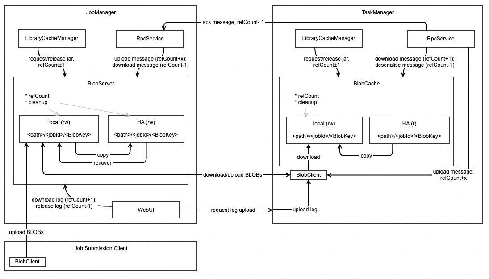
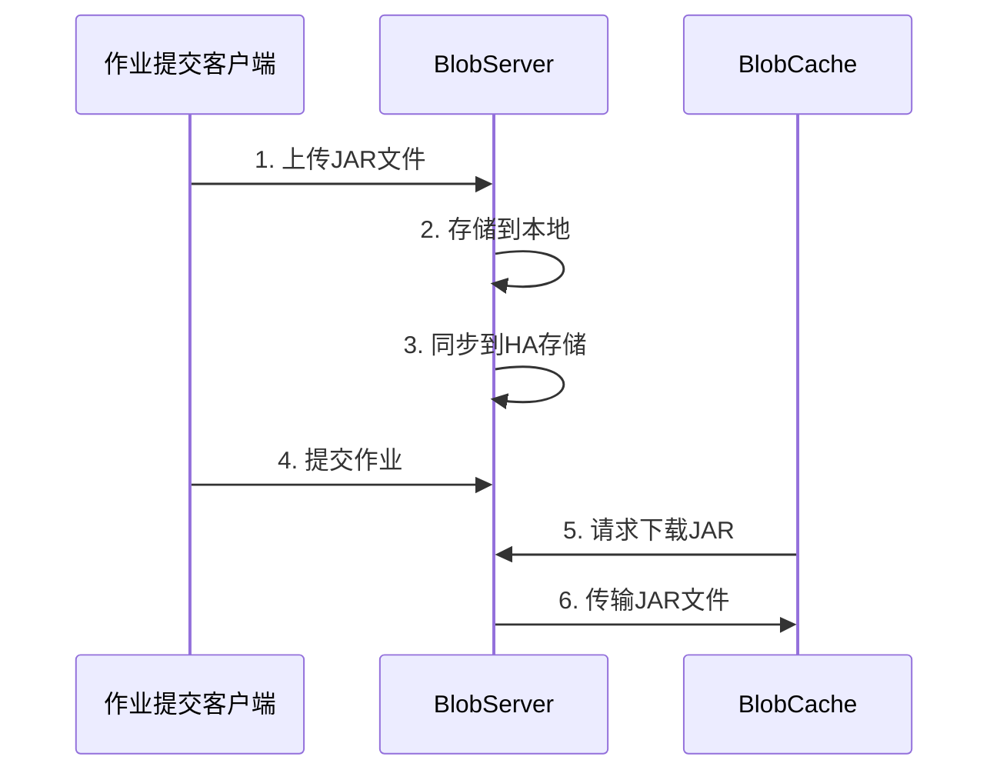

# FLIP-19 BLOB存储大改造：让文件管理更可靠

想象你正在管理一个大型商城的仓库。这个仓库里存放了各种各样的物品 - 从商品说明书到快递单，从商品图片到交易记录。随着时间推移，你发现了几个问题：有时候同一份文件被重复存储了好多份；有时候某个文件明明已经用不着了，却一直占用着空间；更糟糕的是，有时候文件的内容被意外修改了，却没人发现。这些问题让仓库管理变得混乱且低效。

在Apache Flink中，BLOB (Binary Large Object) 存储系统就像这样一个仓库，它负责管理各种二进制文件。这些文件可能是用户上传的JAR包、任务之间传递的大型消息、或者是TaskManager的日志文件。在Flink 1.4版本之前，这个"仓库"也面临着类似的问题。

## 主要改进

让我们通过一张图来了解新的BLOB存储架构：

### 1. 文件校验升级

就像商场里的防伪标签，新系统会在读取或复制文件时进行校验和验证。这样可以确保文件内容没有被意外修改，提高了系统的可靠性。

### 2. 引用计数与智能清理

想象商场里的库存管理系统，商品的使用状态需要实时跟踪和更新。新的BLOB存储系统采用了智能的引用计数机制，能够准确记录每个文件当前的使用情况。当系统发现某个文件不再被任何任务使用时，不会立即将其删除，而是会等待一段时间。在这段时间内，如果又有新的任务需要使用这个文件，它就会被保留下来。这就像是商场里的"临期商品区"，商品不会一过期就扔掉，而是先放在特殊区域观察一段时间。

### 3. 分层存储设计

新的BLOB存储系统采用了类似大型连锁商场的分层仓储体系。这个体系包含三个核心组件：中央仓库（BlobServer）负责统一管理和备份，分店仓库（BlobCache）提供本地快速存取，物流团队（BlobClient）则负责协调各个仓库之间的调度工作。这种分层设计既保证了数据的可靠性，又能满足快速访问的需求，同时还能灵活应对系统扩展和故障恢复。

BlobServer就像大型商场的中央仓库，负责最核心的存储管理工作。它管理着两个重要的仓储空间：一个是用于快速存取的本地仓库，另一个则是用于容灾的备份仓库。每个文件在存储时都会遵循`<path>/<jobId>/<BlobKey>`的路径规则，确保文件组织清晰有序。当有新文件上传时，BlobServer会先将文件存入本地仓库，随后立即同步到备份仓库，这样既保证了数据的安全性，又不会影响性能。在需要获取文件时，它会优先从本地仓库调取文件，只有在本地找不到的情况下才会去备份仓库查找。

BlobCache就像是商场各个分店的仓库经理。每个分店都有自己的小仓库，采用与中央仓库相同的存储路径结构。这些分店仓库经理虽然可以查看中央的备份仓库，但只有查看权限，不能直接修改里面的内容。当需要某个文件时，分店经理会先查看自己的库存。如果本地没有，就会向中央仓库申请调货。为了节省空间，每个分店经理都有权决定什么时候清理自己仓库里不再使用的文件。

BlobClient扮演着仓库服务专员的角色，负责处理各种文件存取请求。它就像是一个专业的物流调度员，接收到上传或下载的请求后，会和BlobServer建立专门的连接通道，确保文件传输的安全和效率。它精确地记录每一个请求的细节，并负责监督整个传输过程，直到确认文件安全送达。

### 4. 高可用恢复机制

设想这样一个场景：中央仓库因为一场意外事故需要重建，新的管理员该如何接手工作？新上任的BlobServer会先做四件事：首先，它会仔细查看备份仓库里的存货清单，了解现有资源。然后，它会将必需的文件从备份仓库恢复到本地仓库，确保业务能够继续运转。接着，它会对所有现存的文件进行一次全面的清点和造册。最后，对于那些找不到归属的"无主"文件，会特别标记出来，等待后续统一清理。这个过程就像是一次有序的仓库交接。

### 5. 文件分类与生命周期

在新的存储系统中，不同类型的文件有着不同的用途和生命周期管理方式。JAR文件主要用于存储用户的程序代码，它们的生命周期通常与作业保持一致，只有当作业结束后才会被清理。RPC消息则用于任务之间的通信，这类文件通常是短期存在的，使用完就可以删除。而日志文件主要用于系统监控，采用按需存储和及时清理的策略，避免占用过多存储空间。

## 实际应用场景

让我们看几个具体的使用场景：

### 场景一：提交新作业

### 场景二：大型RPC消息传输
当系统中的TaskManager需要相互传递超大消息时，会采用以下流程：发送方首先将消息内容存储到BlobServer中。接收方随后从BlobServer下载这些消息内容。当消息处理完成后，系统会将引用计数减一。当所有接收方都确认处理完毕后，这些消息就会自动进入清理队列，等待系统定时清理。

### 场景三：日志查看
当用户想要通过Web界面查看TaskManager的运行日志时，整个过程是这样的：首先Web UI会发起日志查看请求，TaskManager接收到请求后会将相关的日志文件上传到BlobServer。接着Web UI从BlobServer下载这些日志并展示给用户。由于日志文件通常只是临时使用，查看完毕后这些文件就可以被清理掉，不需要长期保存。

## 技术小贴士

现在，只要你使用的是Flink 1.4及更高版本，这些改进就已经默认启用了。不过在使用时还是有一些细节需要注意。首先，关于文件保留时间的设置，系统提供了`blob.retention.interval`参数，它的默认值是30分钟，这个时间是从原来的1小时配置减半而来的。其次，在规划TaskManager的存储空间时要预留充足的余地，建议至少准备预期BLOB总大小两倍的空间。最后，如果你在使用高可用模式，一定要确保HA存储的空间足够大，因为它需要容纳所有作业的文件。记住，合理的存储规划能够避免很多运行时的问题。

## 总结

FLIP-19对Flink的BLOB存储系统进行了全面改造，通过引入文件校验机制、智能引用计数、分层存储设计等一系列改进，让整个存储系统变得更加可靠和高效。就像一个现代化的智能仓库，既能确保货物的安全性，又能高效地管理存储空间。这个改进不仅解决了原有架构中的并发和清理问题，还为未来的功能扩展（如大型RPC消息的处理）打下了坚实的基础。现在，这个改进已经成为Flink 1.4及后续版本的标准功能，为Flink的稳定运行提供了强有力的支持。
