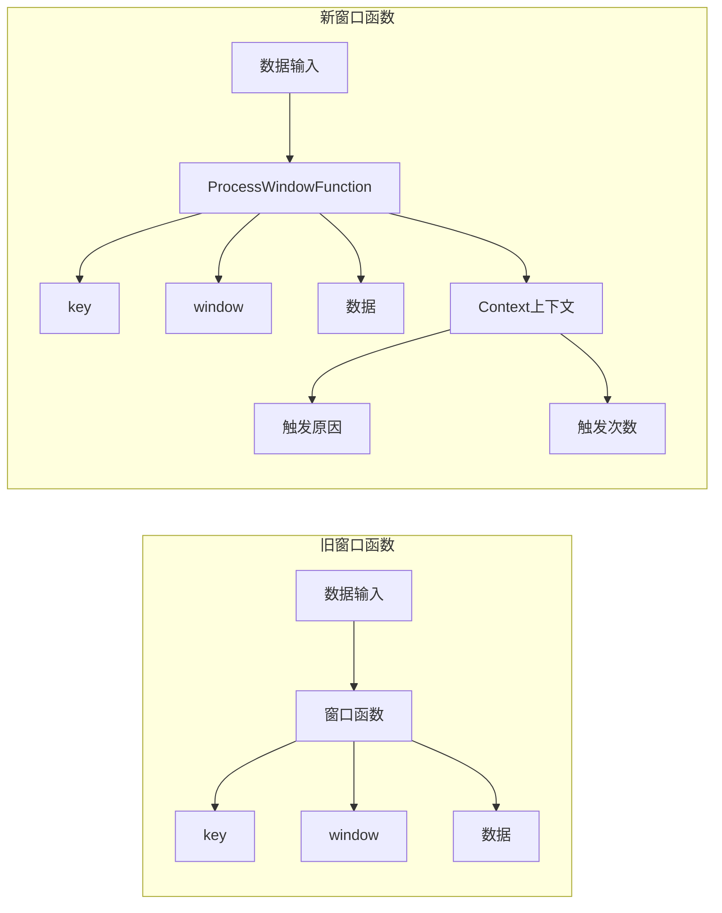
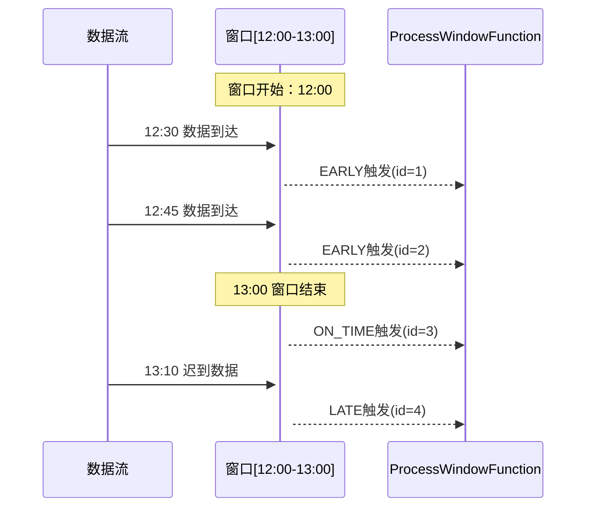

# FLIP-2 窗口函数知道得更多：让窗口处理更加智能

## 开篇

你有没有遇到过这样的情况：作为一个班级的班主任，你要统计每个小时学生的到课情况。目前的系统只会告诉你"这个小时有多少学生到了"，但你可能还想知道："是不是有学生迟到了？""这是第几次统计这个小时的人数？"

在 Flink 的窗口处理中，也存在类似的情况。当前的窗口函数只能知道"窗口里有什么数据"，却不知道"这些数据是正常到达的还是迟到的"，也不知道"这是第几次处理这个窗口的数据"。FLIP-2 就是要解决这个"只见树木不见森林"的问题，让窗口函数能获取更多的上下文信息。

## 老方案有啥问题？

目前的窗口函数（WindowFunction）能获取的信息非常有限，就像一个信息不完整的报表：

### 第一个问题：信息太少
目前窗口函数只能知道三件事：
1. 是哪个窗口触发了（比如"下午1点到2点"这个时间段）
2. 这个窗口对应的 key 是什么（比如"数学课"）
3. 窗口里有什么数据（比如"到课的学生列表"）

### 第二个问题：缺乏上下文
就像老师不仅想知道"谁到了"，还想知道"谁迟到了"一样，窗口处理时我们还需要更多的信息。我们想知道这些数据是准时到的还是迟到的，是因为时间到了自然触发计算的，还是因为其他原因提前触发的。同时，我们还想知道这个窗口之前统计过几次了。

这些信息在实际工作中都非常重要。比如在电商系统中，我们需要区分哪些是正常的订单，哪些是延迟到达的订单；在监控系统中，我们需要知道这已经是第几次触发报警了；在数据分析时，我们需要清楚地标记出哪些是补充进来的历史数据。这些场景都需要窗口函数能提供更多的上下文信息。

## FLIP-2 是怎么解决的？

让我们先看看新旧方案的对比：



FLIP-2 的解决方案很巧妙，主要包含两个创新：

### 第一步：设计新的窗口处理接口

首先，FLIP-2 设计了一个全新的接口叫 ProcessWindowFunction，它最大的特点是引入了一个"上下文"对象。这就像给每个班主任配了一个智能助手，不仅知道"谁到了"，还能告诉你更多的信息。

这个新接口的设计非常灵活，可以随时添加新的功能。就像智能助手可以不断升级，提供更多的信息一样。

### 第二步：增加更多的上下文信息

FLIP-2 计划在这个新接口中添加两类重要信息：

1. **窗口触发的原因**
   - ON_TIME（准时）：数据按时到达并处理
   - EARLY（提前）：因为某些原因需要提前看结果
   - LATE（迟到）：处理迟到的数据

2. **窗口触发的次数**
   - 给每次触发都标上一个序号
   - 方便追踪这个窗口触发了多少次
   - 便于区分不同批次的处理结果

让我们通过一个时序图来理解窗口触发的不同情况：



让我们详细解释一下这个时序图：

1. 首先，一个时间窗口从12:00开始创建，它负责处理12:00到13:00这一小时内的数据。

2. 在12:30时，第一批数据到达了。有时候我们不能等到窗口结束才看结果，比如在实时监控系统中，我们想尽早发现异常情况；或者在实时大屏中，我们需要尽快展示当前统计结果。所以系统支持提前触发计算（EARLY触发），并给这次触发标上序号id=1。这就好比老师在上课中途先统计一下到目前为止谁到了，这样如果出勤率太低就可以及时采取措施。

3. 到了12:45，又有新数据到达。系统再次提前触发计算（EARLY触发），这次的序号是id=2。这就像老师又做了一次点名。

4. 当时间来到13:00，这个窗口就正式结束了。此时系统会进行一次正常的触发（ON_TIME触发），序号是id=3。这相当于老师在下课时做最后一次点名。

5. 有趣的是，在13:10时又有一些数据到达了。虽然窗口已经结束，但系统仍然会对这些迟到的数据进行处理（LATE触发），并标记序号为id=4。这就像是有学生迟到了，老师还是会记录下来。

通过这个例子，我们可以看到新窗口函数的强大之处：它不仅知道数据的内容，还能区分数据到达的时间（准时还是迟到），记录处理的次数，这让数据处理变得更加灵活和智能。

## 具体怎么实现的？

实现上主要包含两个部分：

1. **新的接口设计**：
   ```java
   public abstract class ProcessWindowFunction<IN, OUT, KEY, W extends Window> {
       public abstract void process(KEY key, Context ctx, Iterable<IN> elements, 
           Collector<OUT> out);
       
       public abstract class Context {
           public abstract W window();    // 窗口信息
           public abstract int id();      // 触发次数
           public abstract FiringInfo firingInfo();  // 触发原因
       }
   }
   ```

2. **内部实现改造**：

在保持对旧接口兼容的同时，我们增加了计数器来记录触发次数，并通过检查水位线（watermark）来判断数据的到达情况。这样的设计既保证了向后兼容性，又提供了新的功能。

## 带来了哪些好处？

这些改进给 Flink 带来了实实在在的好处。首先是数据处理变得更加精细了，现在我们可以根据数据到达的时间来区别对待：对迟到的数据进行特殊处理，区分正常数据和补充数据，这样就能支持更复杂的业务场景。

其次是监控和调试变得更加方便。通过新增的信息，我们能清楚地知道每个窗口触发了多少次，数据是什么时候到达的。这些信息让问题排查变得更加容易，就像有了一个详细的操作日志。

最后是系统的扩展性得到了提升。新的接口设计非常灵活，将来如果需要添加新的功能，可以直接在上下文中增加，完全不会影响到现有的代码。这种平滑升级的特性让系统维护变得更加容易。

## 实际使用有什么建议？

在使用 FLIP-2 的新特性时，这里有一些实用建议供大家参考。

### 1. 接口选择要因地制宜

跟看病一样，要对症下药。如果你的业务逻辑比较简单，只需要基本的窗口计算功能，那就继续使用原来的 WindowFunction 就好。但如果你需要更多的上下文信息，比如要区分迟到数据，那就应该选择新的 ProcessWindowFunction。另外，在选择时也要考虑未来的需求，如果觉得后面可能需要更多功能，建议直接使用新接口。

### 2. 好好利用触发信息

这些新增的触发信息就像是数据的"身份证"，告诉我们每条数据的来龙去脉。我们可以用触发原因来区分不同情况的数据，用触发次数来做版本管理。对于迟到的数据，也要提前设计好处理策略，是直接丢弃还是特殊处理，都要根据业务需求来定。

### 3. 要权衡性能开销

就像升级到更高配置的手机一样，新功能必然会带来一些额外开销。这些上下文信息会占用一些存储空间，所以要权衡信息的完整性和系统性能。建议设置合理的清理策略，定期清理不需要的状态数据，避免状态越积越多。

## 总结

FLIP-2 就像给窗口函数装上了一个"全息投影仪"，让它能看到更完整的信息。不仅知道"发生了什么"，还知道"为什么发生"和"发生了多少次"。

这样的改进对于构建更智能的数据处理系统至关重要。就像一个好老师不仅要知道学生是否到课，还要了解他们的出勤情况和学习表现一样，一个好的窗口处理系统也需要掌握更全面的信息。

虽然这些改进看起来很小，但它们为 Flink 的实时处理能力打开了一扇新的大门。正如一句老话说的："细节决定成败"，FLIP-2 正是通过这些细节的改进，让 Flink 的窗口处理变得更加强大和智能。
