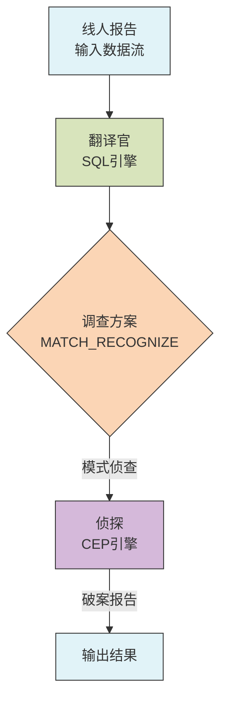
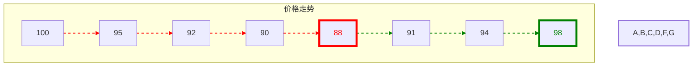
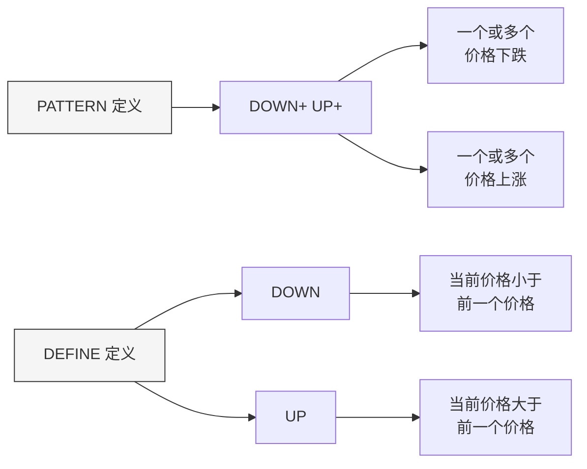

# FLIP-20: SQL 化身数据侦探：一场模式探案的故事

## 什么是 CEP？

CEP（Complex Event Processing，复杂事件处理）就像是数据世界中的放大镜，能够在源源不断的数据流中发现特定的事件序列。举个例子：商场要发现"三次连续购买失败"的顾客好及时提供帮助，银行要识别"短时间内多次小额取现"的可疑行为，电商要找出"价格突然大幅波动"的商品。这些都需要 CEP 来实现。它不是在寻找单个事件，而是在寻找符合特定模式的事件序列。

## 开篇

想象一下，数据就像是一个繁华城市里川流不息的人群。在这个数据城市里，有一位经验丰富的侦探，叫作 CEP（复杂事件处理）。这位侦探最擅长的就是在人来人往中找出特定的行为模式 - 比如发现可疑人物的活动规律。但有个问题：要请这位侦探帮忙，得写一大堆复杂的委托书（Java代码）。

现在好了，来了一位神通广大的翻译官 SQL。有了这位翻译官，只要用简单的语言描述想找的模式，侦探就能心领神会，立刻开展调查。这就是 FLIP-20 要实现的目标：让 SQL 和 CEP 联手破案，让数据查询变得既简单又强大。

## 为什么需要这样的合作？

就像破案需要多方合作一样，数据分析也需要不同技术的配合。CEP 侦探擅长找出复杂的行为模式，而 SQL 翻译官则善于用简单的语言表达需求。两者合作，能让数据调查工作事半功倍。



看这张图，就像是一个完整的破案流程：线人（数据源）提供情报，经过翻译官（SQL）整理成调查方案，交给侦探（CEP）进行分析，最后得出破案报告。这就是 SQL 和 CEP 合作的完美范例。

## 破案行动：如何运作？

来看一个具体的案例：假设你是金融警探，要找出股市中的"V型"可疑交易模式 - 股价先连续下跌后又连续上涨。这种模式可能暗示着市场操纵。以前需要人工盯盘，现在有了 SQL-CEP 搭档，只需要写一份这样的调查方案：

```sql
SELECT *
FROM Ticker MATCH_RECOGNIZE (
     PARTITION BY symbol
     ORDER BY tstamp
     MEASURES  STRT.tstamp AS start_tstamp,
               LAST(DOWN.tstamp) AS bottom_tstamp,
               LAST(UP.tstamp) AS end_tstamp
     ONE ROW PER MATCH
     AFTER MATCH SKIP TO LAST UP
     PATTERN (STRT DOWN+ UP+)
     DEFINE
        DOWN AS DOWN.price < PREV(DOWN.price),
        UP AS UP.price > PREV(UP.price)
     ) MR
ORDER BY MR.symbol, MR.start_tstamp;
```

假设输入数据如下（某只股票在不同时间点的价格）：
```
symbol    tstamp         price
APPLE     09:00:00      100
APPLE     09:01:00      95
APPLE     09:02:00      92
APPLE     09:03:00      90
APPLE     09:04:00      88
APPLE     09:05:00      91
APPLE     09:06:00      94
APPLE     09:07:00      98
APPLE     09:08:00      96
```

SQL执行后的输出结果：
```
symbol  start_tstamp  bottom_tstamp  end_tstamp
APPLE   09:00:00     09:04:00       09:07:00
```

这个结果告诉我们：
- 在09:00:00时发现了一个模式的开始（价格100）
- 价格持续下跌直到09:04:00触底（价格88）
- 然后开始上涨，直到09:07:00达到阶段性高点（价格98）
- 这构成了一个完整的V型模式

价格变化示意图：

红色连线表示下跌趋势，绿色连线表示上涨趋势。红色数字为最低点，绿色数字为高点。

让我们逐步解开这份调查方案的密码：

1. `PARTITION BY symbol`：按股票代码分组，每个股票单独侦查
2. `ORDER BY tstamp`：按时间戳排序，确保事件按时间顺序分析
3. `MEASURES` 子句定义了要从匹配结果中提取的数据：
   - `STRT.tstamp AS start_tstamp`：第一个匹配事件的时间戳
   - `LAST(DOWN.tstamp) AS bottom_tstamp`：最后一个DOWN模式的时间戳，即V型的底部时间点
   - `LAST(UP.tstamp) AS end_tstamp`：最后一个UP模式的时间戳，即整个V型模式的结束时间
4. `ONE ROW PER MATCH`：每找到一个匹配就输出一行结果
5. `AFTER MATCH SKIP TO LAST UP`：找到一个V型后，从最后一次上涨处继续寻找下一个模式
6. `PATTERN (STRT DOWN+ UP+)`：定义了完整的V型模式：
   - `STRT`：起始点
   - `DOWN+`：一个或多个连续下跌
   - `UP+`：一个或多个连续上涨
7. `DEFINE` 部分定义了具体的判断条件：
   - `DOWN AS DOWN.price < PREV(DOWN.price)`：当前价格低于前一个价格就是下跌
   - `UP AS UP.price > PREV(UP.price)`：当前价格高于前一个价格就是上涨

这就像侦探列出了一份详细的侦查清单，每个环节都有明确的定义和判断标准。



这个图展示了侦查方案的两个关键要素：
1. PATTERN（侦查目标）：描述要寻找的价格变化规律
2. DEFINE（判定标准）：明确每个环节的具体判断条件

## 幕后故事：实现细节

就像破案需要完善的警务系统，这个功能的实现也需要几个关键部门的配合：

| 功能模块 | 负责内容 | 实现状态 |
|---------|---------|---------|
| SQL 解析 | 解析 MATCH_RECOGNIZE 语法 | 已完成 |
| 模式编译 | 将SQL模式转换为CEP模式 | 已完成 |
| 运行时匹配 | 执行实际的模式匹配 | 已完成 |
| 结果生成 | 生成匹配结果 | 已完成 |

## 使用建议

在设计模式时，应该始终遵循简洁原则。复杂的模式定义不仅会增加系统计算开销，还容易导致维护困难。面对复杂的业务需求，更好的做法是将其拆分成多个简单的模式，分别处理后再组合结果。这样不仅能提高系统性能，还能让代码更容易理解和维护。

分区策略的选择对性能影响重大。选择分区键时，需要充分考虑业务特点和数据分布情况。好的分区策略能够充分利用系统并行处理能力，而不当的分区可能导致数据倾斜，反而影响性能。因此，建议在选择分区键时，仔细分析数据特征，确保数据能够均匀分布在各个分区中。

时间窗口的配置需要权衡数据完整性和系统资源消耗。窗口太小可能会遗漏某些模式，窗口太大则会占用过多系统资源。应该根据具体的业务场景设置合适的时间范围，同时配置合理的状态清理机制，避免状态持续增长导致资源耗尽。

输出模式的选择要基于具体的应用需求。对于需要快速发现和响应的场景，如实时监控和告警，使用ONE ROW PER MATCH模式更为合适；而对于需要深入分析的场景，如用户行为分析，使用ALL ROWS PER MATCH模式能提供更详细的信息。选择时还需要考虑下游系统的处理能力，避免产生过大的数据压力。


## 总结

有了这对"破案神探"组合，以前需要写大量代码才能完成的复杂数据分析，现在只需一个简单的 SQL 查询就能搞定。就像福尔摩斯有了华生医生，让破案工作既专业又易懂。

在 Flink 1.7 版本中，这项功能已经可以投入生产使用。随着技术的不断发展，相信会有更多强大的功能被添加进来。无论是金融分析、风险控制、还是业务监控，SQL 化身的数据侦探都能帮你找出隐藏在数据流中的重要线索。
