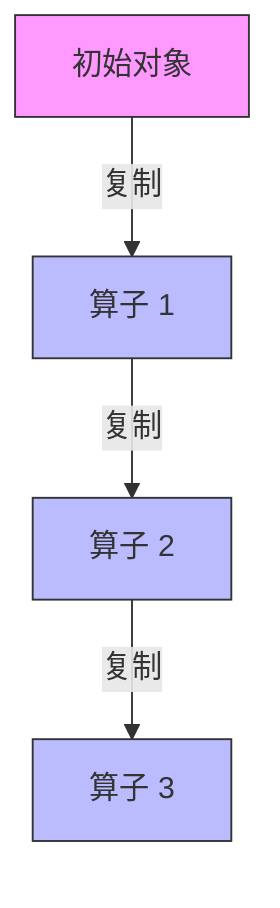
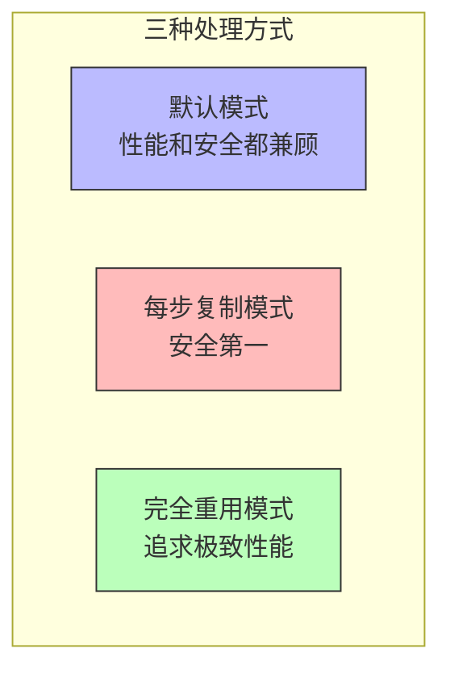

# FLIP-21：Flink让对象在算子间跑得更快

流处理任务执行的时候，一条数据从一个算子流转到另一个算子，期间总会产生复制。这种情况就像快递员在送快递时，到每个驿站都要重新打包一次快递一样，虽然安全，但效率不高。FLIP-21 就是要解决这个问题，让数据在算子之间传递时不用每次都复制，从而提升性能。

## 为什么要改？



从这张图可以看出现在的情况：数据从一个算子到另一个算子，都会被复制一次。这种设计本来是为了安全考虑，因为在使用堆内存存储状态时，如果重用可变对象可能会出问题。就像一个快递员非要在每个驿站都重新包装一次快递，只为了确保包裹完好无损。

但实际使用中发现了几个问题：

| 现象 | 具体表现 |
|-----|---------|
| 性能受影响 | 复制操作特别耗时，尤其是复杂的数据类型比如Avro、Thrift、JSON |
| 没必要的重复工作 | 数据重分布后的分组操作其实不需要复制，因为它是链上的第一个操作 |
| API不统一 | DataSet API就没有这样复制，用起来不一致 |
| 配置名字有歧义 | `enableObjectReuse()`这个名字容易误解，因为实际上并不是真的重用对象 |

## 怎么改？

为了解决这些问题，提出了三种数据传递方式：



上面这张图展示了三种不同的模式：

第一种叫默认模式，只在开始反序列化时创建新对象，后面就不复制了。这种方式既保证安全又不影响性能，这将是新的默认选项。


第二种就是现在的方式，每个算子之间都复制，就像那个特别谨慎的快递员一样，很安全但是比较慢。


第三种是完全重用模式，能重用的就重用，虽然速度最快，但要当心对象的状态，用不好可能会出问题。


## 现在进展如何？

这个FLIP目前还在讨论阶段，主要在讨论两个问题：

首先是该怎么迁移，有两种想法：一种是直接换成默认模式，在发布说明里说清楚；另一种是对老版本的作业保持原样，只在新作业里用新模式。社区现在更喜欢第一种方案，因为虽然改动大一点，但长远来看更简单清晰。

其次是怎么照顾到现有的程序，因为有些程序可能已经习惯了每次复制的方式。不过这种情况比较少见，而且通过配置还是能用老方式，所以问题不大。

从邮件列表的讨论可以看出，这个改进收到了不少正面反馈。虽然具体什么时候能用上还没定，但这个改进对提升Flink性能会有很大帮助，值得期待。

## 当前版本相关配置详解

在对象处理方面，有一个重要的配置项叫 `pipeline.object-reuse`。这个配置就像是一个开关，用来控制Flink是否重用对象来进行反序列化和向用户函数传递数据。为了安全起见，这个开关默认是关闭的（`false`）。

```yaml
pipeline.object-reuse: false  # 默认设置
```

当你把这个开关打开（设为`true`）时，Flink就会在内部重用对象来提升性能。这就像是重复使用同一个快递箱，而不是每次都换新的。但是，就像重用快递箱需要小心处理一样，使用这个设置时也需要注意几点：

| 注意事项 | 说明 |
|---------|------|
| 性能提升 | 减少对象创建和垃圾回收的开销 |
| 用户代码影响 | 用户函数必须正确处理对象重用的情况 |
| 引用有效期 | 对象引用在函数调用结束后可能失效 |
| 测试要求 | 在生产环境启用前需要充分测试 |

这就像是从一次性包装升级到可重复使用的包装箱：效率更高，但需要建立合适的使用规范。

## 总结

这个优化方案就像是给快递系统升级：不是每个驿站都重新打包，而是用更好的包装方式从源头发货。通过引入三种对象处理模式（默认模式、每步复制模式和完全重用模式），让用户可以根据实际需求在性能和安全性之间做选择。目前这个改进还在讨论中，但从社区的反应来看，这个改变对Flink来说就像是给程序装上了"轻功"，让数据在算子之间穿梭时更轻巧灵活了。
