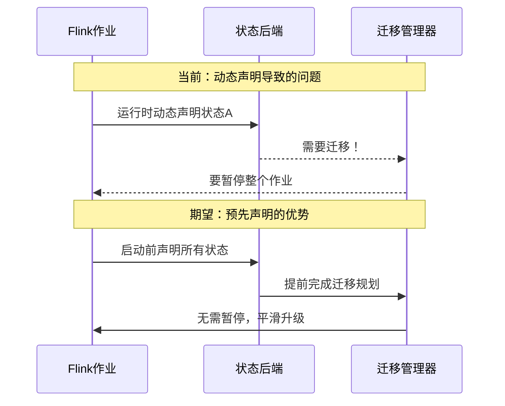

# FLIP-22 运行前就要说清楚：Flink状态预先声明方案

## 开篇

在编程时，变量声明和使用通常遵循一个基本原则：先说明要用什么，再开始用。但在Flink早期的状态管理中，却可以"说用就用"——也就是可以在任何时候动态声明并使用状态。这种灵活性虽然方便，但也带来了一些问题。FLIP-22就是为了解决这些问题，提出了一个更规范的状态声明方案。

## 目前有什么问题？

现有的状态声明方式就像是"边走边建房子"。程序运行时可以随时通过`getRuntimeContext().getState(descriptor)`来声明和使用状态。这种方式看似灵活，但带来了三个主要问题：

### 状态迁移和版本升级难处理
想象一下，如果要升级一个系统，在不知道所有房间布局的情况下进行改造，这将是一个噩梦。同样，Flink只能在状态声明时才知道是否需要进行状态迁移或版本升级。如果状态是动态声明的，就需要在处理过程中全局暂停来进行迁移，这显然不够优雅。



### 状态查询功能受限
现在的设计中，一个状态只有在注册到键值状态注册表后才能被查询。这意味着在状态被重新声明之前，从检查点恢复的状态是无法查询的。这就像是有一个文件，但在重新登记之前，我们找不到它的位置一样。

### JobManager信息不全
JobManager现在无法获知状态的完整信息，比如序列化方式、算子状态的分发方案等。这就像是总部不清楚各个分支机构的具体运作方式，导致在需要统筹规划时力不从心。

## 怎么解决这些问题？

FLIP-22提出了一个全新的状态声明方案，主要包括三个部分：

### 1. 预先声明机制

这种新的方案要求在作业提交前就声明好所有要使用的状态。具体来说：


这种机制主要通过以下方式实现：

- 在StreamOperator和RichFunction接口中添加新的状态注册方法
- 状态描述器必须在作业提交前注册
- 运行时只能访问已注册的状态

### 2. 注解方式的语法糖

为了让代码更简洁易读，FLIP-22还提供了注解方式来声明状态：

```java
// 键控状态的声明示例
@KeyedState(
    stateId = "myPojoListStateId",
    queryableStateName = "myPojoListStateQueryHandle",
    typeSerializerFactory = MyPojoSerializerFactory.class
)
private ListState<MyPojo> pojoListState;

// 算子状态的声明示例
@OperatorState(
    stateId = "myPojoListStateId",
    redistributeMode = OperatorStateHandle.Mode.BROADCAST
)
private ListState<MyPojo> pojoOperatorState;
```

这种方式不仅代码更清晰，而且能自动完成状态的初始化。

### 3. 旧接口的处理

为了保证平滑过渡，现有的动态声明接口将被标记为过时，但不会立即移除。这就像是当发现一个更好的解决方案时，不是直接拆掉旧房子，而是给出一个过渡期。

## 实现这些改变带来了哪些好处？

预先声明机制带来的好处可以用下面的表格直观地展示：

| 功能点 | 旧方案 | 新方案 |
|-------|--------|--------|
| 状态迁移 | 需要暂停作业 | 可提前规划，平滑进行 |
| 状态查询 | 需等待重新声明 | 立即可用 |
| 状态管理 | JobManager信息不完整 | 全局视图，便于管理 |
| 代码组织 | 分散在各处 | 集中、清晰 |
| 运维效率 | 被动响应 | 主动管理 |

## 当前进展

目前这个FLIP仍在社区讨论中。从邮件列表的讨论来看，主要存在以下争议：

1. 完全禁止动态声明可能过于严格。有些场景下，确实需要根据运行时的情况动态创建状态，比如根据不同的key类型使用不同的聚合函数。

2. 对于一些特殊场景（如WindowOperator）的处理需要进一步考虑。这些场景需要更灵活的状态管理机制。

3. 注解方式在处理带有函数参数的状态时存在局限性，因为Java注解只支持常量参数。

## 总结

FLIP-22提出的状态预先声明方案，就像是在盖房子之前先把设计图纸画好。这种方式虽然看起来不如随心所欲地建设灵活，但能让整个系统更加健壮和可维护。

虽然该方案还在讨论中，面临一些技术细节上的挑战，但其核心理念 - 提前规划、集中管理是值得肯定的。这种改进将为Flink的状态管理带来更多可能性，比如更强大的状态迁移、更完善的查询功能等。

就像所有重要的技术改进一样，在推进这个改变的过程中，需要在灵活性和可维护性之间找到一个平衡点。现有的讨论也表明，社区在认真思考如何既保持Flink的强大功能，又能让系统变得更加健壮。
